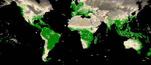

```{r setup, include=FALSE}
options(htmltools.dir.version = FALSE)
knitr::opts_chunk$set(
  fig.width=9, fig.height=3.5, fig.retina=3,
  out.width = "100%",
  cache = FALSE,
  echo = TRUE,
  message = FALSE, 
  warning = FALSE,
  hiline = TRUE
)

# library(RefManageR)
# BibOptions(check.entries = FALSE,
#            bib.style = "authoryear",
#            cite.style = "alphabetic",
#            style = "markdown",
#            hyperlink = FALSE,
#            dashed = FALSE)
# myBib <- ReadBib("bib/2_species.bib", check = FALSE)
```

```{r xaringan-themer, include=FALSE, warning=FALSE}
library(xaringanthemer)

# style_duo_accent(
#   primary_color = "#1381B0",
#   secondary_color = "#FF961C",
#   inverse_header_color = "#FFFFFF"
# )

style_mono_light(base_color = "#23395b")

#https://mycolor.space/?hex=%2323395B&sub=1 
#"Generic gradient" - #23395B #006287 #008E9D #00B897 #89DD81 #F9F871
#"Matching gradient" (reverse) - #23395B #494E77 #716292 #9C77AA #C88DBF #F5A3D0


library(knitr)
library(kableExtra)
```


```{r xaringan-tile-view, echo=FALSE}
# xaringanExtra::use_tile_view()
```


```{r echo = F, fig.align = 'center', out.width = '75%'}
knitr::include_graphics("images/seeds_front.jpg")
```

---

```{r echo = F, fig.align = 'center', out.width = '75%'}
knitr::include_graphics("images/seeds_back.jpg")
```

---

```{r echo = F, fig.align = 'center', out.width = '70%'}
knitr::include_graphics("images/seed_instructions.jpg")
```

---

```{r echo = F, fig.align = 'center', out.width = '75%'}
knitr::include_graphics("images/sabertooth.png")
```

.footnote[image: Mauricio Antón, CC BY 3.0]

---

Of course, humans have been aware of these roles and relationships for some time...

```{r echo = F, fig.align = 'center', out.width = '60%'}

```

.footnote[e.g. Who to avoid...]

---

Of course, humans have been aware of these roles and relationships for some time...

```{r echo = F, fig.align = 'center', out.width = '60%'}

```

.footnote[e.g. Where to find exciting plants...]

---

class: center, middle

This module is about **formalising scientific definitions for the niche** and exploring how **this allows us to develop theory** to help understand and predict various aspects of biodiversity.

---

layout: false

.pull-left[

### Early observations of the Niche

```{r echo = F, fig.align = 'center', out.width = '60%'}
knitr::include_graphics("images/Willdenow.jpg")
```
.footnote[image: Wikipedia]

####_Carl Ludwig Willdenow_, 1765-1812

]

.pull-right[

Perhaps the first to recognize the role of climate in determining the geography of plants, with vegetation organised in latitudinal and elevation zones.

```{r echo = F, fig.align = 'center', out.width = '100%'}

```
.footnote[image: Tony Rebelo CC BY-SA 4.0]

####_Willdenowia sulcata_, The "Groovy Sunreed" or Sonkwasriet, Restionaceae

]


---

layout: false

.pull-left[
### Early observations of the Niche


```{r echo = F, fig.align = 'center', out.width = '50%'}
knitr::include_graphics("images/von_Humboldt.jpg")
```
.footnote[painting by: Joseph Karl Stieler, 1843]

####_Alexander von Humboldt_, 1769-1859

A friend of Willdenow, and first to test his ideas.
]

.pull-right[
```{r echo = F, fig.align = 'center', out.width = '80%'}
knitr::include_graphics("images/humboldt.jpg")
```
.footnote[_Essay on the Geography of Plants_, von Humboldt and Bonpland (1805) documents repeated vegetation zones with elevation (and thus climate) in the Andes.]
]

---

background-image: url("images/torres_del_paine.jpg")
background-size: contain

---

layout: false

## Climate zones and biomes

```{r echo = F, fig.align = 'center', out.width = '70%'}
knitr::include_graphics("images/resolv_ecoregions2017.png")
```

.footnote[https://ecoregions.appspot.com/]

---

layout: false

.pull-left[
## Climate zones and biomes

Here is RH Whittaker's mapping of biomes against two major axes of climate variation. 

He wasn't the first to do this, but the "Whittaker plot" is one of the best known.

The biomes align reasonably well with temperature and precipitation.

The biomes are largely defined by the dominant plant functional types.

]

.pull-right[
```{r echo = F, fig.align = 'center', out.width = '100%'}
knitr::include_graphics("images/whittakerplot.png")
```

.footnote[[**Whittaker 1975**](https://search.worldcat.org/title/communities-and-ecosystems/oclc/1091611)]
]

---

layout: false

.pull-left[
## Climate zones and biomes

### Applications of this idea? 

Projecting the distribution of biomes under future climate change scenarios.

Midgley et al. (2002) used a geographic information system (GIS) to derive a climate envelope for the Fynbos biome under current climate and projected where those conditions would be under a future climate scenario.

.footnote[[**Midgley et al. 2002**](https://doi.org/10.1046/j.1466-822X.2002.00307.x)]
]

.pull-right[
```{r echo = F, fig.align = 'center', out.width = '60%'}

```

]

---

class: center, middle

# Hang on?

```{r echo = F, fig.align = 'center', out.width = '80%'}

```

#### We started by talking about growing vegetables and now we're looking at regions and the whole world?

---

layout: false

## The Hierarchy of Ecology

.left-column[
**Individual organism**

**Populations** are groups of interacting individuals of the same species.

**Communities** are groups of interacting individuals or populations of different species.

**Ecosystems** are the combination of biotic communities and their physical environment. 
]

.right-column[
```{r echo = F, fig.align = 'center', out.width = '95%'}

```
]

.center[image: _The Atlas of World Wildlife_ 1973]

---

class: center, middle

## The Niche Concept and the Hierarchy of Ecology


The Niche Concept is **typically applied at the level of species**, but has implications for higher order levels of the hierarchy - i.e. populations, communities, ecosystems (including biomes or the whole biosphere).

> _"The niche concept is not always used explicitly in theories at all these levels of organization, but it provides an important, if sometimes implicit connection between these disparate fields of ecology that justifies its status as a fundamental ecological concept."_ - [**Leibold 1995**](http://dx.doi.org/10.2307/1938141)

---

layout: false

## Climate _niche_ and species

.pull-left[

We often apply niche concepts in the context of species distributions, projecting their current and future distributions on the basis of climate

In future lectures you will learn there are multiple niche concepts, and they can be applied to species distributions in different ways...
]

.pull-right[
```{r echo = F, fig.align = 'center', out.width = '100%'}

```

.footnote[[**Wilson and Jetz 2016**](https://doi.org/10.1371/journal.pbio.1002415)]

]

---

layout: false

.pull-left[
## Climate _niche_ and biomes

Since biomes are largely defined by dominant plant functional types (PFT), we could model biomes by aggregating species distributions by PFT and assigning biomes based on PFT combinations.


```{r echo = F, fig.align = 'center', out.width = '90%'}

```

]

.pull-right[
```{r echo = F, fig.align = 'center', out.width = '90%'}
knitr::include_graphics("images/conradi2020_F2.jpg")
```

.footnote[[**Conradi et al. 2020**](https://doi.org/10.1111/nph.16580)]
]

---
class: middle

## Take-home

>*While the idea that species have particular environmental preferences/requirements and that they play specific roles in ecosystems is as old as life itself, the formal recognition and development of definitions of the niche allows us to develop more sophisticated theory in ecology, evolution and conservation.*

>*Niche theory has its roots in early biogeographic observations about the geography of plants by Willdenow, von Humboldt and others.*

>*While the niche concept has implications for other levels of the ecological hierarchy (populations, communities, ecosystems, biomes), it is only formally defined at the level of species.*

>*That said, we often apply the concept somewhat flexibly to other levels of the hierarchy, and in particular to the distribution of species and biomes across the globe.*

---
class: center, middle

# Thanks!

Slides created via the R packages:

[**xaringan**](https://github.com/yihui/xaringan)<br>
[gadenbuie/xaringanthemer](https://github.com/gadenbuie/xaringanthemer)

The chakra comes from [remark.js](https://remarkjs.com), [**knitr**](http://yihui.name/knitr), and [R Markdown](https://rmarkdown.rstudio.com).
