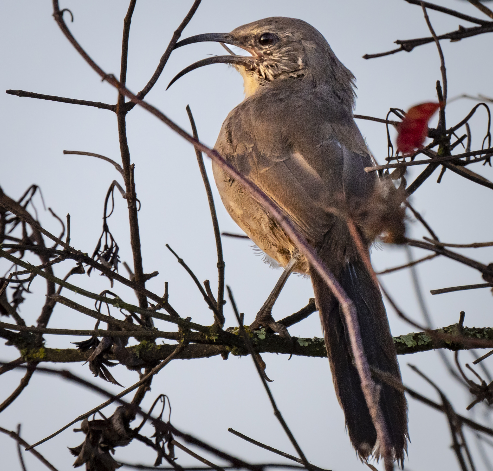
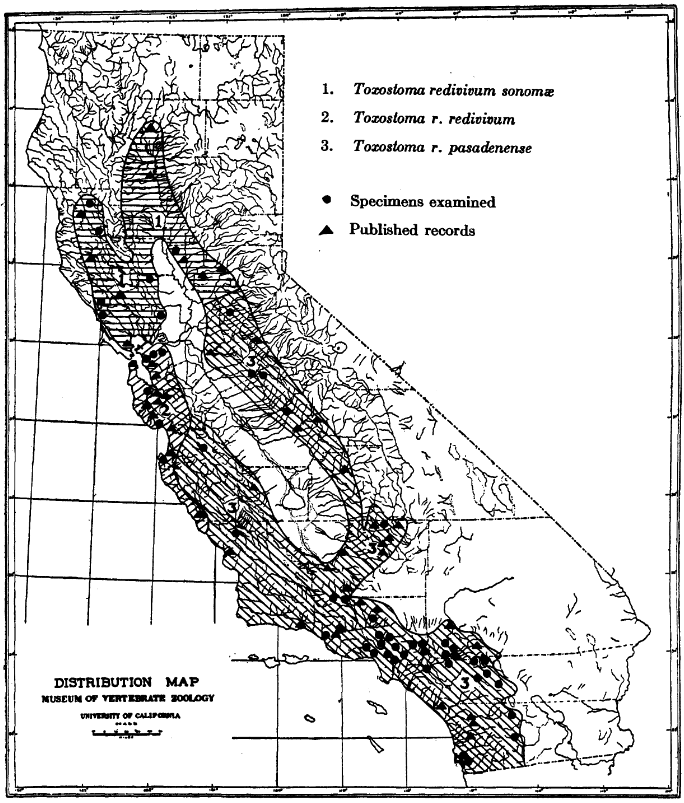
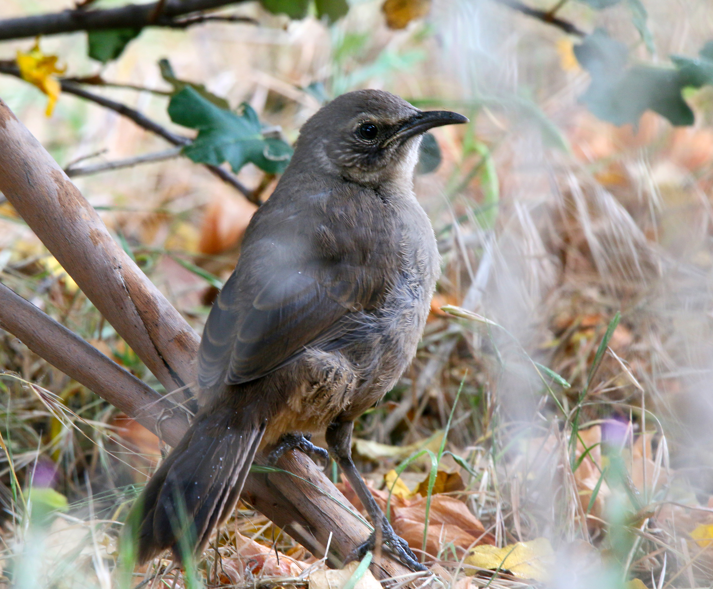
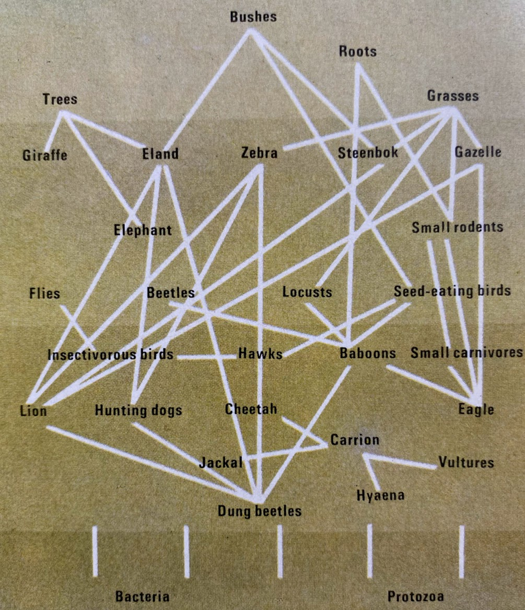
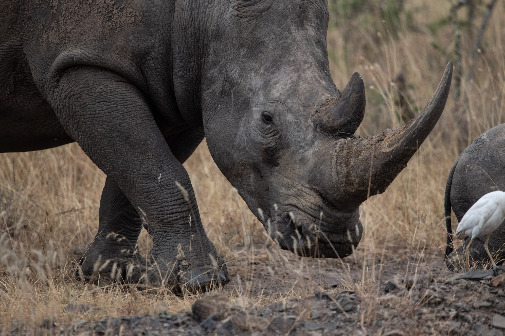
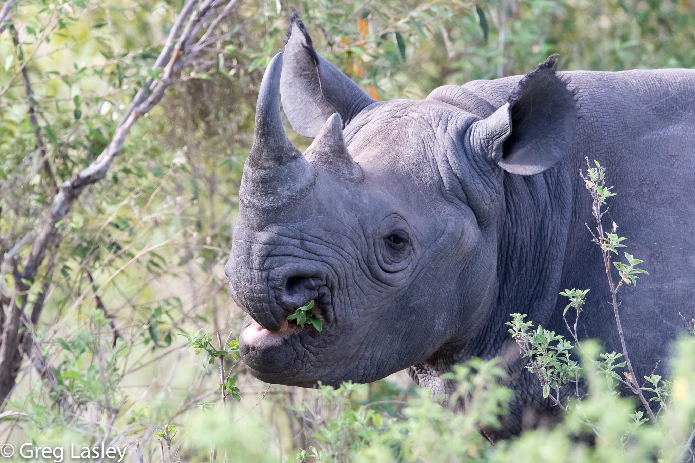
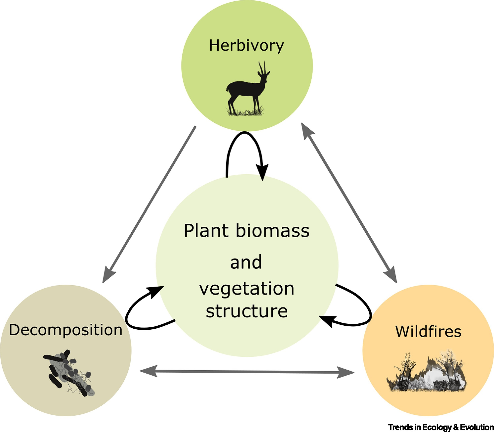
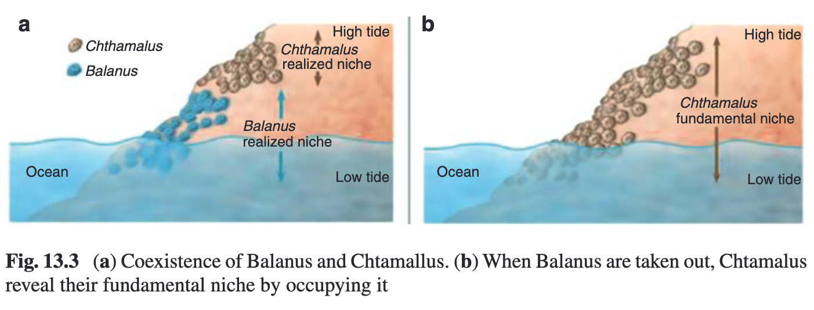
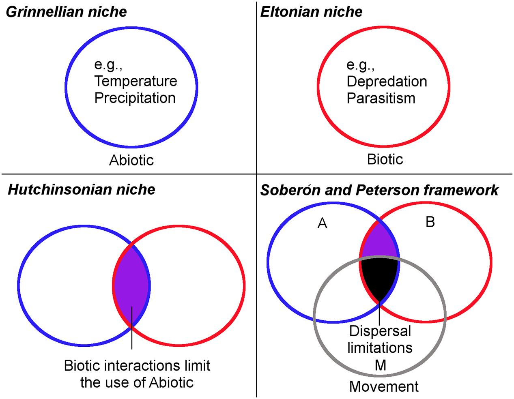

```{r setup, include=FALSE}
options(htmltools.dir.version = FALSE)
knitr::opts_chunk$set(
  fig.width=9, fig.height=3.5, fig.retina=3,
  out.width = "100%",
  cache = FALSE,
  echo = TRUE,
  message = FALSE, 
  warning = FALSE,
  hiline = TRUE
)

# library(RefManageR)
# BibOptions(check.entries = FALSE,
#            bib.style = "authoryear",
#            cite.style = "alphabetic",
#            style = "markdown",
#            hyperlink = FALSE,
#            dashed = FALSE)
# myBib <- ReadBib("bib/2_species.bib", check = FALSE)
```

```{r xaringan-themer, include=FALSE, warning=FALSE}
library(xaringanthemer)

# style_duo_accent(
#   primary_color = "#1381B0",
#   secondary_color = "#FF961C",
#   inverse_header_color = "#FFFFFF"
# )

style_mono_light(base_color = "#23395b")

#https://mycolor.space/?hex=%2323395B&sub=1 
#"Generic gradient" - #23395B #006287 #008E9D #00B897 #89DD81 #F9F871
#"Matching gradient" (reverse) - #23395B #494E77 #716292 #9C77AA #C88DBF #F5A3D0


library(knitr)
library(kableExtra)
```


```{r xaringan-tile-view, echo=FALSE}
# xaringanExtra::use_tile_view()
```

class: center, middle

> _"Ecology's love-hate relationship with the niche concept has been long and not
 especially pretty. Whereas some ecologists continue to see value in the concept,
 others have despaired of ever finding an expression that is both general and non-circular. Part of the problem, originating early in our science, has been that different investigators have meant different things by "niche.""_
 
Nelson G. Hairson, Jr. - _Editor's Note on [**Leibold 1995**](http://dx.doi.org/10.2307/1938141)_

<br>

>_"...most [ecologists] would agree that niche is a central concept in ecology, even though we do not know exactly what it means..."_ 

[**Real and Levin 1991**](https://press.uchicago.edu/ucp/books/book/chicago/F/bo3613618.html)

---

class: center, middle

###Proviso!

Given this uncertainty, what you are getting in this module is my understanding of the niche. With time and experience you will develop your own...

<br>

I like to think of niche concepts as akin to species concepts. Each has its pros and cons, but none are perfect.

---

class: middle

### Central figures in defining the niche

- Joseph Grinnell | The _Grinnellian Niche_
- Charles Elton | The _Eltonian Niche_
- G Evelyn Hutchinson | The _Hutchinsonian Niche_

---

### The Grinnellian Niche

.pull-left[
```{r echo = F, fig.align = 'center', out.width = '85%'}
knitr::include_graphics("images/grinnell_1917.png")
```

> _"An explanation of this restricted distribution is probably to be found in the close adjustment of the bird in various physiological and psychological respects to a narrow range of **environmental conditions**. The nature of these critical conditions is to be learned through an examination of the bird's **habitat**."_

.footnote[[**Grinnell 1917**](http://dx.doi.org/10.2307/4072271)]
]

.pull-right[
```{r echo = F, fig.align = 'center', out.width = '85%'}

```

.footnote[Photo: Leslie Cavaliere, iNaturalist]
]

---

.pull-left[

### The Grinnellian Niche

<br>

Focused on the **abiotic** by exploring species **_habitat_** based on the environmental requirements of organisms (temperature, rainfall, soils, etc).

>_"The California Thrasher is unquestionably delimited in its range in ultimate analysis by temperature conditions."_

>_"..direct concordance is observed between areas of stated rainfall on the latter [climatic map] and the ranges of the respective subspecies..."_

Has largely become synonymous with species' geographic distributions.

]

.pull-right[
```{r echo = F, fig.align = 'center', out.width = '90%'}

```

.footnote[[**Grinnell 1917**](http://dx.doi.org/10.2307/4072271)]
]

---

### The Grinnellian Niche

.pull-left[

>_"...always dependent upon vegetational cover; and this cover must be of the chaparral type..."_

He also suggested niche requirements could be nested:

>_"...we may conclude, then, that its range is determined by a narrow  phase of conditions obtaining in the Chaparral association [vegetation structure], within  the California fauna [humidity/rainfall], and within the Upper Sonoran life-zone [temperature]"_

i.e. vegetation structure within humidity/rainfall within temperature

.footnote[[**Grinnell 1917**](http://dx.doi.org/10.2307/4072271)]

]

.pull-right[
```{r echo = F, fig.align = 'center', out.width = '100%'}

```

.footnote[Photo: Matthew H. Pearson, iNaturalist]
]

---

### The Grinnellian Niche

.pull-left[

What's the difference between Grinnell's niche concept and "habitat"?

> _"The physical space where an [organism] lives, which contains its environment, is its habitat"_ - [Hickman et al. 2008](https://www.mheducation.com/highered/product/integrated-principles-zoology-hickman-jr-larson/M9781264091218.html)

> _"[Grinnell's] niche is the sum of the habitat requirements and behaviors that allow a species to persist and produce offspring."_ - Wikipedia

The thrasher's "niche" is defined by the matching of its traits (camouflage, wings or leg size/shape, behaviour, etc) with its habitat - allowing it to complete its lifecycle there.

"Vagrant" birds are typically outside their niche - they are not able to reproduce there.

]

.pull-right[
```{r echo = F, fig.align = 'center', out.width = '100%'}

```

.footnote[Photo: Matthew H. Pearson, iNaturalist]
]

---

.pull-left[

### The Eltonian Niche

> _"what [it] is doing in its community,... its place in the **biotic** environment, its relations to food and enemies"_ - [**Elton 1927**](https://press.uchicago.edu/ucp/books/book/chicago/A/bo25281897.html)

> _"used in ecology in the sense that we speak of trades or professions or jobs in a human community"_ - [**Elton 1933**](https://books.google.co.za/books/about/The_Ecology_of_Animals.html?id=OxzZAAAAMAAJ&redir_esc=y)

Focuses on the organism's role or **function** in the ecosystem, often in relation to trophic position (consumers, predators, etc) and **resource use**.

Often considers the **attributes or traits** of species that allow them to fulfill their role.

]

.pull-right[
```{r echo = F, fig.align = 'center', out.width = '90%'}

```

.footnote[image: _The Atlas of World Wildlife_ 1973]
]

---

### The Eltonian Niche

He used the two African rhinoceros species as an example.
.pull-left[
```{r echo = F, fig.align = 'center', out.width = '85%'}

```

White rhinos have a wide ("wyd") mouth (the origin of its name), for feeding on grass (a grazer). 

.footnote[Photo: Frédéric Bacuez, iNaturalist]
]

.pull-right[
```{r echo = F, fig.align = 'center', out.width = '85%'}

```

Black rhinos have narrow pointed lips for selective feeding on the foliage of bushes (a browser). 

.footnote[Photo: Greg Lasley, iNaturalist]
]

---

.pull-left[

### The Eltonian versus

- the biotic environment
- resource exploitation
- resource limitations/constraints
- species can interact with and modify these resources (i.e. they have both a _response to_ and _effect on_ the environment)

]

.pull-right[

### Grinnellian Niche

- the abiotic environment
- environmental conditions
- environmental limitations/constraints
- mostly only considers species' _response to_ the environment

]

<br>

Note the key difference between:

- _**resources**_ (which can be exploited and altered by the species, e.g. prey or nutrient availability) and 
- _**environmental conditions**_ (are not altered by the species on ecological timescales, e.g temperature, rainfall)

---

### The Eltonian versus Grinnellian Niche

.pull-left[
There certainly are gray areas of overlap... 

It is often difficult to separate variables into "resources" vs "environmental conditions" or biotic vs abiotic, e.g. fire, soil fertility, light availability 

E.g. Light availability can be an abiotic environmental condition (incoming solar radiation) or a biotically alterable limiting resource (light competition among plants))...

It is often a matter of spatial or temporal scale. E.g. there is good evidence for biotic effects on the formation of geological strata!
]

.pull-right[
```{r echo = F, fig.align = 'center', out.width = '90%'}

```
.footnote[e.g. Biotic feedbacks - [**Pausas and Bond 2020** _Trends in Ecology and Evolution_](https://doi.org/10.1016/j.tree.2020.04.004)]
]

---

.pull-left[

### The Hutchinsonian Niche

G Evelyn Hutchinson made key propositions that really expanded the utility of the niche concept.

**Firstly**, he explicitly considered the niche as describing the set of **biotic _and_ abiotic conditions** where a species can persist.

]

.pull-right[

]

---

.pull-left[

### The Hutchinsonian Niche

G Evelyn Hutchinson made key propositions that really expanded the utility of the niche concept.

**Firstly**, he explicitly considered the niche as describing the set of **biotic _and_ abiotic conditions** where a species can persist.

**Secondly**, he proposed that _the niche is an n-dimensional hypervolume within which a species is able to maintain a viable population_ - [**Hutchinson 1957**](https://doi.org/10.1101%2Fsqb.1957.022.01.039)

- This aids our ability to think about the niche, but also allows us to explicitly **quantify the niche and niche space**.

- It can be applied to both Eltonian and Grinnellian niches, depending on whether the axes are environmental (e.g. climate, soils) or resources (e.g. food sources).

]

.pull-right[
```{r echo = F, fig.align = 'center', out.width = '100%'}
knitr::include_graphics("images/treurnicht2020_hutchinson.jpg")
```

The _n-dimensional hypervolume_ is a multidimensional space of ecological variables within which a species can maintain a viable population. This example shows 2 dimensions, minimum and maximum temperature, and describes "viability" as population growth rate.

.footnote[Figure from [**Treurnicht et al. 2020**](http://dx.doi.org/10.1111/geb.13048)]
]

---

### The Hutchinsonian Niche

.pull-left[

**Thirdly**, he made a distinction between _fundamental_ and _realised_ niches - [**Hutchinson 1957**](https://doi.org/10.1101%2Fsqb.1957.022.01.039)

- The _**fundamental niche**_ is the range of conditions (biotic and abiotic) and resources in which a species could survive and reproduce if free of interference from other species.
  - Largely abiotic, but can include biotic factors (e.g. food availability) that are not limited by other species.
- The _**realised niche**_ is a subset of the fundamental niche where a species actually occurs due to interference from other species (e.g. interspecific competition). 
  - Largely biotic, but can include abiotic factors (e.g. light availability) that are limited by other species.

]

.pull-right[
```{r echo = F, fig.align = 'center', out.width = '100%'}
knitr::include_graphics("images/Fundamental vs Realised Niche_Escobar et al 2017.jpg")
```

.footnote[Figure from [**Escobar et al 2017**](https://doi.org/10.3389/fvets.2017.00105)]
]

---

### Connell's limpets and fundamental vs realised niches

```{r echo = F, fig.align = 'center', out.width = '100%'}

```

.pull-left[
.footnote[[**Connell 1961**](http://www.csun.edu/~msteele/classes/marine_ecology/readings/Connell%201961.pdf)]
]

.pull-right[
.footnote[Image from [**Huneman 2019**](https://link.springer.com/chapter/10.1007/978-3-030-10991-2_13)]
]

---

### A simplified summary of how the approaches fit together

```{r echo = F, fig.align = 'center', out.width = '50%'}

```

.pull-left[
.footnote[[**Escobar and Craft 2016**](https://doi.org/10.3389/fmicb.2016.01174)]
]

.pull-right[
.footnote[*Soberon and Peterson covered in later lectures]
]
---
class: middle

## Take-home

>*While the niche is a central concept in ecology, a universally accepted definition has eluded us.*

>*Grinnell and Elton proposed niche concepts focused on the species' occurrence across the abiotic environment versus the species' functional role and use of resources respectively.*

>*Hutchinson considered both abiotic and biotic aspects and proposed the n-dimensional hypervolume as a means to quantify the niche. He also made a distinction between the fundamental and realised niches.*

---
class: center, middle

# Thanks!

Slides created via the R packages:

[**xaringan**](https://github.com/yihui/xaringan)<br>
[gadenbuie/xaringanthemer](https://github.com/gadenbuie/xaringanthemer)

The chakra comes from [remark.js](https://remarkjs.com), [**knitr**](http://yihui.name/knitr), and [R Markdown](https://rmarkdown.rstudio.com).
