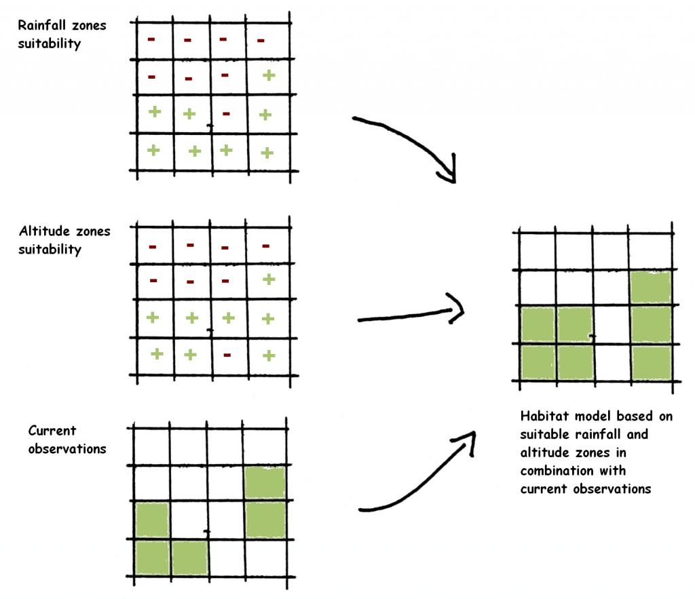
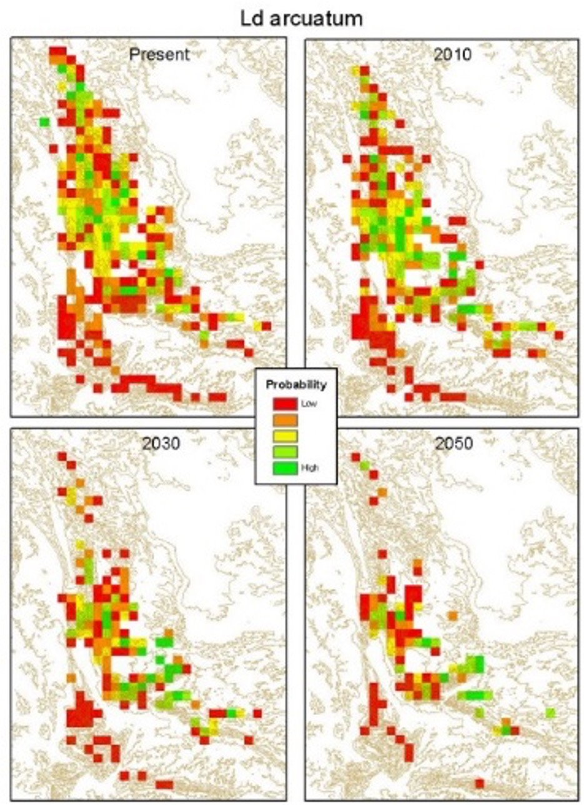
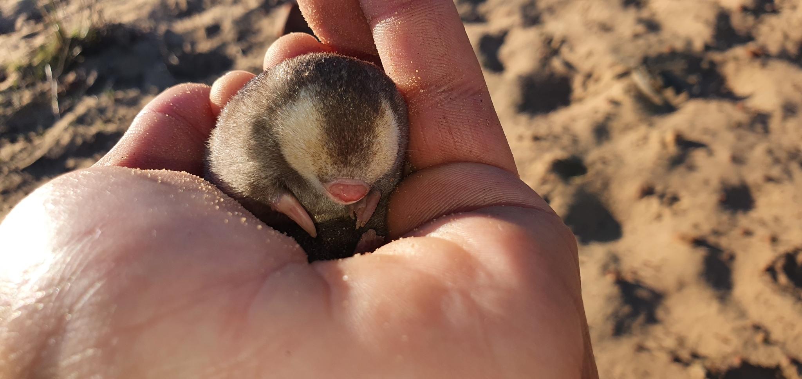
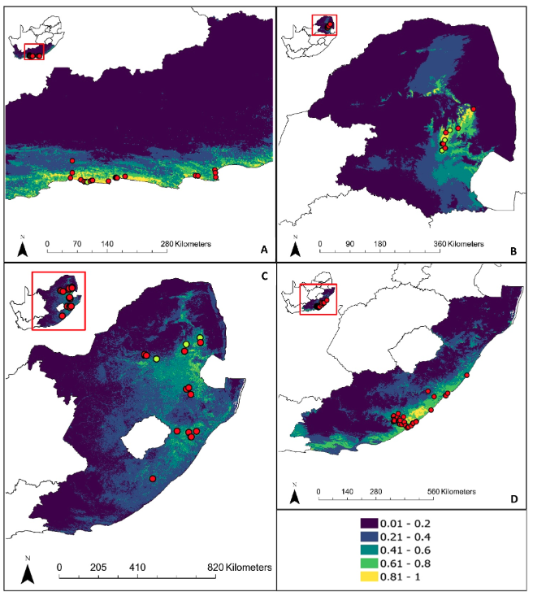
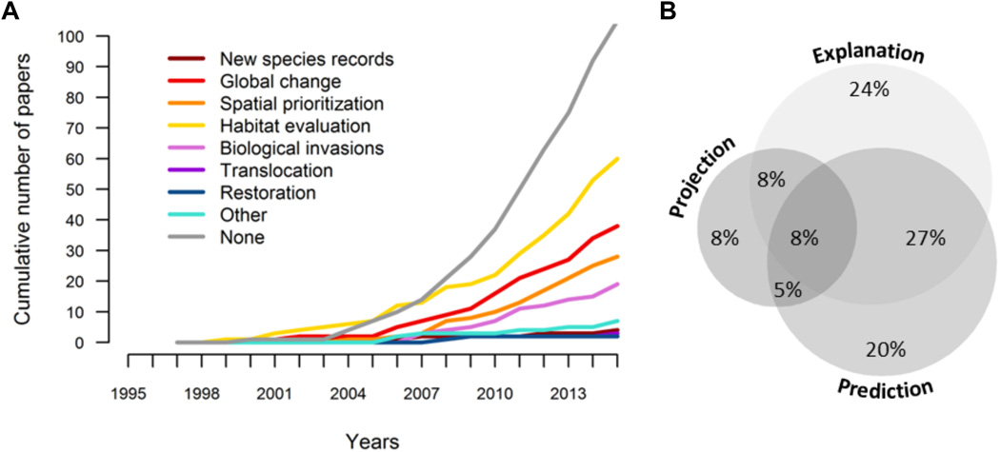
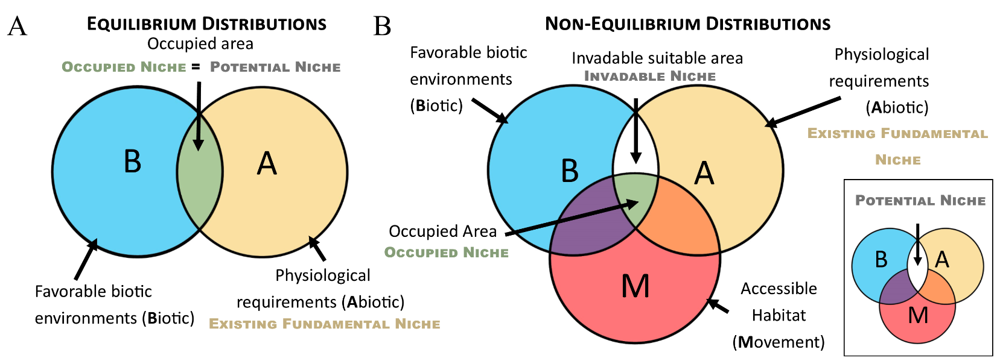
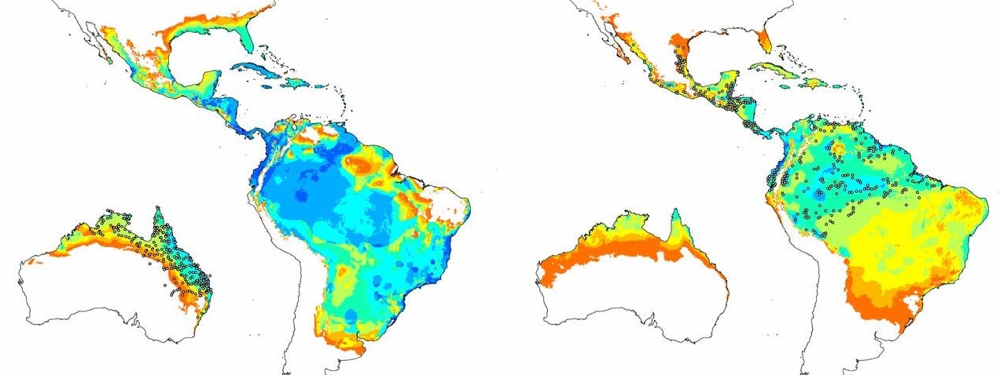

```{r setup, include=FALSE}
options(htmltools.dir.version = FALSE)
knitr::opts_chunk$set(
  fig.width=9, fig.height=3.5, fig.retina=3,
  out.width = "100%",
  cache = FALSE,
  echo = TRUE,
  message = FALSE, 
  warning = FALSE,
  hiline = TRUE
)

# library(RefManageR)
# BibOptions(check.entries = FALSE,
#            bib.style = "authoryear",
#            cite.style = "alphabetic",
#            style = "markdown",
#            hyperlink = FALSE,
#            dashed = FALSE)
# myBib <- ReadBib("bib/2_species.bib", check = FALSE)
```

```{r xaringan-themer, include=FALSE, warning=FALSE}
library(xaringanthemer)

# style_duo_accent(
#   primary_color = "#1381B0",
#   secondary_color = "#FF961C",
#   inverse_header_color = "#FFFFFF"
# )

style_mono_light(base_color = "#23395b")

#https://mycolor.space/?hex=%2323395B&sub=1 
#"Generic gradient" - #23395B #006287 #008E9D #00B897 #89DD81 #F9F871
#"Matching gradient" (reverse) - #23395B #494E77 #716292 #9C77AA #C88DBF #F5A3D0


library(knitr)
library(kableExtra)
```


```{r xaringan-tile-view, echo=FALSE}
# xaringanExtra::use_tile_view()
```


.pull-left[

### The Grinnellian Niche

<br>

Focused on the **abiotic** by exploring species _habitat_ based on the environmental requirements of organisms (temperature, rainfall, soils, etc).

Has largely become synonymous with species' geographic distributions.

]

.pull-right[
```{r echo = F, fig.align = 'center', out.width = '90%'}
knitr::include_graphics("images/grinnell_1917_map.png")
```

.footnote[[**Grinnell 1917**](http://dx.doi.org/10.2307/4072271)]
]

---

### The Hutchinsonian Niche

.pull-left[

<br>

G Evelyn Hutchinson proposed that _the niche is an n-dimensional hypervolume within which a species is able to maintain a viable population_ - [**Hutchinson 1957**](https://doi.org/10.1101%2Fsqb.1957.022.01.039)

This both aids our ability to think about the niche, but also allows us to explicitly **quantify the niche and niche space**.

]

.pull-right[
```{r echo = F, fig.align = 'center', out.width = '100%'}
knitr::include_graphics("images/treurnicht2020_hutchinson.jpg")
```

.footnote[Figure from [**Treurnicht et al. 2020**](http://dx.doi.org/10.1111/geb.13048)]
]

---

### Species Distribution Models (SDMs)

.pull-left[
Also referred to as Ecological Niche Models.

Utilise concepts proposed by Grinnell and Hutchinson to predict the geographic distribution (or range) of species.

SDMs propose that a species' distribution can be predicted based on the environmental conditions at localities where they have been observed.

The "prediction" is usually based on a statistical model that uses the known localities to estimate the probability of a species occurring across the given environmental space.
]

.pull-right[
```{r echo = F, fig.align = 'center', out.width = '100%'}

```

.footnote[Figure by [**Ragnvald**](https://commons.wikimedia.org/wiki/File:Predicting_habitats.png)]
]
---

### Species Distribution Models (SDMs)

```{r echo = F, fig.align = 'center', out.width = '70%'}
knitr::include_graphics("images/SDM_Elith_Leathwick.gif")
```

**Left:** mapped species occurrences plus spatial data for environmental variables across a particular area. 

**Centre:** a 3-dimentional volume showing species occurrences (black) in environmental space (grey). Occurrences are clearly non-random, allowing us to predict the probability of species occurrence at any point. 

**Right:** The predicted geographic distribution of the species, with dark regions representing a high probability of species occurrence and light areas a low probability.

.footnote[[**Elith and Leathwick. 2009**](http://dx.doi.org/10.1146/annurev.ecolsys.110308.120159)]

---

.pull-left[

### What are SDMs used for?

SDMs can predict the present distribution of a species if it is poorly known, but have also been used extensively to explore species' vulnerability to climate change by projecting their potential range under future climates, among other uses.

```{r echo = F, fig.align = 'center', out.width = '85%'}
knitr::include_graphics("images/ld_arcuatum.jpg")
```
.footnote[_Leucadendron arcuatum_ by [**Francois du Randt, iNaturalist**](https://www.inaturalist.org/observations/34417163)]
]

.pull-right[
```{r echo = F, fig.align = 'center', out.width = '75%'}

```

.footnote[Figure from [**The Protea Atlas Project**](https://www.proteaatlas.org.za/)]
]

---

.pull-left[

### What are SDMs used for?

Projected species distributions are used in many ways, including in conservation. Our National Screening Tool for environmental impact authorizations for developments includes modelled distributions of animals. Sites where sensitive species occur are required to do more thorough site inspection studies.

```{r echo = F, fig.align = 'center', out.width = '100%'}

```
.footnote[Cape Golden Mole, [**JP le Roux, iNaturalist**](https://www.inaturalist.org/observations/124849922)]
]

.pull-right[

```{r echo = F, fig.align = 'center', out.width = '80%'}

```

```{r echo = F, fig.align = 'center', out.width = '70%'}

```

.footnote[Golden mole distributions, [**Cowan et al. 2021**](http://dx.doi.org/10.1016/j.jnc.2021.126044)]
]

---

### What are SDMs used for?

.pull-left[

<br>

> _"A search of articles in peer-reviewed journals over the past 20 years found more than 6000 studies using or mentioning one of the most common classes of biodiversity modeling: species distribution models (SDMs)."_ 

[**Araújo et al. 2019**](http://dx.doi.org/10.1126/sciadv.aat4858)

<br>

They are clearly very useful in many fields!!!
]

.pull-right[
```{r echo = F, fig.align = 'center', out.width = '100%'}

```

A) type of biodiversity assessment accomplished with the trend in the numbers of studies shown over time

B) purpose of the model

.footnote[Figure from [**Araújo et al. 2019**](http://dx.doi.org/10.1126/sciadv.aat4858)]
]

---

class: center, middle

### Can you foresee any issues with SDMs?

---

### 1. Statistical models vs reality?

_Statistical models are necessarily simplifications of reality, and their predictions always come with some error (i.e. there is uncertainty)._

--

Sources of error in SDMs:

- the choice of variables included in the model 
    - have all of the most important determinants of a species distribution been included?
--
- biases in the occurrence data 
    - easy-to-access areas are usually overrepresented (e.g. near roads)
--
- quality of the occurrence and environmental data...
    - GIGO (garbage in - garbage out)
--
- the type and structure of the statistical model...
    - continuous (abundance), discrete (presence/absence), frequentist vs Bayesian, etc

--

Ideally one quantifies and reports the uncertainty for your model, but that is a topic for [**BIO3019S**](https://science.uct.ac.za/department-biological-sciences/undergraduate-study/third-year-courses)...

---

.pull-left[
### 2. SDMs and the realised niche?

Hutchinson made a distinction between the _fundamental_ versus the _realised_ niche - [**Hutchinson 1957**](https://doi.org/10.1101%2Fsqb.1957.022.01.039)

- The _**fundamental niche**_ is the range of conditions (biotic and abiotic) and resources in which a species could survive and reproduce if free of interference from other species.
- The _**realised niche**_ is a subset of the fundamental niche where a species actually occurs due to interference from other species (e.g. interspecific competition). 

<br>

Which do SDMs represent? Why is this a problem?

]

.pull-right[
```{r echo = F, fig.align = 'center', out.width = '100%'}
knitr::include_graphics("images/Fundamental vs Realised Niche_Escobar et al 2017.jpg")
```
Figure from [**Escobar et al 2017**](https://doi.org/10.3389/fvets.2017.00105)
]

--
.footnote[Answer: The realised niche, because the model is trained on where the species actually occurred. This can be a problem, because the model doesn't usually include spatial information about factors that determine the realised niche (competition, etc), so themodelled distribution is neither the fundamental nor the realised niche... ]

---

### 3. SDMs and the assumption of equilibrium?

```{r echo = F, fig.align = 'center', out.width = '70%'}

```

A) If a species has an equilibrium distribution, it is occupying all of the potentially suitable habitats in the world (the potential niche is completely filled). 

B) If a species is in a non-equilibrium distribution, its potential niche is not fully occupied due to inaccessible habitat due to dispersal (movement) constraints: distance or barriers to dispersal, inability to recolonise habitats affected by seasonality or long-term dynamism.

Species rarely occupy their full potential niche!

.pull-right[
.footnote[[**Brown and Carnaval 2019**](http://dx.doi.org/10.21425/F5FBG44158)]
]


---

### e.g.Invasive species and the assumption of equilibrium

```{r echo = F, fig.align = 'center', out.width = '70%'}

```

Reciprocal projections of models calibrated using data from either the invasive Australian (left) or native South American (right) occurrence of the cane toad, _Rhinella marina_, and projected into the other.

Invasive (left): predicted a broader latitudinal distribution in the native South American range than is observed

Native (right): failed to predict invasive populations in drier and cooler regions to the SE of Australia

- Why???

.pull-right[
.footnote[[**Tingley et al. 2014**](https://doi.org/10.1073/pnas.1405766111)]
]

---

### e.g. Invasive species and the assumption of equilibrium

Why the difference between the native and invasive realised niches of the cane toad? - [**Tingley et al. 2014**](https://doi.org/10.1073/pnas.1405766111)

.pull-left[
####Hypothesis 1

Dispersal limitation or absence of drier, cooler climate in South America?
]

.pull-right[
####Hypothesis 2

Difference in biotic interactions experienced on each continent?

]

---

### e.g. Invasive species and the assumption of equilibrium

Why the difference between the native and invasive realised niches of the cane toad? - [**Tingley et al. 2014**](https://doi.org/10.1073/pnas.1405766111)

.pull-left[
####Hypothesis 1

Dispersal limitation or absence of drier, cooler climate in South America?

>*"...our findings demonstrate that novel climates colonized by R. marina in Australia were available, but unoccupied, in the species’ native range...*
]

.pull-right[
####Hypothesis 2

Difference in biotic interactions experienced on each continent?

>*"One possibility is that the presence of a closely related species (R. schneideri) in cooler and drier regions of Southern Brazil may be preventing R. marina from colonizing suitable environments south of its present range.* 
*...these two species hybridize..., and even low rates of interspecific hybridization can enforce stable range boundaries"*
]

--

.footnote[**This example highlights that acknowledging the issues or assumptions of SDMs can be very useful for learning about the species and testing hypotheses. The issues are only a problem if not acknowledged and accounted for in some way!**]

---
### A simplified summary of how the approaches fit together

```{r echo = F, fig.align = 'center', out.width = '60%'}
knitr::include_graphics("images/Niches_Escobar and Craft.jpg")
```

.footnote[[**Escobar and Craft 2016**](https://doi.org/10.3389/fmicb.2016.01174)]

---

class: center, middle

### What else have we missed?

---

### The Hutchinsonian Niche

.pull-left[

<br>

G Evelyn Hutchinson proposed that _the niche is an n-dimensional hypervolume within which a species is **able to maintain a viable population**_ - [**Hutchinson 1957**](https://doi.org/10.1101%2Fsqb.1957.022.01.039)

<br>

Does the occurrence of a species at a locality mean it is able to maintain a viable population there...?

]

.pull-right[
```{r echo = F, fig.align = 'center', out.width = '100%'}
knitr::include_graphics("images/treurnicht2020_hutchinson.jpg")
```

.footnote[Figure from [**Treurnicht et al. 2020**](http://dx.doi.org/10.1111/geb.13048)]
]

---

class: center, middle

### What does maintaining a viable population even mean?

--

The topic of our next lecture...

---

class: middle

## Take-home

>*One of the most common applications of the concept of the niche is Species Distribution Modelling (also known as Ecological Niche Modelling).*

>*While SDMs can be very useful, they have many issues and assumptions that need to be taken into account.*

>*Acknowledging the issues or assumptions of SDMs can actually be very useful for learning about species and testing hypotheses.*

>_**Proviso:** There are many ways to build SDMs and it is a rapidly moving field. There are methods to address some of the issues I highlight, but they are less commonly used and since I am covering SDMs in one lecture for this course I'm not going to go there..._

---
class: center, middle

# Thanks!

Slides created via the R packages:

[**xaringan**](https://github.com/yihui/xaringan)<br>
[gadenbuie/xaringanthemer](https://github.com/gadenbuie/xaringanthemer)

The chakra comes from [remark.js](https://remarkjs.com), [**knitr**](http://yihui.name/knitr), and [R Markdown](https://rmarkdown.rstudio.com).
