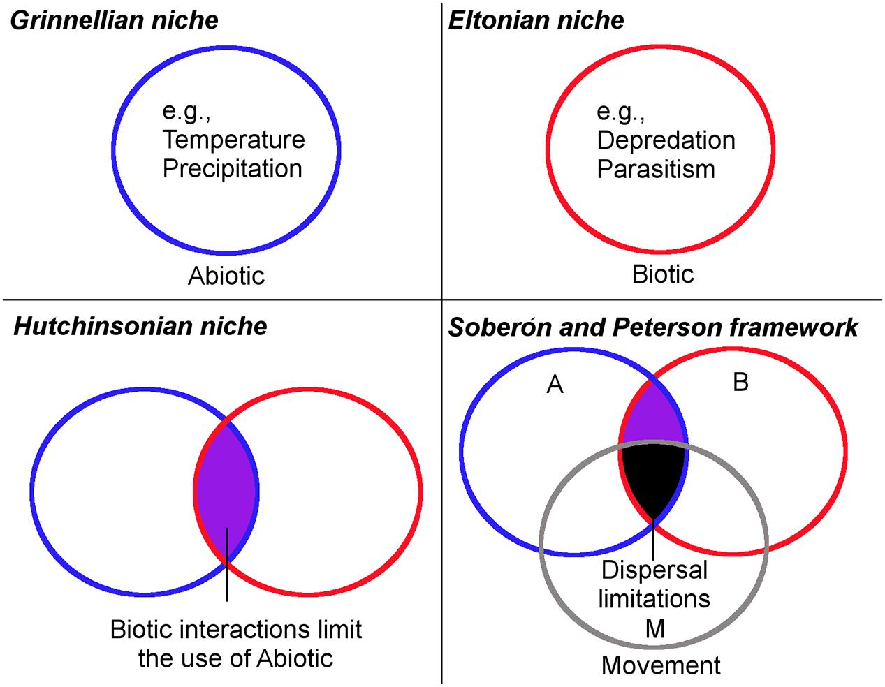

```{r setup, include=FALSE}
options(htmltools.dir.version = FALSE)
knitr::opts_chunk$set(
  fig.width=9, fig.height=3.5, fig.retina=3,
  out.width = "100%",
  cache = FALSE,
  echo = TRUE,
  message = FALSE, 
  warning = FALSE,
  hiline = TRUE
)

# library(RefManageR)
# BibOptions(check.entries = FALSE,
#            bib.style = "authoryear",
#            cite.style = "alphabetic",
#            style = "markdown",
#            hyperlink = FALSE,
#            dashed = FALSE)
# myBib <- ReadBib("bib/2_species.bib", check = FALSE)
```

```{r xaringan-themer, include=FALSE, warning=FALSE}
library(xaringanthemer)

# style_duo_accent(
#   primary_color = "#1381B0",
#   secondary_color = "#FF961C",
#   inverse_header_color = "#FFFFFF"
# )

style_mono_light(base_color = "#23395b")

#https://mycolor.space/?hex=%2323395B&sub=1 
#"Generic gradient" - #23395B #006287 #008E9D #00B897 #89DD81 #F9F871
#"Matching gradient" (reverse) - #23395B #494E77 #716292 #9C77AA #C88DBF #F5A3D0


library(knitr)
library(kableExtra)
```


```{r xaringan-tile-view, echo=FALSE}
# xaringanExtra::use_tile_view()
```

class: center, middle

> _""_

---

.pull-left[

### The Grinnellian Niche

<br>

Focused on the **abiotic** by exploring species _habitat_ based on the environmental requirements of organisms (temperature, rainfall, soils, etc).

Has largely become synonymous with species' geographic distributions.

]

.pull-right[
```{r echo = F, fig.align = 'center', out.width = '90%'}
knitr::include_graphics("images/grinnell_1917_map.png")
```

.footnote[[**Grinnell 1917**](http://dx.doi.org/10.2307/4072271)]
]

---

### The Hutchinsonian Niche

.pull-left[

G Evelyn Hutchinson proposed that _the niche is an n-dimensional hypervolume within which a species is able to maintain a viable population_ - [**Hutchinson 1957**](https://doi.org/10.1101%2Fsqb.1957.022.01.039)

This both aids our ability to think about the niche, but also allows us to explicitly **quantify the niche and niche space**.

]

.pull-right[
```{r echo = F, fig.align = 'center', out.width = '100%'}
knitr::include_graphics("images/treurnicht2020_hutchinson.jpg")
```

.footnote[Figure from [**Treurnicht et al. 2020**](http://dx.doi.org/10.1111/geb.13048)]
]

---

### Species Distribution Models (SDMs)

Also referred to as Ecological Niche Models


---

---

---

### SDMs and the Hutchinsonian Niche?

.pull-left[

Hutchinson made a distinction between the _fundamental_ versus the _realised_ niche - [**Hutchinson 1957**](https://doi.org/10.1101%2Fsqb.1957.022.01.039)

- The _**fundamental niche**_ is the range of conditions (biotic and abiotic) and resources in which a species could survive and reproduce if free of interference from other species.
- The _**realised niche**_ is a subset of the fundamental niche where a species actually occurs due to interference from other species (e.g. interspecific competition). 

<br>

Which do SDMs represent?

]

.pull-right[
```{r echo = F, fig.align = 'center', out.width = '100%'}
knitr::include_graphics("images/Fundamental vs Realised Niche_Escobar et al 2017.jpg")
```

.footnote[Figure from [**Escobar et al 2017**](https://doi.org/10.3389/fvets.2017.00105)]
]

---

### A simplified summary of how the approaches fit together

```{r echo = F, fig.align = 'center', out.width = '60%'}

```

.footnote[[**Escobar and Craft 2016**](https://doi.org/10.3389/fmicb.2016.01174)]

---
class: middle

## Take-home

>**

>**

>**

---

layout: false

## This module from here...

1. Intro
2. Different definitions of the niche
3.

---
class: center, middle

# Thanks!

Slides created via the R packages:

[**xaringan**](https://github.com/yihui/xaringan)<br>
[gadenbuie/xaringanthemer](https://github.com/gadenbuie/xaringanthemer)

The chakra comes from [remark.js](https://remarkjs.com), [**knitr**](http://yihui.name/knitr), and [R Markdown](https://rmarkdown.rstudio.com).
