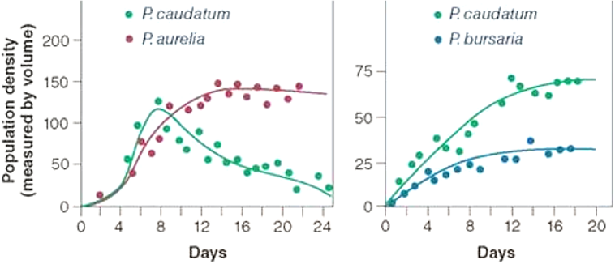
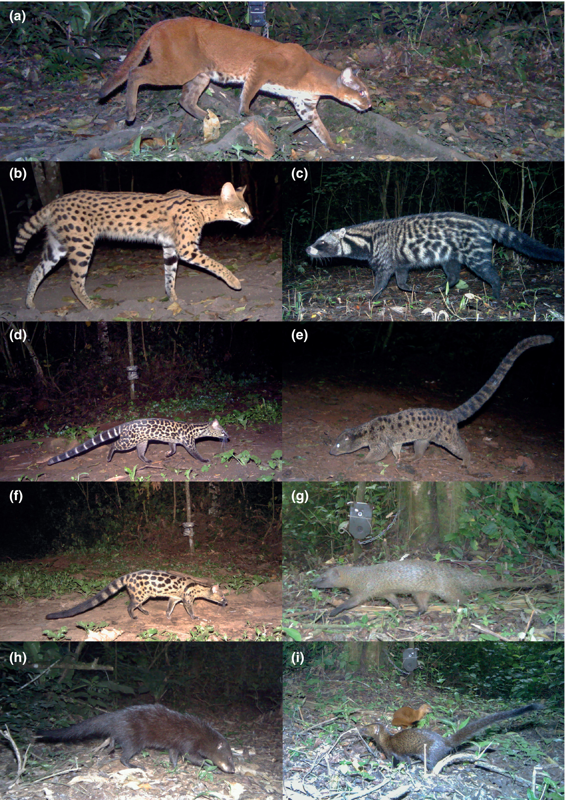
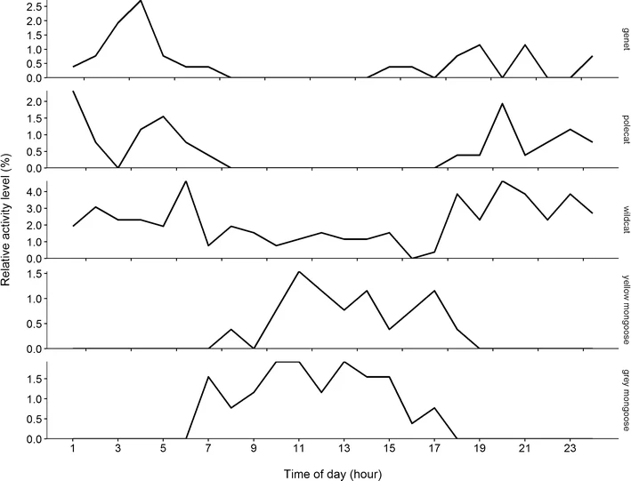

```{r setup, include=FALSE}
options(htmltools.dir.version = FALSE)
knitr::opts_chunk$set(
  fig.width=9, fig.height=3.5, fig.retina=3,
  out.width = "100%",
  cache = FALSE,
  echo = TRUE,
  message = FALSE, 
  warning = FALSE,
  hiline = TRUE
)

# library(RefManageR)
# BibOptions(check.entries = FALSE,
#            bib.style = "authoryear",
#            cite.style = "alphabetic",
#            style = "markdown",
#            hyperlink = FALSE,
#            dashed = FALSE)
# myBib <- ReadBib("bib/2_species.bib", check = FALSE)
```

```{r xaringan-themer, include=FALSE, warning=FALSE}
library(xaringanthemer)

# style_duo_accent(
#   primary_color = "#1381B0",
#   secondary_color = "#FF961C",
#   inverse_header_color = "#FFFFFF"
# )

style_mono_light(base_color = "#23395b")

#https://mycolor.space/?hex=%2323395B&sub=1 
#"Generic gradient" - #23395B #006287 #008E9D #00B897 #89DD81 #F9F871
#"Matching gradient" (reverse) - #23395B #494E77 #716292 #9C77AA #C88DBF #F5A3D0


library(knitr)
library(kableExtra)
```


```{r xaringan-tile-view, echo=FALSE}
# xaringanExtra::use_tile_view()
```

.pull-left[

### Exponential growth

$dN/dt = rN$

Population growth rate, $r$, doesn't change with population size

- i.e. no competition

```{r, echo = F, out.width="80%", fig.height = 6}
library(tidyverse)

data.frame(N = c(2,4,8,16,32), 
           t = c(0,1,2,3,4)) %>%
  ggplot(aes(x = t, y = N)) +
  geom_line() +
  geom_point(size = 5) +
  ylim(0,35) +
  xlim(0,5) +
  ylab("Number of Individuals (N)") +
  xlab("Time or generations (t)") +
  theme_bw() +
  theme(axis.text=element_text(size=20),
        axis.title=element_text(size=24,face="bold"))

```

]

.pull-right[

### Logistic growth

$dN/dt = rN (K – N)/K$

Population growth rate, $r$, gets small as the population approaches carrying capacity, $K$

- i.e. _**intraspecific competition!**_

```{r, echo = F, out.width="80%", fig.height = 6}
library(tidyverse)

data.frame(N = c(2,4,8,16,24,28,30,30,30), 
           t = c(0,1,2,3,4,5,6,7,8)) %>%
  ggplot(aes(x = t, y = N)) +
  geom_line() +
  geom_point(size = 5) +
  ylim(0,35) +
  xlim(0,10) +
  ylab("Number of Individuals (N)") +
  xlab("Time or generations (t)") +
  theme_bw() +
  theme(axis.text=element_text(size=20),
        axis.title=element_text(size=24,face="bold")) +
  geom_hline(yintercept = 30, colour = "blue", linetype = 2) +
  geom_text(aes(x = 0, y = 32, label = "K"), colour = "blue", size = 10)

```
]

--

.footnote[_But what about int**er**specific competition? (i.e. between species)_]

---

.pull-left[

### Experiments with _Paramecium_

Georgyi Frantsevitch Gause's microcosm experiments with species of the unicellular cilliate genus _Paramecium_ taught us a lot about intra- and interspecific competition.

<br>

Microcosms are artificial, simplified ecosystems that are used to simulate the behaviour of natural ecosystems under controlled conditions.

<br>

Gause's microcosms were test tubes supplied with an oatmeal medium, which promotes the growth of bacteria in the upper, oxygenated part of the test tube, and yeast in the lower, de-oxygenated part.

]

.pull-right[

<br>

```{r echo = F, fig.align = 'center', out.width = '100%'}
knitr::include_graphics("images/Paramecium_aurelia.jpg")
```

.footnote[image: [**Wikipedia**](https://en.wikipedia.org/wiki/Paramecium#/media/File:Paramecium.jpg)]

]

---

### Experiments with _Paramecium_ spp

_Paramecium_ species cultured separately demonstrated logistic growth (i.e. **_intraspecific_** competition).

```{r echo = F, fig.align = 'center', out.width = '60%'}
knitr::include_graphics("images/paramecium_separate.png")
```

.footnote[[**Gause 1934**](http://dx.doi.org/10.1126/science.79.2036.16.b)]
--

Here _Paramecium_ species cultured together, demonstrate **_interspecific_** competition...

```{r echo = F, fig.align = 'center', out.width = '40%'}

```

---

### Experiments with _Paramecium_ spp

Why the different outcomes between the species mixes?

.pull-left[
#### Observation

```{r echo = F, fig.align = 'center', out.width = '90%'}

```

In the panel on the **left**, growth of both species is suppressed, but _P. caudatum_ actually goes extinct!

The pair on the **right** appear to be able to coexist, albeit at lower densities than when grown alone.

]

--

.pull-right[

#### Explanation

**Left:** _P. caudatum_ and _P. aurelia_ both feed on bacteria, but _P. aurelia_ grows 6 times faster than _P. caudatum_, resulting in **competitive exclusion**.

**Right:** While _P. caudatum_ out-competes _P. bursaria_ for bacteria, _P. bursaria_ can also survive on yeast in the lower, less oxygenated part of the test tube, because it contains tiny green algae that provide it with oxygen. We call this **resource (or niche) partitioning**.

Most competitive interactions result in one of these two outcomes.

.footnote[[**Gause 1934**](http://dx.doi.org/10.1126/science.79.2036.16.b)]
]

---

.pull-left[
### Niche/Resource partitioning

There are many examples in nature of species that are able to coexist in a community, because they partition their resources.

Many of these examples are from birds, such as [**Robert MacArthur's 1958 study**](http://dx.doi.org/10.2307/1931600) of warblers in the genus _Dendroica_ in the conifer forests of northeastern USA. Here he concluded:

>_"There are differences of feeding position, behavior, and nesting date which reduce competition."_

These are niche differences, but by which definition of the niche?

]

.pull-right[
```{r echo = F, fig.align = 'center', out.width = '75%'}
knitr::include_graphics("images/bird_apartment.jpg")
```

.footnote[Atlas of World Wildlife 1973 (not MacArthur's warblers...)]
]

---

.pull-left[
### Niche/Resource partitioning

There are many examples in nature of species that are able to coexist in a community, because they partition their resources.

Many of these examples are from birds, such as [**Robert MacArthur's 1958 study**](http://dx.doi.org/10.2307/1931600) of warblers in the genus _Dendroica_ in the conifer forests of northeastern USA. Here he concluded:

>_"There are differences of feeding position, behavior, and nesting date which reduce competition."_

These are niche differences, but by which definition of the niche?

> The Eltonian Niche ( $\because$ focus is resources)

One can also observe niche partitioning (or niche shifts) in the Grinnellian niche.
]

.pull-right[
```{r echo = F, fig.align = 'center', out.width = '75%'}
knitr::include_graphics("images/bird_apartment.jpg")
```

.footnote[Atlas of World Wildlife 1973 (not MacArthur's warblers...)]
]
---

.pull-left[
### Character Displacement

A process by which niche partitioning can occur.

_"the divergence shown when two partly allopatric species of comparable niche requirements become sympatric in part of their range"_ - [**Hutchinson 1959**](https://www.jstor.org/stable/2458768)

_"Two closely related species have overlapping ranges. In the parts of the ranges where one species occurs alone, the populations of that species are similar to the other species and  may even be very difficult to distinguish from it. In the area of overlap, where the two species occur together, the populations are more divergent and easily distinguished, i.e., they "displace" one another in one or more characters. The characters involved can be morphological, ecological, behavioral, or physiological; they are assumed to be genetically based."_ - [**Brown and Hutchinson 1956**](http://dx.doi.org/10.2307/2411924)

]

.pull-right[
```{r echo = F, fig.align = 'center', out.width = '75%'}
knitr::include_graphics("images/Brown_Hutchinson_1956_F2.png")
```

Size and shape of the bill and facial stripe in _Sitta neumayer_ and _S. tephronota_. A and B are collections of the respective species where they occur alone. C and D were collected where they co-occur.

]

---

.pull-left[

### Character Displacement

A process by which niche partitioning can occur.

```{r echo = F, fig.align = 'center', out.width = '75%'}

```

[**Britton et al. 2010**](http://dx.doi.org/10.1016/j.ympev.2014.03.024) studied the sedge species _Tetraria triangularis_ across its range.

]

.pull-right[

<br>

```{r echo = F, fig.align = 'center', out.width = '100%'}

```

They found that while populations on different peaks had been genetically isolated for millions of years and had evolved into different haplotypes, they were nearly morphologically and ecologically identical.

Where secondary dispersal resulted in haplotypes co-occurring, they showed morphological and habitat divergence - i.e. they do not interbreed and are separate cryptic species.

]

---

### Competitive Exclusion

The **competitive exclusion principle** is often attributed to Gause, and sometimes called Gause's law, but there were earlier observations by Grinnell, Darwin and others, e.g.

>_Two species of approximately the same food habits are not likely to remain long evenly balanced in numbers in the same region. One will crowd out the other._ - [**Grinnell 1904**](https://doi.org/10.2307/4070199)

--

<br>

Unequivocal examples of competitive exclusion are rare, and can only really be demonstrated with experiments such as Gause's. These experiments are near-impossible for organisms with longer lifespans.

--

<br>

Why would we need experiments? Why would field observations not be good enough?

---

### Competitive exclusion and the Ghost of Competition Past

```{r echo = F, fig.align = 'center', out.width = '65%'}
knitr::include_graphics("images/Connell_1980_Ghost.png")
```

In nature, while interspecific competition may be common, where competitive exclusion has occurred it cannot be observed as only one competitor would remain.

- i.e. the loser is driven to extinction or there is spatial segregation of competitors (i.e. the species do not coexist locally, but occur in sympatry)

While similar species occurring in sympatry may suggest that competitive exclusion has occurred, there are other potential explanations like dispersal limitation or minor niche differences that prevents them accessing the same physical space.

The criteria required to demonstrate that competitive exclusion has occurred, or that species have coevolved due to competition (e.g. resource partitioning or character displacement) are onerous! - see [**Connell 1980**](http://dx.doi.org/10.2307/3544421).

---

class: center, middle

### How can we determine if/when species can coexist?

---

class: center, middle

### One criterion is that both species need to maintain viable populations.

---

class: center, middle

### How do we quantify the effect of interspecific competition on population growth? 

---

.pull-left[

### Exponential growth

$dN/dt = rN$

Population growth rate, $r$, doesn't change with population size

- i.e. no competition

```{r, echo = F, out.width="80%", fig.height = 6}
library(tidyverse)

data.frame(N = c(2,4,8,16,32), 
           t = c(0,1,2,3,4)) %>%
  ggplot(aes(x = t, y = N)) +
  geom_line() +
  geom_point(size = 5) +
  ylim(0,35) +
  xlim(0,5) +
  ylab("Number of Individuals (N)") +
  xlab("Time or generations (t)") +
  theme_bw() +
  theme(axis.text=element_text(size=20),
        axis.title=element_text(size=24,face="bold"))

```

]

.pull-right[

### Logistic growth

$dN/dt = rN (K – N)/K$

Population growth rate, $r$, gets small as the population approaches carrying capacity, $K$

- i.e. _**intraspecific competition!**_

```{r, echo = F, out.width="80%", fig.height = 6}
library(tidyverse)

data.frame(N = c(2,4,8,16,24,28,30,30,30), 
           t = c(0,1,2,3,4,5,6,7,8)) %>%
  ggplot(aes(x = t, y = N)) +
  geom_line() +
  geom_point(size = 5) +
  ylim(0,35) +
  xlim(0,10) +
  ylab("Number of Individuals (N)") +
  xlab("Time or generations (t)") +
  theme_bw() +
  theme(axis.text=element_text(size=20),
        axis.title=element_text(size=24,face="bold")) +
  geom_hline(yintercept = 30, colour = "blue", linetype = 2) +
  geom_text(aes(x = 0, y = 32, label = "K"), colour = "blue", size = 10)

```
]

--

.footnote[_But what about int**er**specific competition? (i.e. between species)_]

---

### Population growth with intra- and interspecific competition

.pull-left[
Assuming we have two species, 1 and 2. The population growth of species 1 can be modelled as:

<br>

$dN_1/dt = r_1 N_1(K_1 – {N_1 \mathbf{+ \alpha_{12} N_2}})/K_1$

<br>

This is the logistic curve with numeric subscripts to indicate the species (1 & 2) and a new term, $\mathbf{\alpha_{12} N_2}$, to account for the competitive effect of species 2 on species 1. 

- $N_2$ gives the population size of species 2
- $\alpha_{12}$ is the per-capita competitive effect of species 2 on species 1. It is called **the competition coefficient**.
]

--

.pull-right[

**What do the values of** $\alpha_{12}$ **mean?**

It is expressed relative to intraspecific competition (i.e. the effect of species 1 on species 1), so:

- if $= 1$ then the effect of species 2 on species 1 is the same as the effect of species 1 on species 1
  - the equation would essentially reduce to the logistic growth curve and you could treat all individuals as one species
- if $> 1$ the effect of species 2 on species 1 is greater
- if $< 1$ the effect of species 2 on species 1 is less
- if $= 0$ there is no effect of species 2 on species 1 and the new term effectively disappears (= 0)   - i.e. the presence of individuals of species 2 is irrelevant for species 1
]

---

### Population growth with intra- and interspecific competition

The population growth of species 1 can be modelled as:

<br>

$dN_1/dt = r_1 N_1(K_1 – {N_1 + \alpha_{12} N_2})/K_1$

<br>

Similarly, the population growth of species 2 can be modelled as:   

<br>

$dN_2/dt = r_2 N_2(K_2 – {N_2 + \alpha_{21} N_1})/K_2$

<br>

These are **the Lotka-Volterra competition equations**, independently developed by Alfred Lotka and Vito Volterra in the 1920s.

---

### What is carrying capacity ( $K$ ) when multiple species are present?

.pull-left[

$K$ = the maximum population that available resources can support, and growth drops to zero.

$K$ for each species is now constrained not only by density-dependent intraspecific competition, but also by the second species drawing from the same resource pool (interspecific competition)...
]

.pull-right[
]

---

### What is carrying capacity ( $K$ ) when multiple species are present?

.pull-left[

$K$ = the maximum population that available resources can support, and growth drops to zero.

$K$ for each species is now constrained not only by density-dependent intraspecific competition, but also by the second species drawing from the same resource pool (interspecific competition)...

Instead of being a single number, $K$ is now a linear function expressed in terms of the population sizes of the two species, $N_1$ and $N_2$.
  - The relationship is negative, because as one increases the other must decrease...
  - Above the line, resources are limiting and populations decline. Below the line, resources are available for populations to grow.
]

.pull-right[

```{r echo = F, fig.align = 'center', out.width = '80%'}
knitr::include_graphics("images/ZNGI_0.png")
```

This is termed a zero net growth isocline (ZNGI) and you derive separate ones for each species.
]

---

### What is carrying capacity ( $K$ ) when multiple species are present?

.pull-left[

Focusing on species 1, popln growth will drop to zero:

**Firstly**, when $N_2$ is negligible but $N_1 = K_1$ (i.e. species 1 reaches its carrying capacity). This is represented by the red dot. 

]

.pull-right[

```{r echo = F, fig.align = 'center', out.width = '80%'}
knitr::include_graphics("images/ZNGI_2.png")
```

The zero net growth isocline (ZNGI) of species 1
]

---

### What is carrying capacity ( $K$ ) when multiple species are present?

.pull-left[

Focusing on species 1, popln growth will drop to zero:

**Firstly**, when $N_2$ is negligible but $N_1 = K_1$ (i.e. species 1 reaches its carrying capacity). This is represented by the red dot. 

**Secondly**, when $N_1$ is negligible but $N_2$ is so large that species 2 is using up all the resources. This is represented by the blue dot.

- Notice that the size of $N_2$ at this point depends on $\alpha_{12}$. Population growth declines to 0 (the ZNGI) at lower $N_2$ when $\alpha_{12}$ is large (species 2 has a strong competitive effect).

]

.pull-right[

```{r echo = F, fig.align = 'center', out.width = '80%'}
knitr::include_graphics("images/ZNGI_2.png")
```

The zero net growth isocline (ZNGI) of species 1
]

---

### What is carrying capacity ( $K$ ) when multiple species are present?

.pull-left[

Focusing on species 1, popln growth will drop to zero:

**Firstly**, when $N_2$ is negligible but $N_1 = K_1$ (i.e. species 1 reaches its carrying capacity). This is represented by the red dot. 

**Secondly**, when $N_1$ is negligible but $N_2$ is so large that species 2 is using up all the resources. This is represented by the blue dot.

- Notice that the size of $N_2$ at this point depends on $\alpha_{12}$. Population growth declines to 0 (the ZNGI) at lower $N_2$ when $\alpha_{12}$ is large (species 2 has a strong competitive effect).

**Lastly**, there is a series of intermediate combinations of $N_1$ and $N_2$ that also result in complete use of the available resources and halt population growth. These are represented by the dashed line.
]

.pull-right[

```{r echo = F, fig.align = 'center', out.width = '80%'}
knitr::include_graphics("images/ZNGI_2.png")
```

The zero net growth isocline (ZNGI) of species 1
]

---

### What is carrying capacity ( $K$ ) when multiple species are present?

.pull-left[

Or mathematically if you prefer?

For population growth of species 1 to drop to zero:

$dN_1/dt = r_1 N_1(K_1 – {N_1 + \alpha_{12} N_2})/K_1 = 0$

This can occur when:

- Two trivial scenarios not worth mentioning, $(r = 0$ or $N_1 = 0)$
- $N_2$ is close to 0 and $N_1 = K_1$ (the red dot)
- $N_1$ is close to 0 and $N_2 = K_1/\alpha_{12}$ (the blue dot)
- $N_1 = K_1 - \alpha_{12} N_2$ (many combinations represented by the dashed line)

Together this gives the zero net growth isocline (ZNGI) of species 1.
]

.pull-right[

```{r echo = F, fig.align = 'center', out.width = '80%'}
knitr::include_graphics("images/ZNGI_2.png")
```

The zero net growth isocline (ZNGI) of species 1
]

---

### ZNGI's for two species

```{r echo = F, fig.align = 'center', out.width = '55%'}
knitr::include_graphics("images/ZNGI_B1.png")
```

---

### ZNGI's and the coexistence of species

.left-column[

In (a) and (b) species 1 and species 2 are stronger competitors respectively and competitive exclusion occurs

(c) both species' interspecific competitive effects > their intraspecific competitive effects

(d) both species' interspecific competitive effects < their intraspecific competitive effects

]

.right-column[
```{r echo = F, fig.align = 'center', out.width = '75%'}
knitr::include_graphics("images/ZNGI_B2.png")
```
.footnote[Brown = Species 1; Black = Species 2]
]

---

### ZNGI's and the coexistence of species

.left-column[

Only (d) shows stable coexistence!

_Intraspecific competition must be greater than interspecific competition!_

This conveys a **Rare Species Advantage**, allowing the species with lower population numbers to grow faster and avoid extinction.

]

.right-column[
```{r echo = F, fig.align = 'center', out.width = '75%'}
knitr::include_graphics("images/ZNGI_B2.png")
```
.footnote[Brown = Species 1; Black = Species 2]
]
---

### Limiting similarity and species coexistence

.pull-left[
```{r echo = F, fig.align = 'center', out.width = '90%'}
knitr::include_graphics("images/MacArthur_Levins_1967_F1.png")
```

```{r echo = F, fig.align = 'center', out.width = '100%'}
knitr::include_graphics("images/MacArthur_Levins_1967.png")
```

.footnote[[**MacArthur and Levins 1967**](https://doi.org/10.1086/282505)]
]

.pull-right[

The **Rare Species Advantage** occurs when intraspecific competition is stronger than interspecific competition.

> _"a community can retain all $n$ species if any one of them can increase when rare"_

Their work suggested that this can only happen when species show some degree of niche differentiation. 

It also suggested that the number of species that can be accommodated by a particular environment is proportional to the range of conditions or resources available divided by the niche breadth of the species.

- i.e. the size of the pie and how finely you slice it

]


---

### Examples?

.pull-left[
```{r echo = F, fig.align = 'center', out.width = '60%'}

```
]

.pull-right[
```{r echo = F, fig.align = 'center', out.width = '100%'}

```

[**de Satgé et al. 2017**](http://dx.doi.org/10.1007/s00442-017-3916-2)
]

---

class: middle

## Take-home

>*Gause's microcosm experiments on _Paramecium_ taught us much about competition.*

>*The main outcomes of competition are competitive exclusion or niche/resource partitioning. The latter often occurring via character displacement.*

>*Studying the outcomes of competition is difficult, because the interactions are typically over and we only see the "ghost of competition past".*

>*The Lotka-Volterra competition equations allow us to estimate the zero net growth isocline (ZNGI) for each species, which allows us to predict the outcome of interspecific competition.*

>*For stable coexistence of species to occur, intraspecific competition must be greater than interspecific competition, because this gives rare species an advantage and allows them to recover.*

>*MacArthur and Levins suggested that there is a limit to the similarity of coexisting species, such that* 
  - *(a) rare species advantage only happens where species show some degree of niche differentiation, and*
  - *(b) the number of species that can coexist in a particular environment is proportional to the range of conditions or resources available divided by the niche breadth of the species.*

Check out this [**Crash Course** in community ecology](https://www.youtube.com/watch?v=GxE1SSqbSn4) for a rapid recap of the basics.

---
class: center, middle

# Thanks!

Slides created via the R packages:

[**xaringan**](https://github.com/yihui/xaringan)<br>
[gadenbuie/xaringanthemer](https://github.com/gadenbuie/xaringanthemer)

The chakra comes from [remark.js](https://remarkjs.com), [**knitr**](http://yihui.name/knitr), and [R Markdown](https://rmarkdown.rstudio.com).
