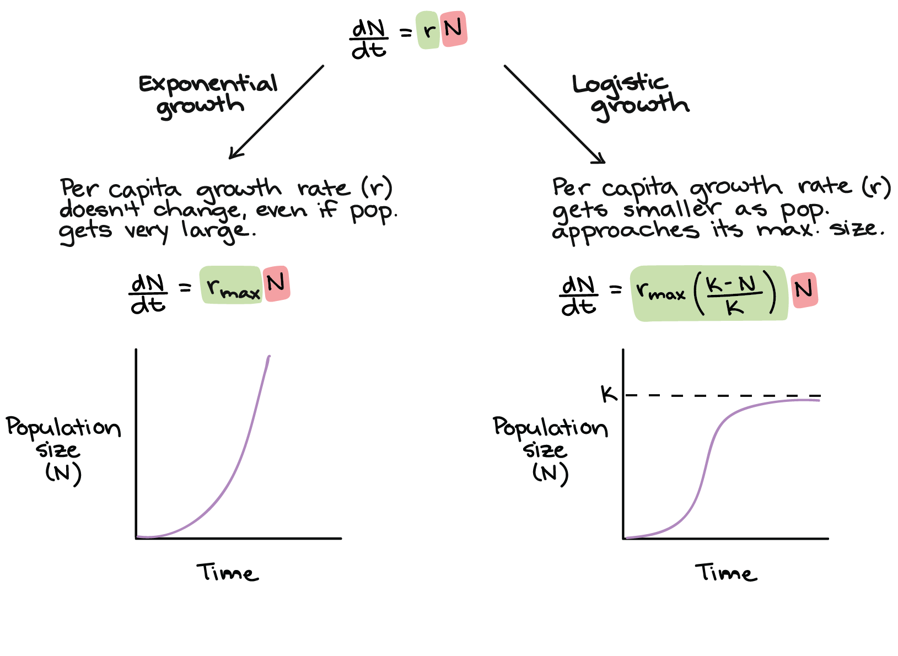
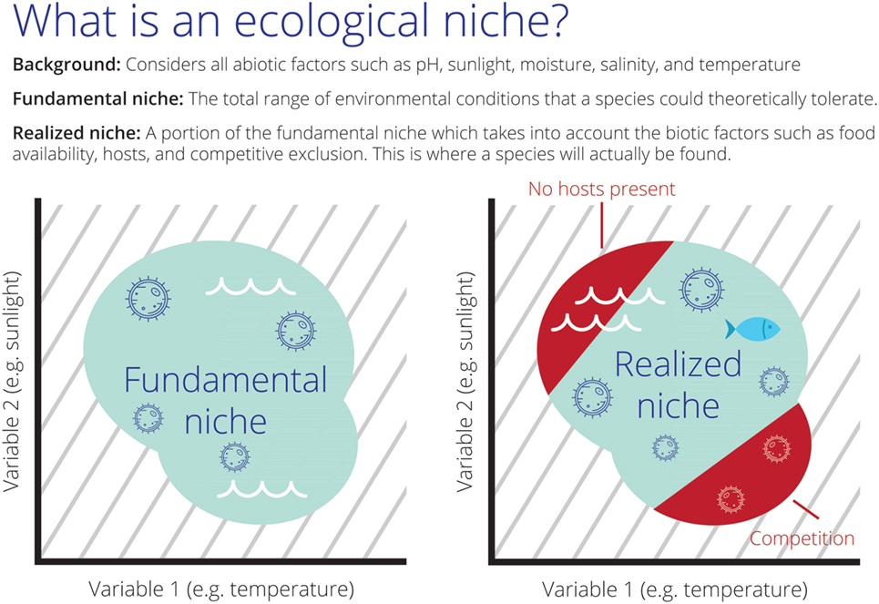

```{r setup, include=FALSE}
options(htmltools.dir.version = FALSE)
knitr::opts_chunk$set(
  fig.width=9, fig.height=3.5, fig.retina=3,
  out.width = "100%",
  cache = FALSE,
  echo = TRUE,
  message = FALSE, 
  warning = FALSE,
  hiline = TRUE
)

# library(RefManageR)
# BibOptions(check.entries = FALSE,
#            bib.style = "authoryear",
#            cite.style = "alphabetic",
#            style = "markdown",
#            hyperlink = FALSE,
#            dashed = FALSE)
# myBib <- ReadBib("bib/2_species.bib", check = FALSE)
```

```{r xaringan-themer, include=FALSE, warning=FALSE}
library(xaringanthemer)

# style_duo_accent(
#   primary_color = "#1381B0",
#   secondary_color = "#FF961C",
#   inverse_header_color = "#FFFFFF"
# )

style_mono_light(base_color = "#23395b")

#https://mycolor.space/?hex=%2323395B&sub=1 
#"Generic gradient" - #23395B #006287 #008E9D #00B897 #89DD81 #F9F871
#"Matching gradient" (reverse) - #23395B #494E77 #716292 #9C77AA #C88DBF #F5A3D0


library(knitr)
library(kableExtra)
```


```{r xaringan-tile-view, echo=FALSE}
# xaringanExtra::use_tile_view()
```

### The Hutchinsonian Niche

.pull-left[

<br>

G Evelyn Hutchinson proposed that _the niche is an n-dimensional hypervolume within which a species is **able to maintain a viable population**_ - [**Hutchinson 1957**](https://doi.org/10.1101%2Fsqb.1957.022.01.039)

<br>

Does the occurrence of a species at a locality mean it is able to maintain a viable population there...?

]

.pull-right[
```{r echo = F, fig.align = 'center', out.width = '100%'}
knitr::include_graphics("images/treurnicht2020_hutchinson.jpg")
```

.footnote[Figure from [**Treurnicht et al. 2020**](http://dx.doi.org/10.1111/geb.13048)]
]

---

class: center, middle

### What does maintaining a viable population even mean?

---

### Population growth curve

.pull-left[
Consider growth of a population, starting with 2 individuals at t = 0. 
- Assume a per-capita reproductive rate, $r$ = 2

]

.pull-right[
```{r, echo = F, out.height="100%", out.width="100%", fig.height = 8}
library(tidyverse)

data.frame(N = c(2), 
           t = c(0)) %>%
  ggplot(aes(x = t, y = N)) +
  geom_line() +
  geom_point(size = 5) +
  ylim(0,35) +
  xlim(0,5) +
  ylab("Number of Individuals (N)") +
  xlab("Time or generations (t)") +
  theme_bw() +
  theme(axis.text=element_text(size=20),
        axis.title=element_text(size=24,face="bold"))

```
]

---

### Population growth curve

.pull-left[
Consider growth of a population, starting with 2 individuals at t = 0. 
- Assume a per-capita reproductive rate, $r$ = 2

]

.pull-right[
```{r, echo = F, out.height="100%", out.width="100%", fig.height = 8}
library(tidyverse)

data.frame(N = c(2,4), 
           t = c(0,1)) %>%
  ggplot(aes(x = t, y = N)) +
  geom_line() +
  geom_point(size = 5) +
  ylim(0,35) +
  xlim(0,5) +
  ylab("Number of Individuals (N)") +
  xlab("Time or generations (t)") +
  theme_bw() +
  theme(axis.text=element_text(size=20),
        axis.title=element_text(size=24,face="bold"))

```
]

---

### Population growth curve

.pull-left[
Consider growth of a population, starting with 2 individuals at t = 0. 
- Assume a per-capita reproductive rate, $r$ = 2

]

.pull-right[
```{r, echo = F, out.height="100%", out.width="100%", fig.height = 8}
library(tidyverse)

data.frame(N = c(2,4,8), 
           t = c(0,1,2)) %>%
  ggplot(aes(x = t, y = N)) +
  geom_line() +
  geom_point(size = 5) +
  ylim(0,35) +
  xlim(0,5) +
  ylab("Number of Individuals (N)") +
  xlab("Time or generations (t)") +
  theme_bw() +
  theme(axis.text=element_text(size=20),
        axis.title=element_text(size=24,face="bold"))

```
]

---

### Population growth curve

.pull-left[
Consider growth of a population, starting with 2 individuals at t = 0. 
- Assume a per-capita reproductive rate, $r$ = 2

<br>

_Growth is exponential!_

]

.pull-right[
```{r, echo = F, out.height="100%", out.width="100%", fig.height = 8}
library(tidyverse)

data.frame(N = c(2,4,8,16,32), 
           t = c(0,1,2,3,4)) %>%
  ggplot(aes(x = t, y = N)) +
  geom_line() +
  geom_point(size = 5) +
  ylim(0,35) +
  xlim(0,5) +
  ylab("Number of Individuals (N)") +
  xlab("Time or generations (t)") +
  theme_bw() +
  theme(axis.text=element_text(size=20),
        axis.title=element_text(size=24,face="bold"))

```
]

---

### Population growth curve

.pull-left[
Consider growth of a population, starting with 2 individuals at t = 0. 
- Assume a per-capita reproductive rate, $r$ = 2

<br>

_Growth is exponential!_

Using calculus, we can express growth as an instantaneous rate as $dN/dt$, the rate of change in number of organisms at a particular instant in time.

Since our example is an exponential function, the slope of this curve is given by  $dN/dt = rN$

]

.pull-right[
```{r, echo = F, out.height="100%", out.width="100%", fig.height = 8}
library(tidyverse)

data.frame(N = c(2,4,8,16,32), 
           t = c(0,1,2,3,4)) %>%
  ggplot(aes(x = t, y = N)) +
  geom_line() +
  geom_point(size = 5) +
  ylim(0,35) +
  xlim(0,5) +
  ylab("Number of Individuals (N)") +
  xlab("Time or generations (t)") +
  theme_bw() +
  theme(axis.text=element_text(size=20),
        axis.title=element_text(size=24,face="bold"))

```
]

---

.pull-left[

### Is growth always exponential?


```{r echo = F, fig.align = 'center', out.width = '80%'}
knitr::include_graphics("images/Branch1975_F3.png")
```

Resources available to individuals typically shrink as population size and density increase. Competition between individuals limits growth and reproductive output (i.e. per-capita reproductive rate ( $r$ )).

.footnote[[**Branch 1975**](http://dx.doi.org/10.1111/geb.13048)]

]

.pull-right[

```{r echo = F, fig.align = 'center', out.width = '65%'}
knitr::include_graphics("images/Scutellastra cochlear.jpeg")
```

```{r echo = F, fig.align = 'center', out.width = '65%'}
knitr::include_graphics("images/Branch1975_F6.png")
```

.footnote[image: Allan Ellis, [**iNaturalist**](https://www.inaturalist.org/observations/99128657)]

]

---

### Population growth curve

.pull-left[
What does our curve look like once we include **density-dependent** effects like int*ra*specific competition (competition among individuals of the same species)?

]

.pull-right[
```{r, echo = F, out.height="100%", out.width="100%", fig.height = 8}
library(tidyverse)

data.frame(N = c(2), 
           t = c(0)) %>%
  ggplot(aes(x = t, y = N)) +
  geom_line() +
  geom_point(size = 5) +
  ylim(0,35) +
  xlim(0,10) +
  ylab("Number of Individuals (N)") +
  xlab("Time or generations (t)") +
  theme_bw() +
  theme(axis.text=element_text(size=20),
        axis.title=element_text(size=24,face="bold"))

```
]

---

### Population growth curve

.pull-left[
What does our curve look like once we include **density-dependent** effects like int*ra*specific competition (competition among individuals of the same species)?

It probably starts out much the same while resources are abundant...
]

.pull-right[
```{r, echo = F, out.height="100%", out.width="100%", fig.height = 8}
library(tidyverse)

data.frame(N = c(2,4), 
           t = c(0,1)) %>%
  ggplot(aes(x = t, y = N)) +
  geom_line() +
  geom_point(size = 5) +
  ylim(0,35) +
  xlim(0,10) +
  ylab("Number of Individuals (N)") +
  xlab("Time or generations (t)") +
  theme_bw() +
  theme(axis.text=element_text(size=20),
        axis.title=element_text(size=24,face="bold"))

```
]

---

### Population growth curve

.pull-left[
What does our curve look like once we include **density-dependent** effects like int*ra*specific competition (competition among individuals of the same species)?

...but slows as resources become limiting...
]

.pull-right[
```{r, echo = F, out.height="100%", out.width="100%", fig.height = 8}
library(tidyverse)

data.frame(N = c(2,4,8,16), 
           t = c(0,1,2,3)) %>%
  ggplot(aes(x = t, y = N)) +
  geom_line() +
  geom_point(size = 5) +
  ylim(0,35) +
  xlim(0,10) +
  ylab("Number of Individuals (N)") +
  xlab("Time or generations (t)") +
  theme_bw() +
  theme(axis.text=element_text(size=20),
        axis.title=element_text(size=24,face="bold"))

```
]

---

### Population growth curve

.pull-left[
What does our curve look like once we include **density-dependent** effects like int*ra*specific competition (competition among individuals of the same species)?

It probably starts out much the same while resources are abundant...

...but slows as resources become limiting...
]

.pull-right[
```{r, echo = F, out.height="100%", out.width="100%", fig.height = 8}
library(tidyverse)

data.frame(N = c(2,4,8,16,24), 
           t = c(0,1,2,3,4)) %>%
  ggplot(aes(x = t, y = N)) +
  geom_line() +
  geom_point(size = 5) +
  ylim(0,35) +
  xlim(0,10) +
  ylab("Number of Individuals (N)") +
  xlab("Time or generations (t)") +
  theme_bw() +
  theme(axis.text=element_text(size=20),
        axis.title=element_text(size=24,face="bold"))

```
]

---

### Population growth curve

.pull-left[
What does our curve look like once we include **density-dependent** effects like int*ra*specific competition (competition among individuals of the same species)?

It probably starts out much the same while resources are abundant...

...but slows as resources become limiting...
]

.pull-right[
```{r, echo = F, out.height="100%", out.width="100%", fig.height = 8}
library(tidyverse)

data.frame(N = c(2,4,8,16,24,28), 
           t = c(0,1,2,3,4,5)) %>%
  ggplot(aes(x = t, y = N)) +
  geom_line() +
  geom_point(size = 5) +
  ylim(0,35) +
  xlim(0,10) +
  ylab("Number of Individuals (N)") +
  xlab("Time or generations (t)") +
  theme_bw() +
  theme(axis.text=element_text(size=20),
        axis.title=element_text(size=24,face="bold"))

```
]

---

### Population growth curve

.pull-left[
What does our curve look like once we include **density-dependent** effects like int*ra*specific competition (competition among individuals of the same species)?

It probably starts out much the same while resources are abundant...

...but slows as resources become limiting...
]

.pull-right[
```{r, echo = F, out.height="100%", out.width="100%", fig.height = 8}
library(tidyverse)

data.frame(N = c(2,4,8,16,24,28,30), 
           t = c(0,1,2,3,4,5,6)) %>%
  ggplot(aes(x = t, y = N)) +
  geom_line() +
  geom_point(size = 5) +
  ylim(0,35) +
  xlim(0,10) +
  ylab("Number of Individuals (N)") +
  xlab("Time or generations (t)") +
  theme_bw() +
  theme(axis.text=element_text(size=20),
        axis.title=element_text(size=24,face="bold"))

```
]

---

### Population growth curve

.pull-left[
What does our curve look like once we include **density-dependent** effects like int*ra*specific competition (competition among individuals of the same species)?

It probably starts out much the same while resources are abundant...

...but slows as resources become limiting...

...and eventually flattens out...
]

.pull-right[
```{r, echo = F, out.height="100%", out.width="100%", fig.height = 8}
library(tidyverse)

data.frame(N = c(2,4,8,16,24,28,30,30,30), 
           t = c(0,1,2,3,4,5,6,7,8)) %>%
  ggplot(aes(x = t, y = N)) +
  geom_line() +
  geom_point(size = 5) +
  ylim(0,35) +
  xlim(0,10) +
  ylab("Number of Individuals (N)") +
  xlab("Time or generations (t)") +
  theme_bw() +
  theme(axis.text=element_text(size=20),
        axis.title=element_text(size=24,face="bold"))

```
]

---

### Population growth curve

.pull-left[
What does our curve look like once we include **density-dependent** effects like int*ra*specific competition (competition among individuals of the same species)?

It probably starts out much the same while resources are abundant...

...but slows as resources become limiting...

...and eventually flattens out...

Any thoughts on the equation to fit this curve?

$dN/dt = ?$
]

.pull-right[
```{r, echo = F, out.height="100%", out.width="100%", fig.height = 8}
library(tidyverse)

data.frame(N = c(2,4,8,16,24,28,30,30,30), 
           t = c(0,1,2,3,4,5,6,7,8)) %>%
  ggplot(aes(x = t, y = N)) +
  geom_line() +
  geom_point(size = 5) +
  ylim(0,35) +
  xlim(0,10) +
  ylab("Number of Individuals (N)") +
  xlab("Time or generations (t)") +
  theme_bw() +
  theme(axis.text=element_text(size=20),
        axis.title=element_text(size=24,face="bold"))

```
]

---

### Population growth curve

.pull-left[
What does our curve look like once we include **density-dependent** effects like int*ra*specific competition (competition among individuals of the same species)?

It probably starts out much the same while resources are abundant...

...but slows as resources become limiting...

...and eventually flattens out...

Any thoughts on the equation to fit this curve?

$dN/dt = rN (K – N)/K$

A logistic function, or what we call the logistic growth curve.
]

.pull-right[
```{r, echo = F, out.height="100%", out.width="100%", fig.height = 8}
library(tidyverse)

data.frame(N = c(2,4,8,16,24,28,30,30,30), 
           t = c(0,1,2,3,4,5,6,7,8)) %>%
  ggplot(aes(x = t, y = N)) +
  geom_line() +
  geom_point(size = 5) +
  ylim(0,35) +
  xlim(0,10) +
  ylab("Number of Individuals (N)") +
  xlab("Time or generations (t)") +
  theme_bw() +
  theme(axis.text=element_text(size=20),
        axis.title=element_text(size=24,face="bold"))

```
]

---

Show r and K on graph, explain what they are and link to Terry's lectures?

---

Add something like this?

```{r echo = F, fig.align = 'center', out.width = '80%'}

```

---

Then carry on as Tony did with Gause and _Paramecium_

---

### SDMs and the Hutchinsonian Niche?

.pull-left[

Hutchinson made a distinction between the _fundamental_ versus the _realised_ niche - [**Hutchinson 1957**](https://doi.org/10.1101%2Fsqb.1957.022.01.039)

- The _**fundamental niche**_ is the range of conditions (biotic and abiotic) and resources in which a species could survive and reproduce if free of interference from other species.
- The _**realised niche**_ is a subset of the fundamental niche where a species actually occurs due to interference from other species (e.g. interspecific competition). 

<br>

Which do SDMs represent?

]

.pull-right[
```{r echo = F, fig.align = 'center', out.width = '100%'}

```

.footnote[Figure from [**Escobar et al 2017**](https://doi.org/10.3389/fvets.2017.00105)]
]

---


---

### The Hutchinsonian Niche

.pull-left[

<br>

G Evelyn Hutchinson proposed that _the niche is an n-dimensional hypervolume within which a species is **able to maintain a viable population**_ - [**Hutchinson 1957**](https://doi.org/10.1101%2Fsqb.1957.022.01.039)

<br>

Does the occurrence of a species at a locality mean it is able to maintain a viable population there...?

]

.pull-right[
```{r echo = F, fig.align = 'center', out.width = '100%'}
knitr::include_graphics("images/treurnicht2020_hutchinson.jpg")
```

.footnote[Figure from [**Treurnicht et al. 2020**](http://dx.doi.org/10.1111/geb.13048)]
]

---

class: center, middle

### What does maintaining a viable population even mean?

--

The topic of our next lecture...

---

class: middle

## Take-home

>**

>**

>**

---
class: center, middle

# Thanks!

Slides created via the R packages:

[**xaringan**](https://github.com/yihui/xaringan)<br>
[gadenbuie/xaringanthemer](https://github.com/gadenbuie/xaringanthemer)

The chakra comes from [remark.js](https://remarkjs.com), [**knitr**](http://yihui.name/knitr), and [R Markdown](https://rmarkdown.rstudio.com).
