```{r setup, include=FALSE}
options(htmltools.dir.version = FALSE)
knitr::opts_chunk$set(
  fig.width=9, fig.height=3.5, fig.retina=3,
  out.width = "100%",
  cache = FALSE,
  echo = TRUE,
  message = FALSE, 
  warning = FALSE,
  hiline = TRUE
)

# library(RefManageR)
# BibOptions(check.entries = FALSE,
#            bib.style = "authoryear",
#            cite.style = "alphabetic",
#            style = "markdown",
#            hyperlink = FALSE,
#            dashed = FALSE)
# myBib <- ReadBib("bib/2_species.bib", check = FALSE)
```

```{r xaringan-themer, include=FALSE, warning=FALSE}
library(xaringanthemer)

# style_duo_accent(
#   primary_color = "#1381B0",
#   secondary_color = "#FF961C",
#   inverse_header_color = "#FFFFFF"
# )

style_mono_light(base_color = "#23395b")

#https://mycolor.space/?hex=%2323395B&sub=1 
#"Generic gradient" - #23395B #006287 #008E9D #00B897 #89DD81 #F9F871
#"Matching gradient" (reverse) - #23395B #494E77 #716292 #9C77AA #C88DBF #F5A3D0


library(knitr)
library(kableExtra)
```


```{r xaringan-tile-view, echo=FALSE}
# xaringanExtra::use_tile_view()
```

### The Hutchinsonian Niche

.pull-left[

<br>

G Evelyn Hutchinson proposed that _the niche is an n-dimensional hypervolume within which a species is **able to maintain a viable population**_ - [**Hutchinson 1957**](https://doi.org/10.1101%2Fsqb.1957.022.01.039)

<br>

Does the occurrence of a species at a locality mean it is able to maintain a viable population there...?

]

.pull-right[
```{r echo = F, fig.align = 'center', out.width = '100%'}
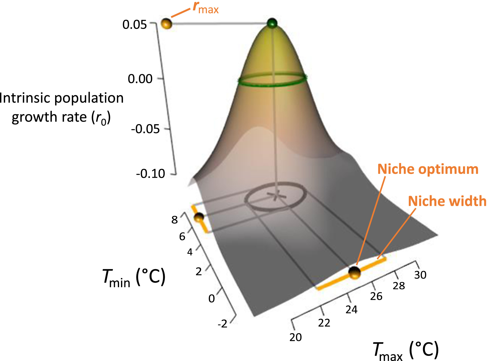
```

.footnote[Figure from [**Treurnicht et al. 2020**](http://dx.doi.org/10.1111/geb.13048)]
]

---

class: center, middle

### What does maintaining a viable population even mean?

---

class: center, middle

### It means maintaining population growth...

---

class: center, middle

### But that's not easy... 

### Especially where there is competition for resources...

---

### Population growth curve

.pull-left[
Consider growth of a population, starting with 2 individuals at t = 0. 
- Assume a per-capita reproductive rate, $r$ = 2

]

.pull-right[
```{r, echo = F, out.height="100%", out.width="100%", fig.height = 8}
library(tidyverse)

data.frame(N = c(2), 
           t = c(0)) %>%
  ggplot(aes(x = t, y = N)) +
  geom_line() +
  geom_point(size = 5) +
  ylim(0,35) +
  xlim(0,5) +
  ylab("Number of Individuals (N)") +
  xlab("Time or generations (t)") +
  theme_bw() +
  theme(axis.text=element_text(size=20),
        axis.title=element_text(size=24,face="bold"))

```
]

---

### Population growth curve

.pull-left[
Consider growth of a population, starting with 2 individuals at t = 0. 
- Assume a per-capita reproductive rate, $r$ = 2

**Note:** _The per-capita reproductive rate ( $r$ ) is the number of reproductively mature individuals contributed per individual from one generation to the next. Population growth is positive where $r > 0$_.

_It is a fundamental biological parameter, determined by things like the number of eggs/seeds produced, the hatching/germination success of eggs/seeds, and the success with which hatchlings/germinants survive to reproductive maturity._

_It is the birth rate minus the death rate._

]

.pull-right[
```{r, echo = F, out.height="100%", out.width="100%", fig.height = 8}
library(tidyverse)

data.frame(N = c(2), 
           t = c(0)) %>%
  ggplot(aes(x = t, y = N)) +
  geom_line() +
  geom_point(size = 5) +
  ylim(0,35) +
  xlim(0,5) +
  ylab("Number of Individuals (N)") +
  xlab("Time or generations (t)") +
  theme_bw() +
  theme(axis.text=element_text(size=20),
        axis.title=element_text(size=24,face="bold"))

```
]

---

### Population growth curve

.pull-left[
Consider growth of a population, starting with 2 individuals at t = 0. 
- Assume a per-capita reproductive rate, $r$ = 2

]

.pull-right[
```{r, echo = F, out.height="100%", out.width="100%", fig.height = 8}
library(tidyverse)

data.frame(N = c(2,4), 
           t = c(0,1)) %>%
  ggplot(aes(x = t, y = N)) +
  geom_line() +
  geom_point(size = 5) +
  ylim(0,35) +
  xlim(0,5) +
  ylab("Number of Individuals (N)") +
  xlab("Time or generations (t)") +
  theme_bw() +
  theme(axis.text=element_text(size=20),
        axis.title=element_text(size=24,face="bold"))

```
]

---

### Population growth curve

.pull-left[
Consider growth of a population, starting with 2 individuals at t = 0. 
- Assume a per-capita reproductive rate, $r$ = 2

]

.pull-right[
```{r, echo = F, out.height="100%", out.width="100%", fig.height = 8}
library(tidyverse)

data.frame(N = c(2,4,8), 
           t = c(0,1,2)) %>%
  ggplot(aes(x = t, y = N)) +
  geom_line() +
  geom_point(size = 5) +
  ylim(0,35) +
  xlim(0,5) +
  ylab("Number of Individuals (N)") +
  xlab("Time or generations (t)") +
  theme_bw() +
  theme(axis.text=element_text(size=20),
        axis.title=element_text(size=24,face="bold"))

```
]

---

### Population growth curve

.pull-left[
Consider growth of a population, starting with 2 individuals at t = 0. 
- Assume a per-capita reproductive rate, $r$ = 2

<br>

_Growth is exponential!_

]

.pull-right[
```{r, echo = F, out.height="100%", out.width="100%", fig.height = 8}
library(tidyverse)

data.frame(N = c(2,4,8,16,32), 
           t = c(0,1,2,3,4)) %>%
  ggplot(aes(x = t, y = N)) +
  geom_line() +
  geom_point(size = 5) +
  ylim(0,35) +
  xlim(0,5) +
  ylab("Number of Individuals (N)") +
  xlab("Time or generations (t)") +
  theme_bw() +
  theme(axis.text=element_text(size=20),
        axis.title=element_text(size=24,face="bold"))

```
]

---

### Population growth curve

.pull-left[
Consider growth of a population, starting with 2 individuals at t = 0. 
- Assume a per-capita reproductive rate, $r$ = 2

<br>

_Growth is exponential!_

Using calculus, we can express growth as an instantaneous rate as $dN/dt$, the rate of change in number of organisms at a particular instant in time.

Since our example is an exponential function, the slope of this curve is given by  $dN/dt = rN$
]

.pull-right[
```{r, echo = F, out.height="100%", out.width="100%", fig.height = 8}
library(tidyverse)

data.frame(N = c(2,4,8,16,32), 
           t = c(0,1,2,3,4)) %>%
  ggplot(aes(x = t, y = N)) +
  geom_line() +
  geom_point(size = 5) +
  ylim(0,35) +
  xlim(0,5) +
  ylab("Number of Individuals (N)") +
  xlab("Time or generations (t)") +
  theme_bw() +
  theme(axis.text=element_text(size=20),
        axis.title=element_text(size=24,face="bold"))

```
]

---

.pull-left[

### Is growth always exponential?


```{r echo = F, fig.align = 'center', out.width = '65%'}

```


Resources available to individuals typically shrink as population size and density increase. 

Competition between individuals limits growth and reproductive output.

.footnote[A study of the Pear Limpet, _Scutellastra cochlear_ ([**Branch 1975**](http://dx.doi.org/10.1111/geb.13048)).

Photo: Allan Ellis, [**iNaturalist**](https://www.inaturalist.org/observations/99128657)]

]

.pull-right[

```{r echo = F, fig.align = 'center', out.width = '65%'}
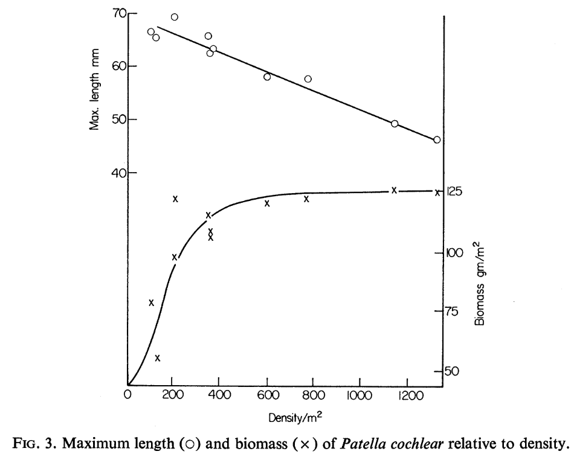
```

```{r echo = F, fig.align = 'center', out.width = '65%'}
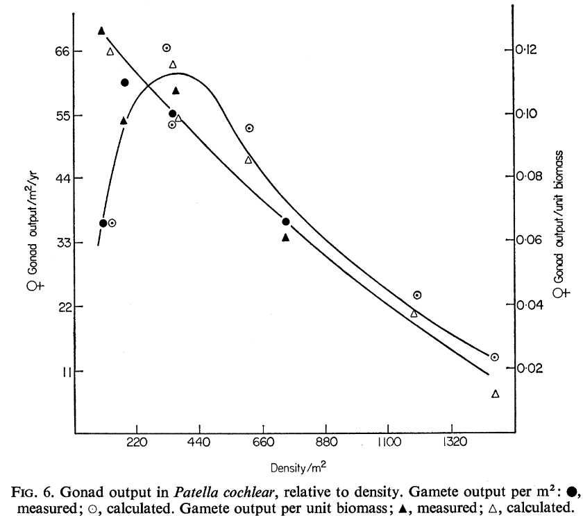
```

]

---

### Population growth curve

.pull-left[
What does our curve look like once we include **density-dependent** effects like int**_ra_**specific competition (competition among individuals of the same species)?

]

.pull-right[
```{r, echo = F, out.height="100%", out.width="100%", fig.height = 8}
library(tidyverse)

data.frame(N = c(2), 
           t = c(0)) %>%
  ggplot(aes(x = t, y = N)) +
  geom_line() +
  geom_point(size = 5) +
  ylim(0,35) +
  xlim(0,10) +
  ylab("Number of Individuals (N)") +
  xlab("Time or generations (t)") +
  theme_bw() +
  theme(axis.text=element_text(size=20),
        axis.title=element_text(size=24,face="bold"))

```
]

---

### Population growth curve

.pull-left[
What does our curve look like once we include **density-dependent** effects like int**_ra_**specific competition (competition among individuals of the same species)?

It starts out much the same while resources are abundant...
]

.pull-right[
```{r, echo = F, out.height="100%", out.width="100%", fig.height = 8}
library(tidyverse)

data.frame(N = c(2,4), 
           t = c(0,1)) %>%
  ggplot(aes(x = t, y = N)) +
  geom_line() +
  geom_point(size = 5) +
  ylim(0,35) +
  xlim(0,10) +
  ylab("Number of Individuals (N)") +
  xlab("Time or generations (t)") +
  theme_bw() +
  theme(axis.text=element_text(size=20),
        axis.title=element_text(size=24,face="bold"))

```
]

---

### Population growth curve

.pull-left[
What does our curve look like once we include **density-dependent** effects like int**_ra_**specific competition (competition among individuals of the same species)?

It starts out much the same while resources are abundant...

]

.pull-right[
```{r, echo = F, out.height="100%", out.width="100%", fig.height = 8}
library(tidyverse)

data.frame(N = c(2,4,8,16), 
           t = c(0,1,2,3)) %>%
  ggplot(aes(x = t, y = N)) +
  geom_line() +
  geom_point(size = 5) +
  ylim(0,35) +
  xlim(0,10) +
  ylab("Number of Individuals (N)") +
  xlab("Time or generations (t)") +
  theme_bw() +
  theme(axis.text=element_text(size=20),
        axis.title=element_text(size=24,face="bold"))

```
]

---

### Population growth curve

.pull-left[
What does our curve look like once we include **density-dependent** effects like int**_ra_**specific competition (competition among individuals of the same species)?

It starts out much the same while resources are abundant...

]

.pull-right[
```{r, echo = F, out.height="100%", out.width="100%", fig.height = 8}
library(tidyverse)

data.frame(N = c(2,4,8,16,24), 
           t = c(0,1,2,3,4)) %>%
  ggplot(aes(x = t, y = N)) +
  geom_line() +
  geom_point(size = 5) +
  ylim(0,35) +
  xlim(0,10) +
  ylab("Number of Individuals (N)") +
  xlab("Time or generations (t)") +
  theme_bw() +
  theme(axis.text=element_text(size=20),
        axis.title=element_text(size=24,face="bold"))

```
]

---

### Population growth curve

.pull-left[
What does our curve look like once we include **density-dependent** effects like int**_ra_**specific competition (competition among individuals of the same species)?

It starts out much the same while resources are abundant...

...but slows as resources become limiting...
]

.pull-right[
```{r, echo = F, out.height="100%", out.width="100%", fig.height = 8}
library(tidyverse)

data.frame(N = c(2,4,8,16,24,28), 
           t = c(0,1,2,3,4,5)) %>%
  ggplot(aes(x = t, y = N)) +
  geom_line() +
  geom_point(size = 5) +
  ylim(0,35) +
  xlim(0,10) +
  ylab("Number of Individuals (N)") +
  xlab("Time or generations (t)") +
  theme_bw() +
  theme(axis.text=element_text(size=20),
        axis.title=element_text(size=24,face="bold"))

```
]

---

### Population growth curve

.pull-left[
What does our curve look like once we include **density-dependent** effects like int**_ra_**specific competition (competition among individuals of the same species)?

It starts out much the same while resources are abundant...

...but slows as resources become limiting...
]

.pull-right[
```{r, echo = F, out.height="100%", out.width="100%", fig.height = 8}
library(tidyverse)

data.frame(N = c(2,4,8,16,24,28,30), 
           t = c(0,1,2,3,4,5,6)) %>%
  ggplot(aes(x = t, y = N)) +
  geom_line() +
  geom_point(size = 5) +
  ylim(0,35) +
  xlim(0,10) +
  ylab("Number of Individuals (N)") +
  xlab("Time or generations (t)") +
  theme_bw() +
  theme(axis.text=element_text(size=20),
        axis.title=element_text(size=24,face="bold"))

```
]

---

### Population growth curve

.pull-left[
What does our curve look like once we include **density-dependent** effects like int**_ra_**specific competition (competition among individuals of the same species)?

It starts out much the same while resources are abundant...

...but slows as resources become limiting...

...and eventually flattens out...
]

.pull-right[
```{r, echo = F, out.height="100%", out.width="100%", fig.height = 8}
library(tidyverse)

data.frame(N = c(2,4,8,16,24,28,30,30,30), 
           t = c(0,1,2,3,4,5,6,7,8)) %>%
  ggplot(aes(x = t, y = N)) +
  geom_line() +
  geom_point(size = 5) +
  ylim(0,35) +
  xlim(0,10) +
  ylab("Number of Individuals (N)") +
  xlab("Time or generations (t)") +
  theme_bw() +
  theme(axis.text=element_text(size=20),
        axis.title=element_text(size=24,face="bold"))

```
]

---

### Population growth curve

.pull-left[
What does our curve look like once we include **density-dependent** effects like int**_ra_**specific competition (competition among individuals of the same species)?

It starts out much the same while resources are abundant...

...but slows as resources become limiting...

...and eventually flattens out...

Any thoughts on the equation to fit this curve?

$dN/dt = ?$
]

.pull-right[
```{r, echo = F, out.height="100%", out.width="100%", fig.height = 8}
library(tidyverse)

data.frame(N = c(2,4,8,16,24,28,30,30,30), 
           t = c(0,1,2,3,4,5,6,7,8)) %>%
  ggplot(aes(x = t, y = N)) +
  geom_line() +
  geom_point(size = 5) +
  ylim(0,35) +
  xlim(0,10) +
  ylab("Number of Individuals (N)") +
  xlab("Time or generations (t)") +
  theme_bw() +
  theme(axis.text=element_text(size=20),
        axis.title=element_text(size=24,face="bold"))

```
]

---

### Population growth curve

.pull-left[
What does our curve look like once we include **density-dependent** effects like int**_ra_**specific competition (competition among individuals of the same species)?

It starts out much the same while resources are abundant...

...but slows as resources become limiting...

...and eventually flattens out...

Any thoughts on the equation to fit this curve?

$dN/dt = rN (K – N)/K$

A logistic function, or what we call the logistic growth curve.
]

.pull-right[
```{r, echo = F, out.height="100%", out.width="100%", fig.height = 8}
library(tidyverse)

data.frame(N = c(2,4,8,16,24,28,30,30,30), 
           t = c(0,1,2,3,4,5,6,7,8)) %>%
  ggplot(aes(x = t, y = N)) +
  geom_line() +
  geom_point(size = 5) +
  ylim(0,35) +
  xlim(0,10) +
  ylab("Number of Individuals (N)") +
  xlab("Time or generations (t)") +
  theme_bw() +
  theme(axis.text=element_text(size=20),
        axis.title=element_text(size=24,face="bold"))

```
]

---

### Population growth curve

.pull-left[
The population growth curve including **density-dependent** effects like int**_ra_**specific competition (competition among individuals of the same species) is a logistic function, flattening out as resources become limiting.

$dN/dt = rN (K – N)/K$

<br>

We know $N$, $t$ and $r$, but what is $K$?
]

.pull-right[
```{r, echo = F, out.height="100%", out.width="100%", fig.height = 8}
library(tidyverse)

data.frame(N = c(2,4,8,16,24,28,30,30,30), 
           t = c(0,1,2,3,4,5,6,7,8)) %>%
  ggplot(aes(x = t, y = N)) +
  geom_line() +
  geom_point(size = 5) +
  ylim(0,35) +
  xlim(0,10) +
  ylab("Number of Individuals (N)") +
  xlab("Time or generations (t)") +
  theme_bw() +
  theme(axis.text=element_text(size=20),
        axis.title=element_text(size=24,face="bold"))

```
]

---

### Population growth curve

.pull-left[
The population growth curve including **density-dependent** effects like int**_ra_**specific competition (competition among individuals of the same species) is a logistic function, flattening out as resources become limiting.

$dN/dt = rN (K – N)/K$

<br>

We know $N$, $t$ and $r$, but what is $K$?

$K$ = carrying capacity

Familiar?
]

.pull-right[
```{r, echo = F, out.height="100%", out.width="100%", fig.height = 8}
library(tidyverse)

data.frame(N = c(2,4,8,16,24,28,30,30,30), 
           t = c(0,1,2,3,4,5,6,7,8)) %>%
  ggplot(aes(x = t, y = N)) +
  geom_line() +
  geom_point(size = 5) +
  ylim(0,35) +
  xlim(0,10) +
  ylab("Number of Individuals (N)") +
  xlab("Time or generations (t)") +
  theme_bw() +
  theme(axis.text=element_text(size=20),
        axis.title=element_text(size=24,face="bold")) +
  geom_hline(yintercept = 30, colour = "blue", linetype = 2) +
  geom_text(aes(x = 0, y = 32, label = "K"), colour = "blue", size = 10)

```
]

---

```{r echo = F, fig.align = 'center', out.width = '65%'}
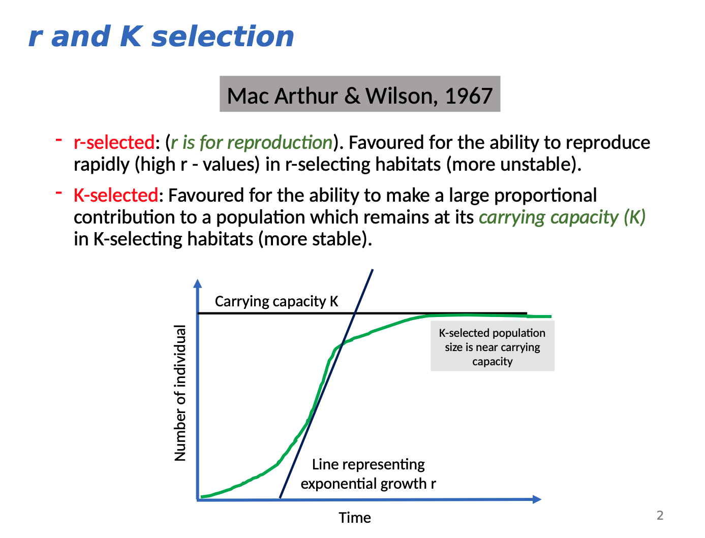
```

.footnote[Terry Hedderson's lecture on life history models]

---

### Population growth curve

.pull-left[
The population growth curve including **density-dependent** effects like int**_ra_**specific competition (competition among individuals of the same species) is a logistic function, flattening out as resources become limiting.

$dN/dt = rN (K – N)/K$

<br>

$K$ = carrying capacity

**Note:** _Where $N$ is small, the logistic growth curve approximates the exponential growth curve $(rN)$, because $(K – N)/K$ is close to 1._

_It begins to deviate as $N$ increases._
]

.pull-right[
```{r, echo = F, out.height="100%", out.width="100%", fig.height = 8}
library(tidyverse)

data.frame(N = c(2,4,8,16,24,28,30,30,30), 
           t = c(0,1,2,3,4,5,6,7,8)) %>%
  ggplot(aes(x = t, y = N)) +
  geom_line() +
  geom_point(size = 5) +
  ylim(0,35) +
  xlim(0,10) +
  ylab("Number of Individuals (N)") +
  xlab("Time or generations (t)") +
  theme_bw() +
  theme(axis.text=element_text(size=20),
        axis.title=element_text(size=24,face="bold")) +
  geom_hline(yintercept = 30, colour = "blue", linetype = 2) +
  geom_text(aes(x = 0, y = 32, label = "K"), colour = "blue", size = 10)

```
]
---

.pull-left[

### Exponential growth

$dN/dt = rN$

Population growth rate, $r$, doesn't change with population size

```{r, echo = F, out.width="80%", fig.height = 7}
library(tidyverse)

data.frame(N = c(2,4,8,16,32), 
           t = c(0,1,2,3,4)) %>%
  ggplot(aes(x = t, y = N)) +
  geom_line() +
  geom_point(size = 5) +
  ylim(0,35) +
  xlim(0,5) +
  ylab("Number of Individuals (N)") +
  xlab("Time or generations (t)") +
  theme_bw() +
  theme(axis.text=element_text(size=20),
        axis.title=element_text(size=24,face="bold"))

```

.footnote[Density independent population growth]
]

.pull-right[

### Logistic growth

$dN/dt = rN (K – N)/K$

Population growth rate, $r$, gets small as the population approaches carrying capacity, $K$

```{r, echo = F, out.width="80%", fig.height = 7}
library(tidyverse)

data.frame(N = c(2,4,8,16,24,28,30,30,30), 
           t = c(0,1,2,3,4,5,6,7,8)) %>%
  ggplot(aes(x = t, y = N)) +
  geom_line() +
  geom_point(size = 5) +
  ylim(0,35) +
  xlim(0,10) +
  ylab("Number of Individuals (N)") +
  xlab("Time or generations (t)") +
  theme_bw() +
  theme(axis.text=element_text(size=20),
        axis.title=element_text(size=24,face="bold")) +
  geom_hline(yintercept = 30, colour = "blue", linetype = 2) +
  geom_text(aes(x = 0, y = 32, label = "K"), colour = "blue", size = 10)

```

.footnote[Density dependent population growth]
]

---

### What are the implications of density-dependent growth?

---

### What are the implications of density-dependent growth?

Serotinous Proteaceae are well known for extreme population density fluctuations after fire.

.pull-left[

```{r echo = F, fig.align = 'center', out.width = '70%'}
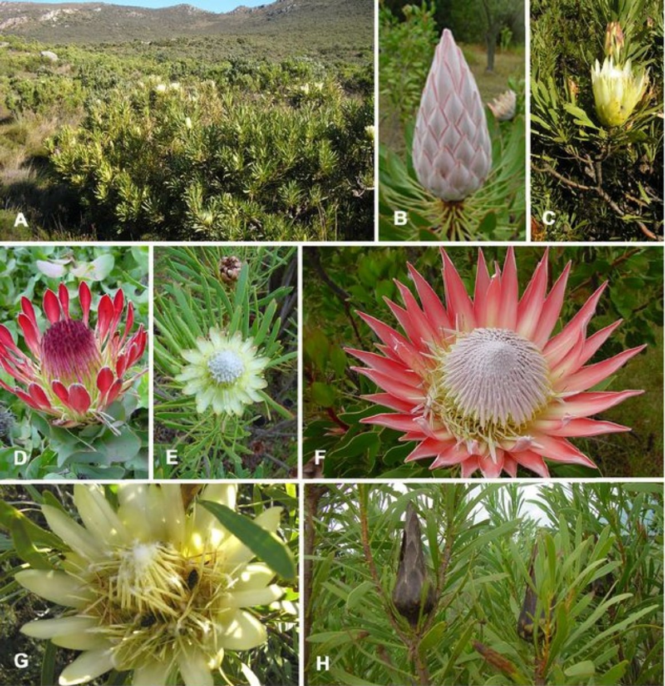
```

.footnote[image: Roets et al 2006]
]

--

.pull-right[
```{r echo = F, fig.align = 'center', out.width = '100%'}

```

While some of this may be exogenous, driven by external forces like climate fluctuations or variability in the fire regime, [**Bond et al 1995**](http://dx.doi.org/10.1080/11956860.1995.11682291) demonstrated that it could be endogenous, driven by internal population dynamics due to density-dependent effects.

.footnote[[**Bond et al 1995**](http://dx.doi.org/10.1080/11956860.1995.11682291)]

]

---

### Density-dependence in serotinous Cape Proteaceae 

.pull-left[

<br>

Empirical datasets showed evidence for a negative impact of density-dependence on:

- recruitment (Figure 1)
- fecundity (Figure 4)

<br>

Notice the exogenous effect of aridity on _Protea repens_ seedling establishment at the arid inland site (Figure 1, bottom).

.footnote[[**Bond et al 1995**](http://dx.doi.org/10.1080/11956860.1995.11682291)]
]

.pull-right[
```{r echo = F, fig.align = 'center', out.width = '100%'}
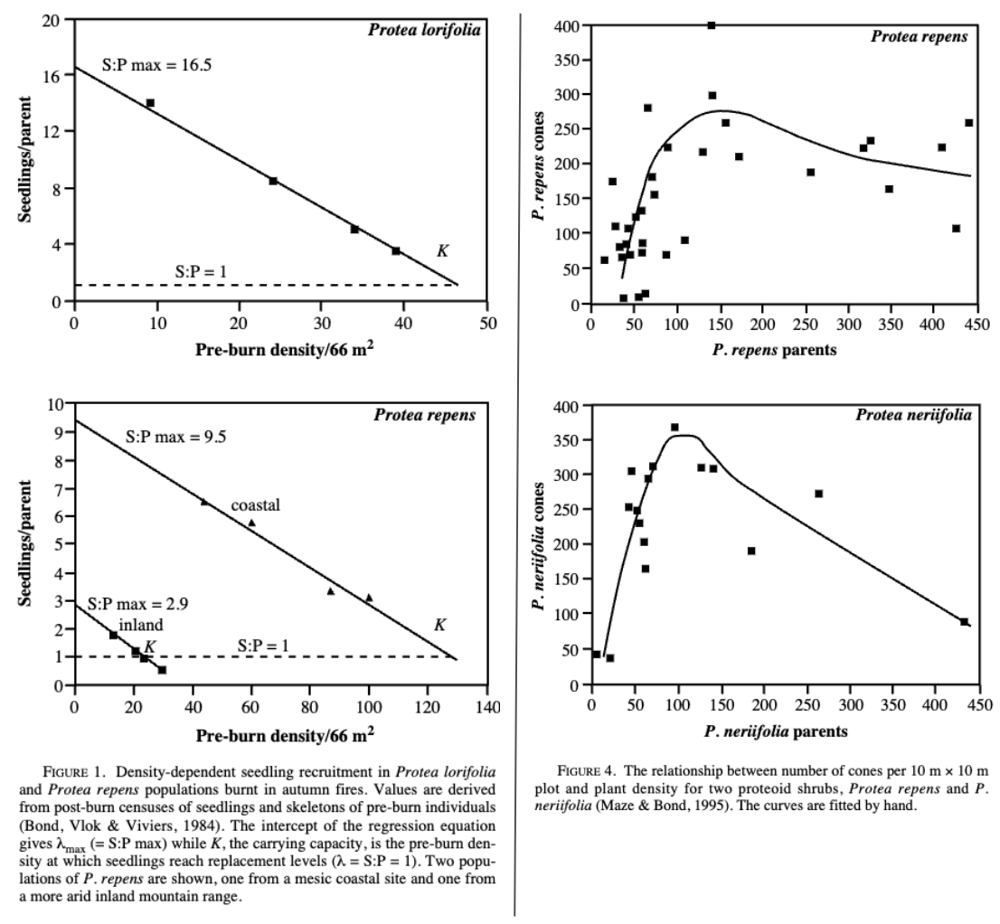
```
]

---

.pull-left[

### Protea density-dependence 

They fed their empirical data into demographic models and projected population growth over multiple generations.

Note that generations and fires are synonymous, because serotinous Proteaceae mostly only recruit after fire.


.footnote[[**Bond et al 1995**](http://dx.doi.org/10.1080/11956860.1995.11682291)]
]

.pull-right[

<br>

<br>

```{r echo = F, fig.align = 'center', out.width = '100%'}
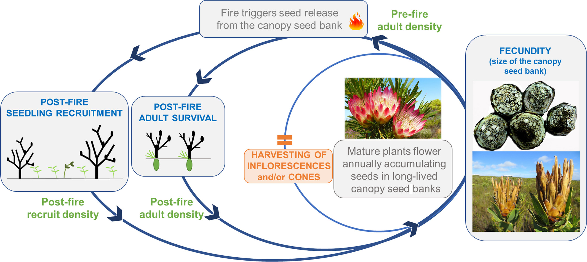
```
.footnote[Figure from [**Treurnicht et al 2021**](http://dx.doi.org/10.1111/1365-2664.13882). Ignore the harvesting...]
]

---

.pull-left[

### Protea density-dependence 

They fed their empirical data into demographic models and projected population growth over multiple generations.

Note that generations and fires are synonymous, because serotinous Proteaceae mostly only recruit after fire.


.footnote[[**Bond et al 1995**](http://dx.doi.org/10.1080/11956860.1995.11682291)]
]

.pull-right[
```{r echo = F, fig.align = 'center', out.width = '70%'}
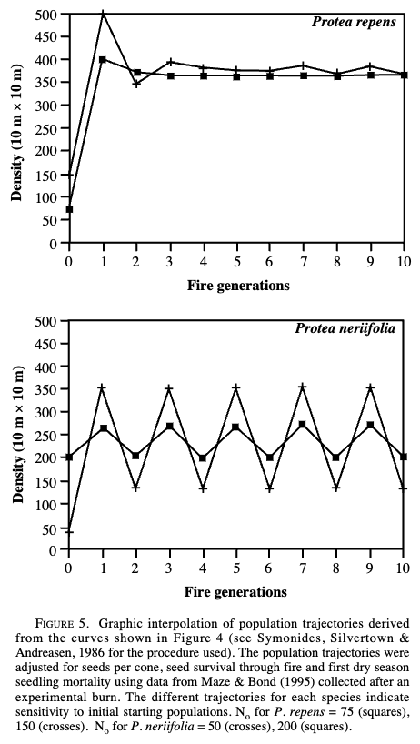
```
]

---

.pull-left[

### Protea density-dependence 

They fed their empirical data into demographic models and projected population growth over multiple generations.

Note that generations and fires are synonymous, because serotinous Proteaceae mostly only recruit after fire.

Decreasing the starting population size ( $N_0$ ), which would reduce the initial effect of density on population growth, increased the amplitude of population fluctuations, creating risk of total population crashes.

This effect was stronger in _P. neriifolia_, because it had higher cone production (fecundity) and was more sensitive to population density.

.footnote[[**Bond et al 1995**](http://dx.doi.org/10.1080/11956860.1995.11682291)]
]

.pull-right[
```{r echo = F, fig.align = 'center', out.width = '70%'}

```
]

---

class: center, middle

### What other factors could cause density-dependence? 

---

### What other factors could cause density-dependence? 

.pull-left[

### Disease or parasites

As population density increases, so does the probability of transmission.

```{r echo = F, fig.align = 'center', out.width = '100%'}
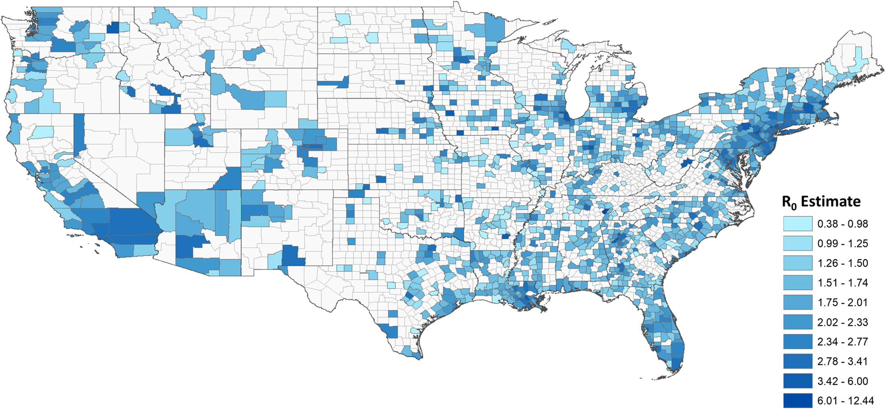
```

.footnote[Covid transmission in the USA ([**Sy et al. 2021**](https://doi.org/10.1371/journal.pone.0249271)).]
]

.pull-right[
```{r echo = F, fig.align = 'center', out.width = '91%'}
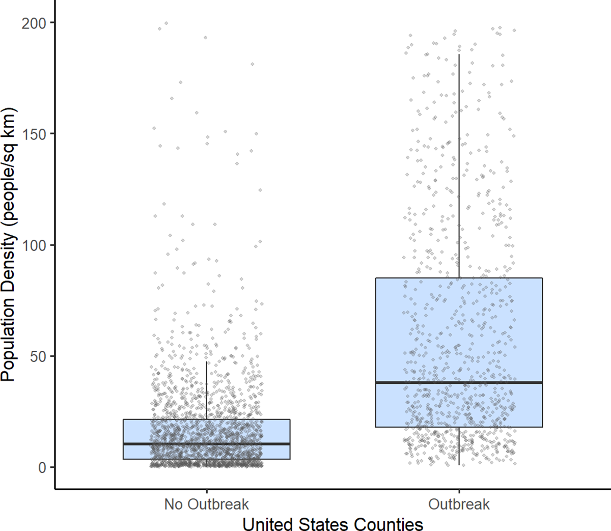
```
]


---

### What other factors could cause density-dependence? 

.pull-left[

### Predation

As the prey population density increases, so does the predator population. Eventually, the high number of predators causes the prey population to crash. This causes the predator population to crash, which allows the prey population to recover. This cycle continues, creating a predator-prey cycle.

There are many variations and elaborations of this theme...
]

.pull-right[
```{r echo = F, fig.align = 'center', out.width = '100%'}
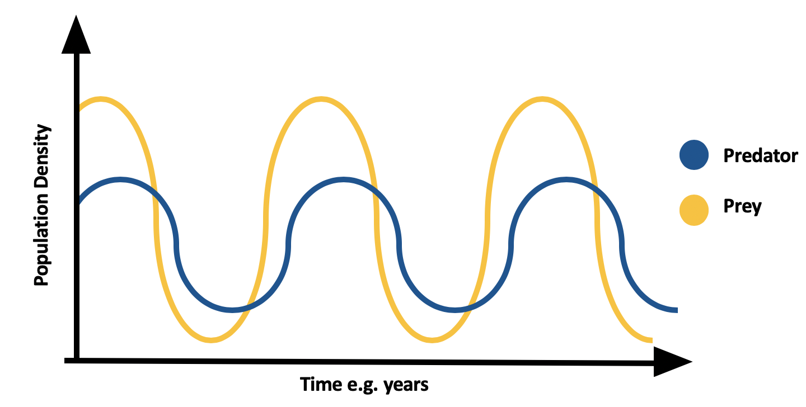
```

.footnote[Image: Hczarn on [**Wikimedia Commons**](https://commons.wikimedia.org/wiki/File:Predator_prey_curve.png), CC-BY-SA 4.0]
]

---

### What other factors could cause density-dependence? 

.pull-left[

### Accumulation of waste products

If the wastes can't be recycled fast enough, they can become toxic to the population. This is a common problem in aquaculture, where fish are kept in high densities and the water becomes polluted with their waste products.

Another example is fermentation in the making of wine. Alcohol is a waste product created by the yeast. As the yeast population grows, alcohol builds up, but it is toxic to the yeast. Above 13% alcohol content, the yeast population is doomed, which is why no naturally fermented wine contains more than 13% alcohol. To make stronger alcoholic beverages, they must be distilled out of wine or beer.

]

.pull-right[

```{r echo = F, fig.align = 'center', out.width = '100%'}
knitr::include_graphics("images/winebarrels.jpeg")
```

.footnote[Image: [**Pexels**](https://www.pexels.com/photo/wine-tank-room-434311/), CC-0]

]

---

class: center, middle

### What about positive density-dependence? 

--

Often called Allee effects after ecologist W.C. Allee, who described the phenomenon in the context of cooperative feeding in social insects ([**Allee 1931**](https://doi.org/10.1111/j.1469-7998.1931.tb02175.x)).

---

mate limitation to cooperative feeding to predator satiation

---

class: middle

## Take-home

>*If population growth were density-independent, it would be exponential...*

>*Most species exhibit density-dependent population growth due to intraspecific competition and other density-dependent factors (e.g. disease transmission), thus self-regulating their population size.*

>*Density-dependence creates an endogenous control on populations and has big implications for their size and stability.*

>*There are other factors that can cause negative density dependence (predation, disease, etc) and some that can cause positive density dependence (also known as Allee effects).*

>*One needs estimates of population growth rates to know whether populations can be maintained and define the environmental conditions of the Hutchinsonian niche. This can be done if you can estimate birth, death and dispersal rates.*

---
class: center, middle

# Thanks!

Slides created via the R packages:

[**xaringan**](https://github.com/yihui/xaringan)<br>
[gadenbuie/xaringanthemer](https://github.com/gadenbuie/xaringanthemer)

The chakra comes from [remark.js](https://remarkjs.com), [**knitr**](http://yihui.name/knitr), and [R Markdown](https://rmarkdown.rstudio.com).
