```{r setup, include=FALSE}
options(htmltools.dir.version = FALSE)
knitr::opts_chunk$set(
  fig.width=9, fig.height=3.5, fig.retina=3,
  out.width = "100%",
  cache = FALSE,
  echo = TRUE,
  message = FALSE, 
  warning = FALSE,
  hiline = TRUE
)

# library(RefManageR)
# BibOptions(check.entries = FALSE,
#            bib.style = "authoryear",
#            cite.style = "alphabetic",
#            style = "markdown",
#            hyperlink = FALSE,
#            dashed = FALSE)
# myBib <- ReadBib("bib/2_species.bib", check = FALSE)
```

```{r xaringan-themer, include=FALSE, warning=FALSE}
library(xaringanthemer)

# style_duo_accent(
#   primary_color = "#1381B0",
#   secondary_color = "#FF961C",
#   inverse_header_color = "#FFFFFF"
# )

style_mono_light(base_color = "#23395b")

#https://mycolor.space/?hex=%2323395B&sub=1 
#"Generic gradient" - #23395B #006287 #008E9D #00B897 #89DD81 #F9F871
#"Matching gradient" (reverse) - #23395B #494E77 #716292 #9C77AA #C88DBF #F5A3D0


library(knitr)
library(kableExtra)
```


```{r xaringan-tile-view, echo=FALSE}
# xaringanExtra::use_tile_view()
```

class: center, middle

#### So far I have been teaching you the "classical" niche concept and coexistence theory. 

#### The aim of this lecture is to introduce you to what have become known as "_Contemporary Niche Theory_" and "_Modern Coexistence Theory_", which are more recent developments in the field that address some of the shortcomings of the classical theories.

This lecture draws extensively from: Leibold, Mathew, and Veronica F. Frans. 2025. “Re-Revisiting the Niche Concept,” April. https://ecoevorxiv.org/repository/view/8978/. If you haven't read the paper, I highly recommend you do...


---

### ZNGI's for two species

```{r echo = F, fig.align = 'center', out.width = '50%'}
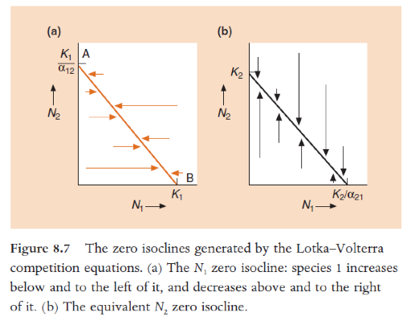
```

.footnote[Brown = Species 1; Black = Species 2]

---

### ZNGI's and the coexistence of species

.left-column[

In (a) and (b) species 1 and species 2 are stronger competitors respectively and competitive exclusion occurs

(c) both species' interspecific competitive effects > their intraspecific competitive effects

(d) both species' interspecific competitive effects < their intraspecific competitive effects

]

.right-column[
```{r echo = F, fig.align = 'center', out.width = '75%'}
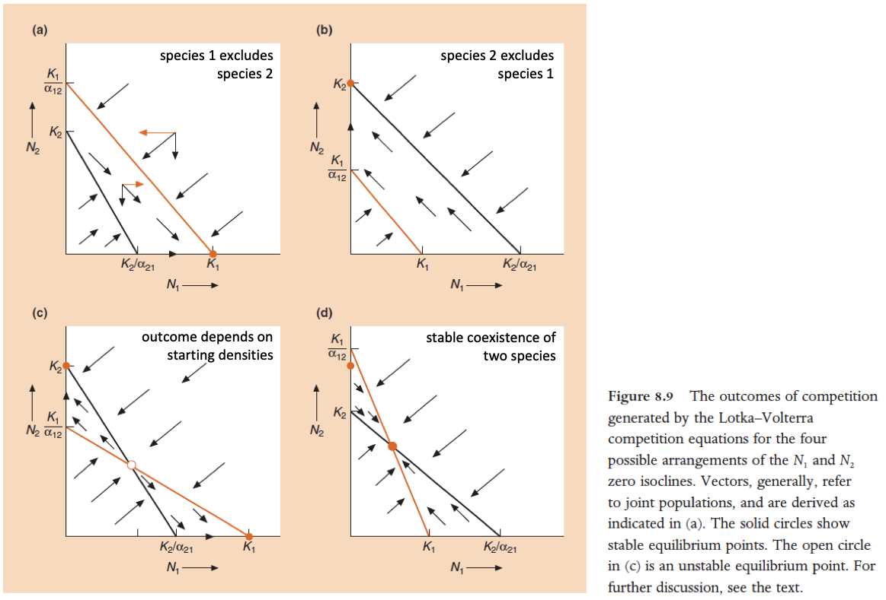
```
.footnote[Brown = Species 1; Black = Species 2]
]

---

### ZNGI's and the coexistence of species

.left-column[

Only (d) shows stable coexistence!

_Intraspecific competition must be greater than interspecific competition!_

This requires a _difference in niches_ and conveys a **Rare Species Advantage**, allowing the species with lower population numbers to grow faster and avoid extinction.

]

.right-column[
```{r echo = F, fig.align = 'center', out.width = '75%'}

```
.footnote[Brown = Species 1; Black = Species 2]
]

---

### Classical coexistence theory and limiting similarity

<br>

...is based on the niche concept and the idea of **_limiting similarity_**:

> the hypothesis that species with identical (or arbitrarily similar) niches cannot stably  coexist in a closed, local community. 

<br>

Grinnell (1917) was the first to make this link, stating: 

>_“It  is, of course, axiomatic that no two species regularly established in a single fauna have precisely the same niche relationship.”_

- i.e. if two species respond identically to environmental conditions, one is likely to have an advantage over the other, be it ever so slight, ultimately leading to competitive exclusion (Grinnell 1904). 

---

### Limiting similarity and species coexistence

.pull-left[
```{r echo = F, fig.align = 'center', out.width = '90%'}
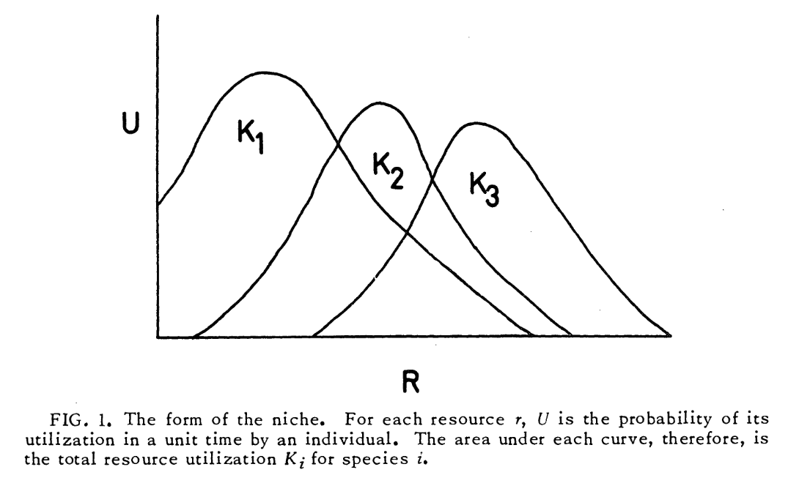
```

```{r echo = F, fig.align = 'center', out.width = '100%'}
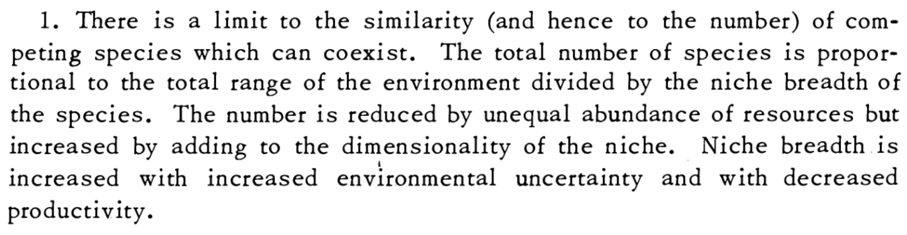
```

.footnote[[**MacArthur and Levins 1967**](https://doi.org/10.1086/282505)]
]

.pull-right[

The **Rare Species Advantage** occurs when intraspecific competition is stronger than interspecific competition.

> _"a community can retain all $n$ species if any one of them can increase when rare"_

Their work suggested that this can only happen when species show some degree of niche differentiation. 

It also suggested that the number of species that can be accommodated by a particular environment is proportional to the range of conditions or resources available divided by the niche breadth of the species.

- i.e. the size of the pie and how finely you slice it

]

---

### Examples?

.pull-left[
```{r echo = F, fig.align = 'center', out.width = '60%'}
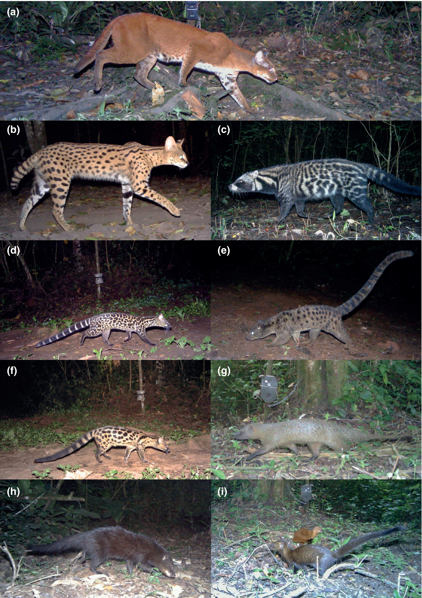
```
]

.pull-right[
```{r echo = F, fig.align = 'center', out.width = '100%'}
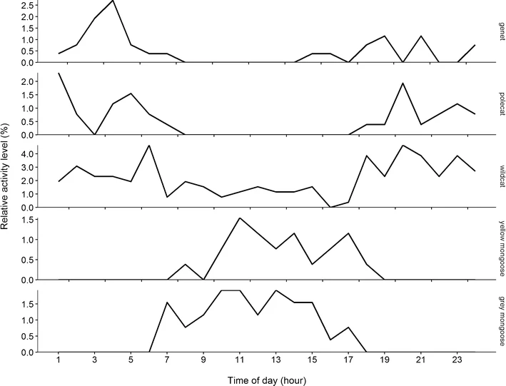
```

Temporal partitioning among small African carnivores ([**de Satgé et al. 2017**](http://dx.doi.org/10.1007/s00442-017-3916-2)).
]

---

class: center, middle

### But there are shortcomings...

---

### 1. What is the limit to similarity? 

.pull-left[

```{r echo = F, fig.align = 'center', out.width = '85%', fig.cap = "Overlapping niches and puported fitness differences for two species along two environmental or resource axes. Note that the lines also represent each species zero net growth isocline (ZNGI) without interspecific competition (i.e. the environmental limits to population growth)."}
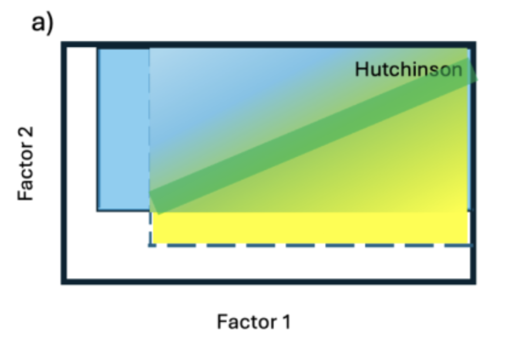
```

]

.pull-right[
How much niche difference is required to allow coexistence? 

- Hutchinson, and subsequent niche theorists like MacArthur and others were not explicit about this… 

Based on Hutchinson's n-dimensional descriptions of the niche, where the fundamental niches of two species overlap the realized niches should be constrained by competition, but there is no quantitative description of where the boundary (the thick green line in the figure) is in the zone of overlap where one species or other is eliminated.

.footnote[Figure 4a from Leibold and Frans 2025]
]

---

### 2. What about species effects on the environment?

.pull-left[

```{r echo = F, fig.align = 'center', out.width = '95%'}
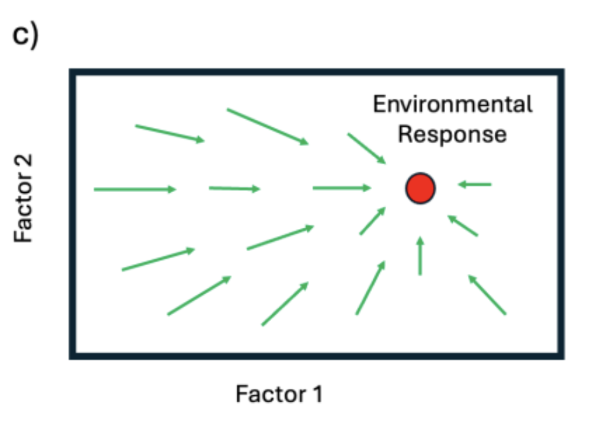
```
]

.pull-right[
Niche theory accounted for species **_response_** to the environment (_~ the fundamental niche_) and interactions with other species (_~the realised niche_), but did not consider how species resource use and other influences alter their environment (i.e. species **_effects_**).

Here the steady state of the environmental resource is the red dot (i.e. state when not altered by the species present). The green arrows indicate the direction of the environmental response to the effect of the species.

.footnote[Leibold and Frans 2025 Fig 3c]
]

---

### Contemporary Niche Theory

.pull-left[
```{r echo = F, fig.align = 'center', out.width = '100%'}
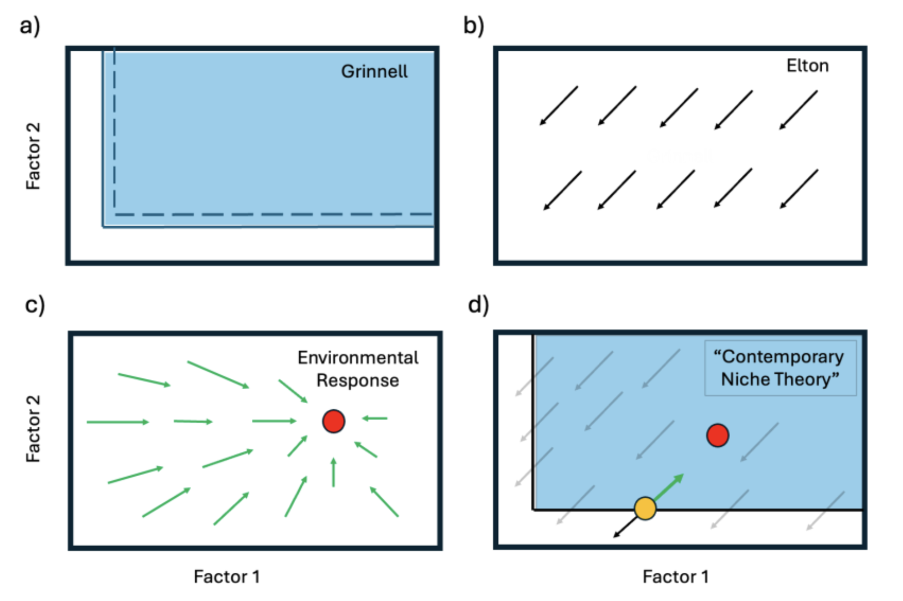
```
]

.pull-right[

Contemporary Niche Theory (Chase and Leibold 2003) solved these issues by merging existing niche definitions (a, b) and the concepts of species **_response_** to the environment and species **_effects_** on the environment, allowing for a more complete understanding of how species interact with each other and their environment to determine coexistence.

The steady state of a species with the environment occurs when conditions are on the line denoting the ZNGI (the species is at steady state, e.g. the yellow dot) and the impact vector (black arrow) is equal and in the opposite direction to the environmental response vector (green arrow).

]

.footnote[Leibold and Frans 2025 Fig 3 - see their caption for additional details...]

---

### Contemporary Niche Theory

Contemporary Niche Theory solves issues 1 and 2, offering explicit mechanisms - based on differences in _ZNGIs_ (i.e. species _response_ to the environment and competition) and _impact vectors_ (i.e. species _effects_ on the environment (resources)) - for determining realized niches under competition (i.e. who wins where).

```{r echo = F, fig.align = 'center', out.width = '60%'}
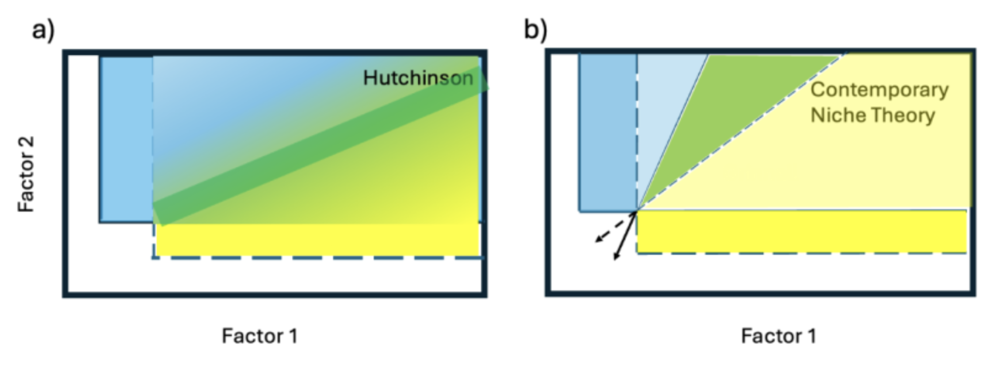
```

These models were later extended to include other cases like predator-prey interactions, mutualisms, and fluctuating environments.

.footnote[Leibold and Frans 2025 Fig 4a&b. Note that I'm sparing you the maths...]

---

class: center, middle

### Modern Coexistence Theory

Moving beyond limiting similarity...

---

.pull-left[

### Modern Coexistence Theory

```{r echo = F, fig.align = 'center', out.width = '70%'}
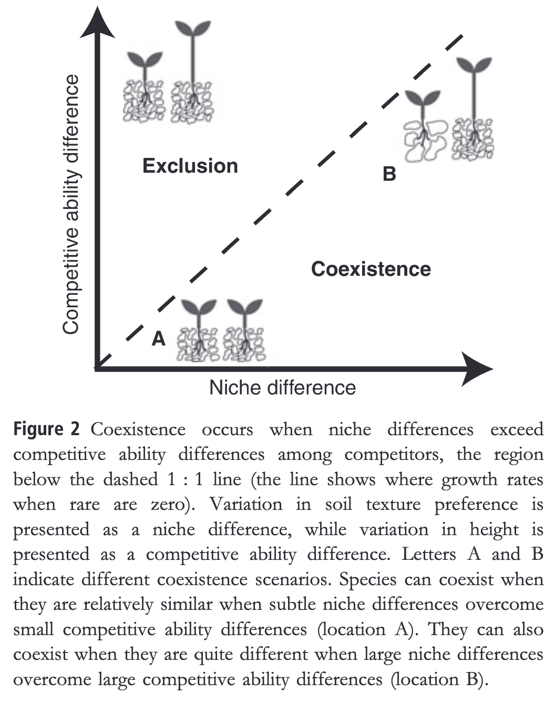
```

]

.pull-right[

[**Chesson 2000**](https://doi.org/10.1146/annurev.ecolsys.31.1.343) proposed a new framework for understanding coexistence, based on the balance of **niche differences** and **fitness differences** (differences in competitive ability). Larger competitive ability differences favor competitive exclusion, while larger niche differences promote coexistence.

]

.footnote[Image from [**Mayfield and Levine 2010**](https://doi.org/10.1111/j.1461-0248.2010.01509.x)]


---

.pull-left[

### Modern Coexistence Theory

```{r echo = F, fig.align = 'center', out.width = '70%'}

```

]

.pull-right[

[**Chesson 2000**](https://doi.org/10.1146/annurev.ecolsys.31.1.343) proposed a new framework for understanding coexistence, based on the balance of **niche differences** and **fitness differences** (differences in competitive ability). Larger competitive ability differences favor competitive exclusion, while larger niche differences promote coexistence.

He distinguished two types of mechanisms that promote coexistence by affecting each of these factors:

_**Stabilizing mechanisms**_ facilitate coexistence by allowing rare species to recover from low population sizes. These mechanisms promote **niche differences** as discussed above and in the previous lecture.

_**Equalizing**_ mechanisms reduce the differences in population growth rates between species (i.e. **fitness differences**). The argument is that these mechanisms do not affect niche differences, but rather reduce _differences in the competitive ability_ of species.

]

.footnote[Image from [**Mayfield and Levine 2010**](https://doi.org/10.1111/j.1461-0248.2010.01509.x)]

---

### Stabilizing mechanisms

<br>

- Stabilizing mechanisms **increase niche differentiation**, making intraspecific competition stronger than interspecific competition. 

<br>

- Niche differences is the stuff we've already talked about (e.g. resource partitioning, temporal partitioning, etc.) and is the basis for the concept of limiting similarity. 

---

### Equalizing mechanisms

<br>

- Equalizing mechanisms **reduce fitness differences** among species, making the effect of competitive differences less important.
    
    - They minimize the competitive advantage of dominant species.

- Factors include predation or herbivory, fire, or other large disturbances or unpredictable environmental fluctuations that affect all species equally (i.e. no species should be better adapted to coping with the disturbance).

- These effects reduce the impact of fitness differences, effectively making all species equal competitors and facilitating coexistence even where stabilizing mechanisms are weak and niche differences are small.

> _"equalizing mechanisms can, at best, slow competitive exclusion; but in the presence of stabilizing mechanisms, [they] may enable coexistence"_ - [**Chesson 2000**](https://doi.org/10.1146/annurev.ecolsys.31.1.343)

---

.pull-left[

### Modern Coexistence Theory

```{r echo = F, fig.align = 'center', out.width = '80%'}
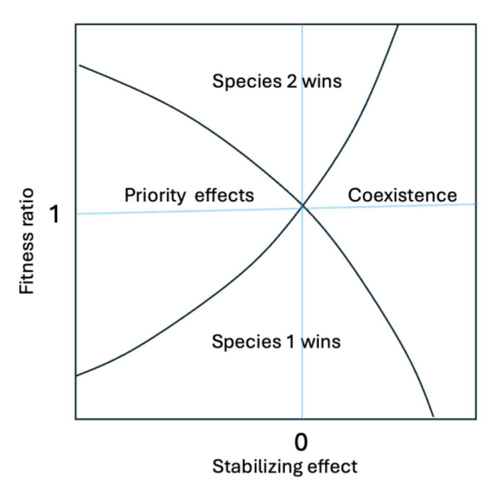
```

.footnote[Leibold and Frans 2025 Fig 6]

]

.pull-right[

<br>

The figure shows the relationship between the fitness ratio of two species (=1 when competitive abilities are identical) and the stabilizing effect of their niche differences on coexistence.

Coexistence is facilitated when species are different in niches (stabilizing effect > 0), but is also affected by differences in fitness (fitness ratio).

Where the difference in fitness is minimal (fitness ratio ~ 1), the stabilizing effect of niche differences is maximized, allowing for coexistence even with very small niche differences.

Where niche overlap is large (stabilizing effect <0), but fitness differences are small (fitness ratio ~ 1), then _priority effects_ dominate and the species that has the larger population will most likely outcompete the other.

.footnote[[**Chesson 2000**](https://doi.org/10.1146/annurev.ecolsys.31.1.343), **Ke and Letton 2018**]

]

---

### Modern Coexistence Theory and Contemporary Niche Theory

.pull-left[

Figures (a) to (d) show differences in the use of resources (A and B) for species 1 (blue) and 2 (green). The "coexistence" outcomes for points 1-7 are shown in panel (e).

In (a) and (c) there are some niche differences (stabilising effects > 0) and species limit their own resources more than their competitor (see blue and green arrows/lines), allowing coexistence in the wedge. 

In (b) and (d) there is niche overlap (stabilising effects < 0) only allowing priority effects within the wedge.

]

.pull-right[

```{r echo = F, fig.align = 'center', out.width = '100%'}
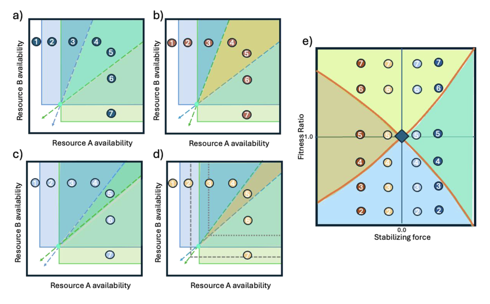
```

.footnote[Leibold and Frans 2025 Fig 7]

]

---

class: middle

## Take-home

>*Niche theory is a constantly developing field...*

>*"Contemporary Niche Theory" and "Modern Coexistence Theory" are recent developments that address some of the shortcomings of the "classical" niche concept and coexistence theory.*

>*Key shortcomings in classical niche theory were the inability to explicitly define the limits to similarity of coexisting species, and the need to reconcile species responses to the environment and competition with their effects on the environment and competition.*

>*"Contemporary Niche Theory" solved these issues by merging the Grinellian and Eltonian niche definitions and and offering explicit mechanisms based on ZNGIs (species response) and impact vectors (species effects).*

>*"Modern Coexistence Theory" proposed that coexistence is determined by both niche differences (which are promoted by stabilizing mechanisms) and fitness or competitive ability differences (which can be reduced by equalising mechanisms).*

>*Combining "Contemporary Niche Theory" and "Modern Coexistence Theory" allows us to clearly predict the outcomes of niche and competitive ability differences for species coexistence.*

---
class: center, middle

# Thanks!

Slides created via the R packages:

[**xaringan**](https://github.com/yihui/xaringan)<br>
[gadenbuie/xaringanthemer](https://github.com/gadenbuie/xaringanthemer)

The chakra comes from [remark.js](https://remarkjs.com), [**knitr**](http://yihui.name/knitr), and [R Markdown](https://rmarkdown.rstudio.com).
