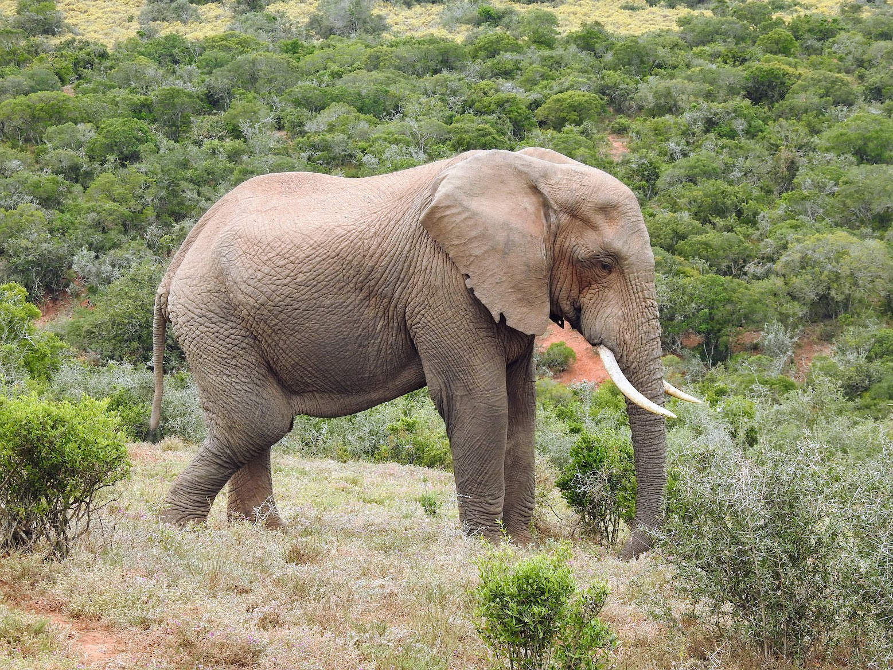

```{r setup, include=FALSE}
options(htmltools.dir.version = FALSE)
knitr::opts_chunk$set(
  fig.width=9, fig.height=3.5, fig.retina=3,
  out.width = "100%",
  cache = FALSE,
  echo = TRUE,
  message = FALSE, 
  warning = FALSE,
  hiline = TRUE
)

# library(RefManageR)
# BibOptions(check.entries = FALSE,
#            bib.style = "authoryear",
#            cite.style = "alphabetic",
#            style = "markdown",
#            hyperlink = FALSE,
#            dashed = FALSE)
# myBib <- ReadBib("bib/2_species.bib", check = FALSE)
```

```{r xaringan-themer, include=FALSE, warning=FALSE}
library(xaringanthemer)

# style_duo_accent(
#   primary_color = "#1381B0",
#   secondary_color = "#FF961C",
#   inverse_header_color = "#FFFFFF"
# )

style_mono_light(base_color = "#23395b")

#https://mycolor.space/?hex=%2323395B&sub=1 
#"Generic gradient" - #23395B #006287 #008E9D #00B897 #89DD81 #F9F871
#"Matching gradient" (reverse) - #23395B #494E77 #716292 #9C77AA #C88DBF #F5A3D0


library(knitr)
library(kableExtra)
```


```{r xaringan-tile-view, echo=FALSE}
# xaringanExtra::use_tile_view()
```

### ZNGI's for two species

```{r echo = F, fig.align = 'center', out.width = '50%'}
knitr::include_graphics("images/ZNGI_B1.png")
```

.footnote[Brown = Species 1; Black = Species 2]

---

### ZNGI's and the coexistence of species

.left-column[

In (a) and (b) species 1 and species 2 are stronger competitors respectively and competitive exclusion occurs

(c) both species' interspecific competitive effects > their intraspecific competitive effects

(d) both species' interspecific competitive effects < their intraspecific competitive effects

]

.right-column[
```{r echo = F, fig.align = 'center', out.width = '75%'}
knitr::include_graphics("images/ZNGI_B2.png")
```
.footnote[Brown = Species 1; Black = Species 2]
]

---

### ZNGI's and the coexistence of species

.left-column[

Only (d) shows stable coexistence!

_Intraspecific competition must be greater than interspecific competition!_

This requires a _difference in niches_ and conveys a **Rare Species Advantage**, allowing the species with lower population numbers to grow faster and avoid extinction.

]

.right-column[
```{r echo = F, fig.align = 'center', out.width = '75%'}
knitr::include_graphics("images/ZNGI_B2.png")
```
.footnote[Brown = Species 1; Black = Species 2]
]

---

class: center, middle

#### The rest of this lecture draws extensively from: Leibold, Mathew, and Veronica F. Frans. 2025. “Re-Revisiting the Niche Concept,” April. https://ecoevorxiv.org/repository/view/8978/.

If you haven't read the paper, I highly recommend it...

---

### Classical coexistence theory and limiting similarity

<br>

...is based on the niche concept and the idea of **_limiting similarity_**:

> the hypothesis that species with identical (or arbitrarily similar) niches cannot stably  coexist in a closed, local community. 

<br>

Grinnell (1917) was the first to make this link, stating: 

>_“It  is, of course, axiomatic that no two species regularly established in a single fauna have precisely the same niche relationship.”_

- i.e. if two species respond identically to environmental conditions, one is likely to have an advantage over the other, be it ever so slight, ultimately leading to competitive exclusion (Grinnell 1904). 


---

### Limiting similarity and species coexistence

.pull-left[
```{r echo = F, fig.align = 'center', out.width = '90%'}
knitr::include_graphics("images/MacArthur_Levins_1967_F1.png")
```

```{r echo = F, fig.align = 'center', out.width = '100%'}
knitr::include_graphics("images/MacArthur_Levins_1967.png")
```

.footnote[[**MacArthur and Levins 1967**](https://doi.org/10.1086/282505)]
]

.pull-right[

The **Rare Species Advantage** occurs when intraspecific competition is stronger than interspecific competition.

> _"a community can retain all $n$ species if any one of them can increase when rare"_

Their work suggested that this can only happen when species show some degree of niche differentiation. 

It also suggested that the number of species that can be accommodated by a particular environment is proportional to the range of conditions or resources available divided by the niche breadth of the species.

- i.e. the size of the pie and how finely you slice it

]

---

### Examples?

.pull-left[
```{r echo = F, fig.align = 'center', out.width = '60%'}
knitr::include_graphics("images/Mills2019_Carnivores.jpg")
```
]

.pull-right[
```{r echo = F, fig.align = 'center', out.width = '100%'}
knitr::include_graphics("images/desatge2017_F2.webp")
```

Temporal partitioning among small African carnivores ([**de Satgé et al. 2017**](http://dx.doi.org/10.1007/s00442-017-3916-2)).
]

---

class: center, middle

### But there are shortcomings...

---

### 1. What is the limit to similarity? 

.pull-left[
How much niche difference is required to allow coexistence?

```{r echo = F, fig.align = 'center', out.width = '95%'}

```

Hutchinson, and subsequent niche theorists like MacArthur and others were not explicit about this…
]

.pull-right[
Based on Hutchinson's n-dimensional descriptions of the niche, where the fundamental niches of two species overlap the realized niches should be constrained by competition, but there is no quantitative description of where the boundary is in the zone of overlap where one species or other is eliminated.

.footnote[Leibold and Frans 2025 Fig 4a]
]

---

### 2. Conversely, what is the limit to dissimilarity?

Surely species that are too dissimilar in their niches would not co-occur in the same environment and thus cannot coexist? [We'll ignore this for now.]

.pull-left[
```{r echo = F, fig.align = 'center', out.width = '90%'}

```

]

.pull-right[
```{r echo = F, fig.align = 'center', out.width = '90%'}
knitr::include_graphics("images/dugong.jpeg")
```
]

.footnote[[**Dugong: Dennis Rabeling on iNaturalist**](https://www.inaturalist.org/observations/72603891)]

---

### 3. What about species effects on the environment?

.pull-left[

```{r echo = F, fig.align = 'center', out.width = '95%'}

```
]

.pull-right[
Niche theory accounted for species **_response_** to the environment (_~ the fundamental niche_) and interactions with other species (_~the realised niche_), but did not consider how species resource use and other influences alter their environment (i.e. species **_effects_**).

Here the steady state of the environmental resource is the red dot (i.e. state when not altered by the species present). The green arrows indicate the direction of the environmental response to the effect of the species.

.footnote[Leibold and Frans 2025 Fig 3c]
]
---

### Contemporary Niche Theory

Contemporary Niche Theory (Chase and Leibold 2003) solved issues 1 and 3, offering explicit mechanisms - based on differences in _ZNGIs_ (i.e. species _response_ to the environment and competition) and _impact vectors_ (i.e. species _effects_ on the environment) - for determining realized niches under competition.

```{r echo = F, fig.align = 'center', out.width = '65%'}

```

These models were later extended to include other cases like predator-prey interactions, mutualisms, and fluctuating environments.

.footnote[Leibold and Frans 2025 Fig 4a&b]

---

### Contemporary Niche Theory vs older Niche Concepts

The math is too much for this course, but here's a few visuals to help you understand the differences.

```{r echo = F, fig.align = 'center', out.width = '55%'}

```


.footnote[Leibold and Frans 2025 Fig 3]

---

class: center, middle

### Modern Coexistence Theory

Moving beyond limiting similarity...

---

.pull-left[

### Modern Coexistence Theory

```{r echo = F, fig.align = 'center', out.width = '70%'}

```

]

.pull-right[

Chesson proposed a new framework for understanding coexistence, which distinguished between two types of mechanisms:

_Stabilizing_ mechanisms, which promote coexistence by allowing rare species to recover from low population sizes. These are essentially _niche differences_ as discussed above an the the previous lecture.

_Equalizing_ mechanisms, which reduce the differences in population growth rates between species (i.e. _fitness differences_). The argument is that these mechanisms are not necessarily niche differences, but rather _differences in the competitive ability_ of species.

Larger competitive ability differences favor competitive exclusion, while larger niche differences promote coexistence.

_"equalizing mechanisms can, at best, slow competitive exclusion; but in the presence of stabilizing mechanisms, [they] may enable coexistence"_ - [**Chesson 2000**](https://doi.org/10.1146/annurev.ecolsys.31.1.343)

]

.footnote[Image from [**Mayfield and Levine 2010**](https://doi.org/10.1111/j.1461-0248.2010.01509.x)]


---

### Examples of stabilizing mechanisms

- Niche differences (e.g. resource partitioning, temporal partitioning, etc.). The stuff we've already talked about.

---

### Examples of equalizing mechanisms

- Generalist predation or herbivory, fire, etc or other large disturbances or unpredictable environmental fluctuations that affect all species equally (i.e. no species should be better adapted to coping with the disturbance).

- These effects reduce the impact of fitness differences, effectively making all species equal competitors and facilitating coexistence even where niche differences are small/.

---

### Modern Coexistence Theory

.pull-left[

```{r echo = F, fig.align = 'center', out.width = '80%'}

```

.footnote[Leibold and Frans 2025 Fig 6]

]

.pull-right[

<br>

The figure shows the relationship between the fitness ratio of two species and the stabilizing effect of their niche differences on coexistence.

Coexistence is facilitated when species are different in niches (stabilizing effect > 0), but is also affected by differences in fitness (fitness ratio).

Where the difference in fitness is minimal (fitness ratio ~ 1), the stabilizing effect of niche differences is maximized, allowing for coexistence even with very small niche differences.

<br>

[**Chesson 2000**](https://doi.org/10.1146/annurev.ecolsys.31.1.343), **Ke and Letton 2018**

]

---

### Modern Coexistence Theory and Contemporary Niche Theory

.left-column[

(a) to (d) shows differences in the rations of resource use (A vs B) for species 1 and 2, respectively. The "coexistence" outcomes are shown in panel (e).

(a) and (c) allow coexistence in the wedge. (b) and (d) only allow priority effects within the wedge.

]

.right-column[

```{r echo = F, fig.align = 'center', out.width = '80%'}

```

.footnote[Leibold and Frans 2025 Fig 7]

]

---

class: middle

## Take-home

>*Gause's microcosm experiments on _Paramecium_ taught us much about competition.*

>*The main outcomes of competition are competitive exclusion or niche/resource partitioning. The latter often occurring via character displacement.*

>*Studying the outcomes of competition is difficult, because the interactions are typically over and we only see the "ghost of competition past".*

>*The Lotka-Volterra competition equations allow us to estimate the zero net growth isocline (ZNGI) for each species, which allows us to predict the outcome of interspecific competition.*

>*For stable coexistence of species to occur, intraspecific competition must be greater than interspecific competition, because this gives rare species an advantage and allows them to recover.*

>*MacArthur and Levins suggested that there is a limit to the similarity of coexisting species, such that* 
  - *(a) rare species advantage only happens where species show some degree of niche differentiation, and*
  - *(b) the number of species that can coexist in a particular environment is proportional to the range of conditions or resources available divided by the niche breadth of the species.*

Check out this [**Crash Course** in community ecology](https://www.youtube.com/watch?v=GxE1SSqbSn4) for a rapid recap of the basics.

---
class: center, middle

# Thanks!

Slides created via the R packages:

[**xaringan**](https://github.com/yihui/xaringan)<br>
[gadenbuie/xaringanthemer](https://github.com/gadenbuie/xaringanthemer)

The chakra comes from [remark.js](https://remarkjs.com), [**knitr**](http://yihui.name/knitr), and [R Markdown](https://rmarkdown.rstudio.com).
