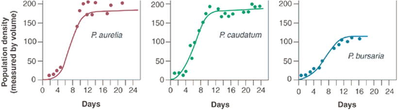
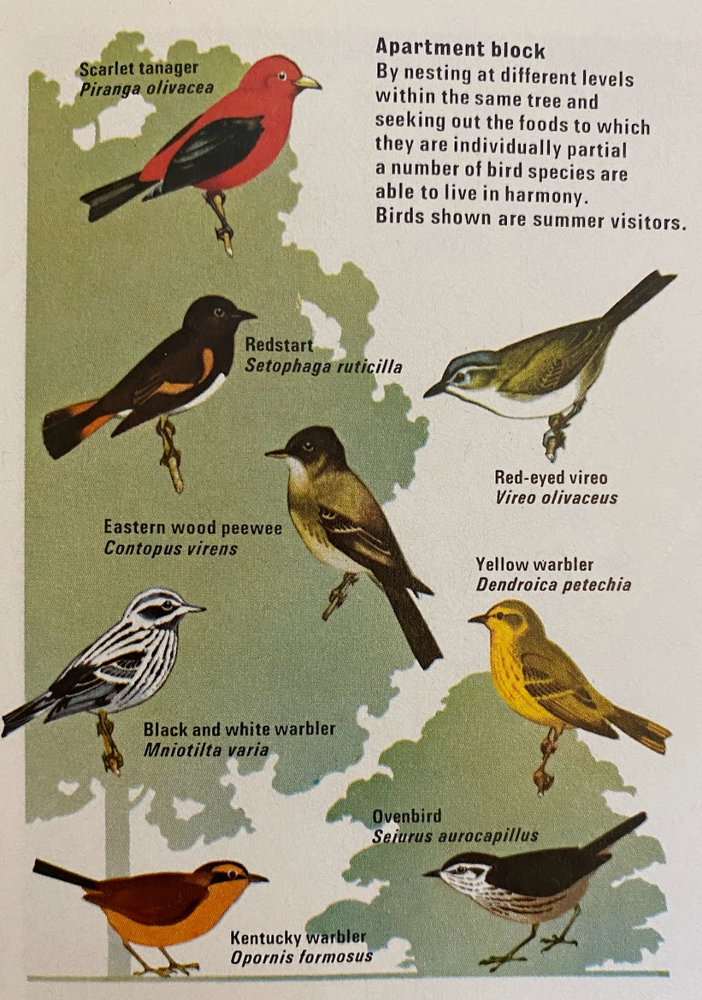
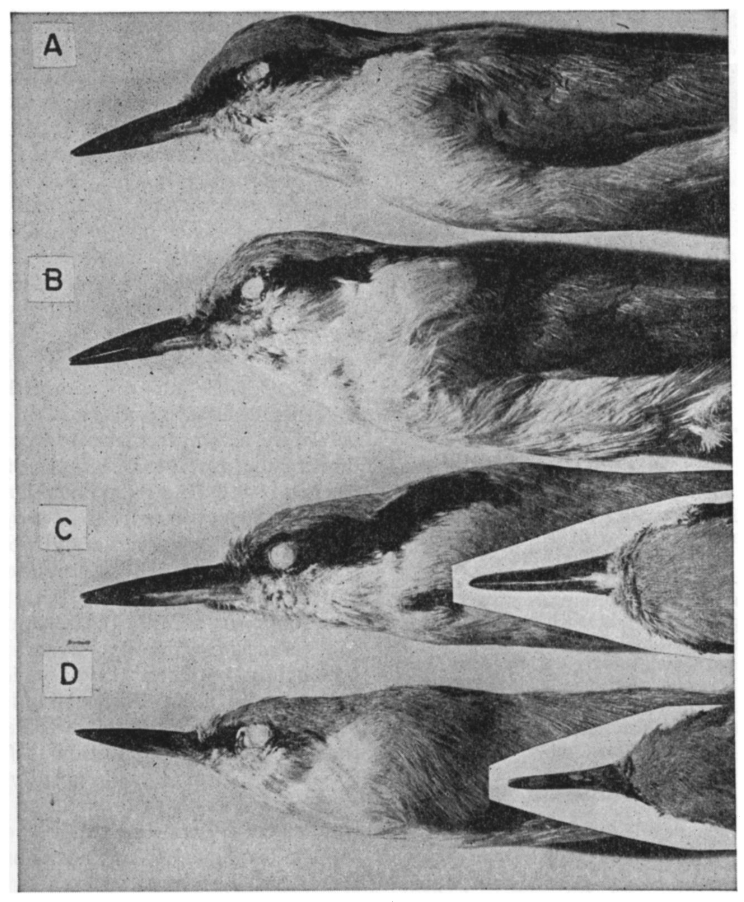
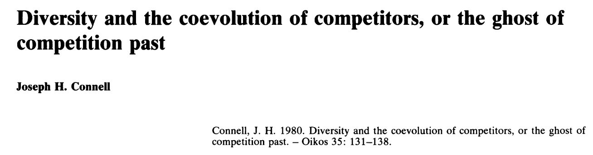
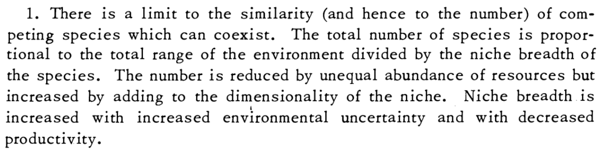
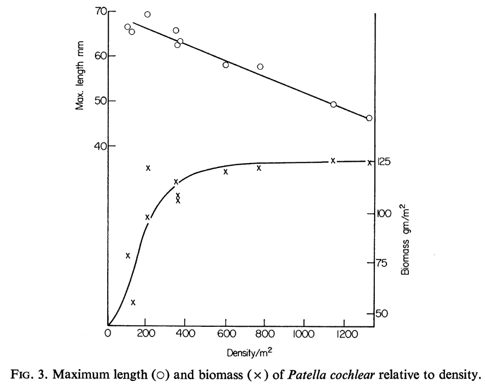
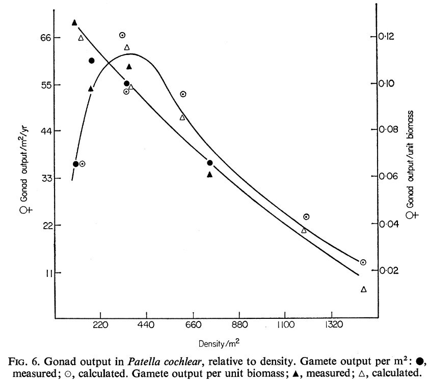
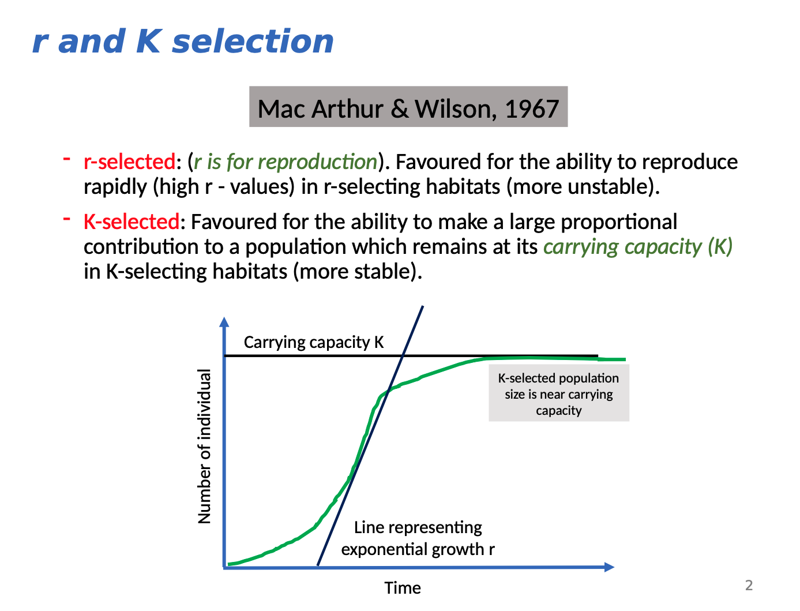

```{r setup, include=FALSE}
options(htmltools.dir.version = FALSE)
knitr::opts_chunk$set(
  fig.width=9, fig.height=3.5, fig.retina=3,
  out.width = "100%",
  cache = FALSE,
  echo = TRUE,
  message = FALSE, 
  warning = FALSE,
  hiline = TRUE
)

# library(RefManageR)
# BibOptions(check.entries = FALSE,
#            bib.style = "authoryear",
#            cite.style = "alphabetic",
#            style = "markdown",
#            hyperlink = FALSE,
#            dashed = FALSE)
# myBib <- ReadBib("bib/2_species.bib", check = FALSE)
```

```{r xaringan-themer, include=FALSE, warning=FALSE}
library(xaringanthemer)

# style_duo_accent(
#   primary_color = "#1381B0",
#   secondary_color = "#FF961C",
#   inverse_header_color = "#FFFFFF"
# )

style_mono_light(base_color = "#23395b")

#https://mycolor.space/?hex=%2323395B&sub=1 
#"Generic gradient" - #23395B #006287 #008E9D #00B897 #89DD81 #F9F871
#"Matching gradient" (reverse) - #23395B #494E77 #716292 #9C77AA #C88DBF #F5A3D0


library(knitr)
library(kableExtra)
```


```{r xaringan-tile-view, echo=FALSE}
# xaringanExtra::use_tile_view()
```

.pull-left[

### Exponential growth

$dN/dt = rN$

Population growth rate, $r$, doesn't change with population size

- i.e. no competition

```{r, echo = F, out.width="80%", fig.height = 6}
library(tidyverse)

data.frame(N = c(2,4,8,16,32), 
           t = c(0,1,2,3,4)) %>%
  ggplot(aes(x = t, y = N)) +
  geom_line() +
  geom_point(size = 5) +
  ylim(0,35) +
  xlim(0,5) +
  ylab("Number of Individuals (N)") +
  xlab("Time or generations (t)") +
  theme_bw() +
  theme(axis.text=element_text(size=20),
        axis.title=element_text(size=24,face="bold"))

```

]

.pull-right[

### Logistic growth

$dN/dt = rN (K – N)/K$

Population growth rate, $r$, gets small as the population approaches carrying capacity, $K$

- i.e. _**intraspecific competition!**_

```{r, echo = F, out.width="80%", fig.height = 6}
library(tidyverse)

data.frame(N = c(2,4,8,16,24,28,30,30,30), 
           t = c(0,1,2,3,4,5,6,7,8)) %>%
  ggplot(aes(x = t, y = N)) +
  geom_line() +
  geom_point(size = 5) +
  ylim(0,35) +
  xlim(0,10) +
  ylab("Number of Individuals (N)") +
  xlab("Time or generations (t)") +
  theme_bw() +
  theme(axis.text=element_text(size=20),
        axis.title=element_text(size=24,face="bold")) +
  geom_hline(yintercept = 30, colour = "blue", linetype = 2) +
  geom_text(aes(x = 0, y = 32, label = "K"), colour = "blue", size = 10)

```
]

--

.footnote[_But what about int**er**specific competition? (i.e. between species)_]

---

.pull-left[

### Experiments with _Paramecium_

Georgyi Frantsevitch Gause's microcosm experiments with species of the unicellular cilliate genus _Paramecium_ taught us a lot about intra- and interspecific competition.

<br>

Microcosms are artificial, simplified ecosystems that are used to simulate the behaviour of natural ecosystems under controlled conditions.

<br>

Gause's microcosms were test tubes supplied with an oatmeal medium, which promotes the growth of bacteria in the upper, oxygenated part of the test tube, and yeast in the lower, de-oxygenated part.

]

.pull-right[

<br>

```{r echo = F, fig.align = 'center', out.width = '100%'}
knitr::include_graphics("images/Paramecium_aurelia.jpg")
```

.footnote[image: [**Wikipedia**](https://en.wikipedia.org/wiki/Paramecium#/media/File:Paramecium.jpg)]

]

---

### Experiments with _Paramecium_ spp

_Paramecium_ species cultured separately demonstrated **_intraspecific_** competition.

```{r echo = F, fig.align = 'center', out.width = '60%'}

```

.footnote[[**Gause 1934**](http://dx.doi.org/10.1126/science.79.2036.16.b)]
--

Here _Paramecium_ species cultured together, demonstrate **_interspecific_** competition...

```{r echo = F, fig.align = 'center', out.width = '40%'}
knitr::include_graphics("images/paramecium_together.png")
```

---

### Experiments with _Paramecium_ spp

Why the different outcomes between the species mixes?

.pull-left[
#### Observation

```{r echo = F, fig.align = 'center', out.width = '90%'}
knitr::include_graphics("images/paramecium_together.png")
```

In the panel on the **left**, growth of both species is suppressed, but _P. caudatum_ actually goes extinct!

The pair on the **right** appear to be able to coexist, albeit at lower densities than when grown alone.

]

--

.pull-right[

#### Explanation

**Left:** _P. caudatum_ and _P. aurelia_ both feed on bacteria, but _P. aurelia_ grows 6 times faster than _P. caudatum_, resulting in its **competitive exclusion**.

**Right:** While _P. caudatum_ out-competes _P. bursaria_ for bacteria, _P. bursaria_ can survive on yeast in the lower, less oxygenated part of the test tube, because it contains tiny green algae that provide it with oxygen. This is an example of **resource (or niche) partitioning**.

.footnote[[**Gause 1934**](http://dx.doi.org/10.1126/science.79.2036.16.b)]
]

---

.pull-left[
### Niche/Resource partitioning

There are many examples in nature of species that are able to coexist in a community, because they partition their resources.

Many of these examples are from birds, such as [**Robert MacArthur's 1958 study**](http://dx.doi.org/10.2307/1931600) of warblers in the genus _Dendroica_ in the conifer forests of northeastern USA. Here he concluded:

>_"There are differences of feeding position, behavior, and nesting date which reduce competition."_

These are niche differences, but by which definition of the niche?

]

.pull-right[
```{r echo = F, fig.align = 'center', out.width = '75%'}

```

.footnote[Atlas of World Wildlife 1973 (not MacArthur's warblers...)]
]

---

.pull-left[
### Niche/Resource partitioning

There are many examples in nature of species that are able to coexist in a community, because they partition their resources.

Many of these examples are from birds, such as [**Robert MacArthur's 1958 study**](http://dx.doi.org/10.2307/1931600) of warblers in the genus _Dendroica_ in the conifer forests of northeastern USA. Here he concluded:

>_"There are differences of feeding position, behavior, and nesting date which reduce competition."_

These are niche differences, but by which definition of the niche?

> The Eltonian Niche (focus on resources)

One can also observe niche partitioning (or niche shifts) in the Grinnellian niche.
]

.pull-right[
```{r echo = F, fig.align = 'center', out.width = '75%'}

```

.footnote[Atlas of World Wildlife 1973 (not MacArthur's warblers...)]
]
---

.pull-left[
### Character Displacement

The process by which niche partitioning occurs.

_"the divergence shown when two partly allopatric species of comparable niche requirements become sympatric in part of their range"_ - [**Hutchinson 1959**](https://www.jstor.org/stable/2458768)

_"Two closely related species have overlapping ranges. In the parts of the ranges where one species occurs alone, the populations of that species are similar to the other species and  may even be very difficult to distinguish from it. In the area of overlap, where the two species occur together, the populations are more divergent and easily distinguished, i.e., they "displace" one another in one or more characters. The characters involved can be morphological, ecological, behavioral, or physiological; they are assumed to be genetically based."_ - [**Brown and Hutchinson 1956**](http://dx.doi.org/10.2307/2411924)

]

.pull-right[
```{r echo = F, fig.align = 'center', out.width = '75%'}

```

Size and shape of the bill and facial stripe in _Sitta neumayer_ and _S. tephronota_. A and B are collections of the respective species where they occur alone. D and C were collected where they co-occur.

]

---

### Competitive Exclusion

The **competitive exclusion principle** is often attributed to Gause, and sometimes called Gause's law, but there were earlier observations by Grinnell, Darwin and others, e.g.

>_Two species of approximately the same food habits are not likely to remain long evenly balanced in numbers in the same region. One will crowd out the other._ - [**Grinnell 1904**](https://doi.org/10.2307/4070199)

--

<br>

Unequivocal examples of competitive exclusion are rare, and can only really be demonstrated with experiments such as Gause's. These experiments are near-impossible for organisms with longer lifespans.

--

<br>

Why would we need experiments? Why would field observations not be good enough?

---

### Competitive exclusion and the Ghost of Competition Past

```{r echo = F, fig.align = 'center', out.width = '70%'}

```

In nature, while interspecific competition may be common, where competitive exclusion has occurred it cannot be observed as only one competitor would remain.

- i.e. the loser is driven to extinction or there is spatial segregation of competitors (i.e. the species do not coexist locally, but occur in sympatry)

While similar species occurring in sympatry may suggest that competitive exclusion has occurred, there are other potential explanations like dispersal limitation that prevents them accessing the same physical space.

The criteria required to demonstrate that competitive exclusion has occurred, or that species have coevolved due to competition (e.g. resource partitioning or character displacement) are onerous! - see [**Connell 1980**](http://dx.doi.org/10.2307/3544421).

---

class: center, middle

### How can we determine if/when species can coexist?

---

class: center, middle

### How about both species maintaining population growth as a criterion?

---

class: center, middle

### How do we quantify the effect of interspecific competition on population growth? 

---

.pull-left[

### Exponential growth

$dN/dt = rN$

Population growth rate, $r$, doesn't change with population size

- i.e. no competition

```{r, echo = F, out.width="80%", fig.height = 6}
library(tidyverse)

data.frame(N = c(2,4,8,16,32), 
           t = c(0,1,2,3,4)) %>%
  ggplot(aes(x = t, y = N)) +
  geom_line() +
  geom_point(size = 5) +
  ylim(0,35) +
  xlim(0,5) +
  ylab("Number of Individuals (N)") +
  xlab("Time or generations (t)") +
  theme_bw() +
  theme(axis.text=element_text(size=20),
        axis.title=element_text(size=24,face="bold"))

```

]

.pull-right[

### Logistic growth

$dN/dt = rN (K – N)/K$

Population growth rate, $r$, gets small as the population approaches carrying capacity, $K$

- i.e. _**intraspecific competition!**_

```{r, echo = F, out.width="80%", fig.height = 6}
library(tidyverse)

data.frame(N = c(2,4,8,16,24,28,30,30,30), 
           t = c(0,1,2,3,4,5,6,7,8)) %>%
  ggplot(aes(x = t, y = N)) +
  geom_line() +
  geom_point(size = 5) +
  ylim(0,35) +
  xlim(0,10) +
  ylab("Number of Individuals (N)") +
  xlab("Time or generations (t)") +
  theme_bw() +
  theme(axis.text=element_text(size=20),
        axis.title=element_text(size=24,face="bold")) +
  geom_hline(yintercept = 30, colour = "blue", linetype = 2) +
  geom_text(aes(x = 0, y = 32, label = "K"), colour = "blue", size = 10)

```
]

--

.footnote[_But what about int**er**specific competition? (i.e. between species)_]

---

### Population growth with intra- and interspecific competition

Assuming we have two species, 1 and 2. The population growth of species 1 can be modelled as:

<br>

$dN_1/dt = r_1 N_1(K_1 – {N_1 \mathbf{+ \alpha_{12} N_2}})/K_1$

<br>

This is the logistic curve with a new term, $\mathbf{\alpha_{12} N_2}$, to account for the competitive effect of species 2 on species 1. 

- $N_2$ gives the population size of species 2
- $\alpha_{12}$ is the per-capita competitive effect of species 2 on species 1 relative to intraspecific competition
    - if $\alpha_{12} = 1$ then the effect of species 2 on species 1 is the same as the effect of species 1 on species 1. In this case the equation would essentially reduce to the logistic growth curve and you could treat all individuals as of one species
    - if $\alpha_{12} > 1$ then
    - if $\alpha_{12} < 1$ then

---

<br>

Similarly, the population growth of species 2 can be modelled as:   

$dN_2/dt = r_2 N_2(K_2 – {N_2 + \alpha_{21} N_1})/K_2$

.footnote[These are the Lotka-Volterra competition equations, independently developed by Alfred Lotka and Vito Volterra in the 1920s.]

---

### What is carrying capacity ( $K$ ) when multiple species are present?

$K$ = the maximum population that the available resources can support, and at which growth drops to zero

$K$ for each species is constrained not only by density-dependent intraspecific competition, but also by the second species drawing from the same resource pool...

Instead of being a single number, $K$ is now a linear function expressed in terms of the population sizes of the two species, $N_1$ and $N_2$.


this is termed a zero net growth isocline (ZNGI)

---

### Limiting similarity and species coexistence

.pull-left[
```{r echo = F, fig.align = 'center', out.width = '90%'}
knitr::include_graphics("images/MacArthur_Levins_1967_F1.png")
```
]

.pull-right[

> _"a community can retain all $n$ species if any one of them can increase when rare"_

- [**MacArthur and Levins 1967**](https://doi.org/10.1086/282505)

This is also called the **Rare Species Advantage** and occurs when intraspecific competition is stronger than interspecific competition.

]

```{r echo = F, fig.align = 'center', out.width = '65%'}

```

---

class: center, middle

### How do we quantify the effect of interspecific competition on population growth? 

---

Lotka-Volterra - see Tony's slides

---


```{r, echo = F}
# library(gauseR)
# 
# data(gause_1934_book_f22)
# 
# logistic_data<-gause_1934_book_f22[gause_1934_book_f22$Treatment=="Pa",]
# 
# plot(Volume_Species2~Day, logistic_data, xlab="Day", ylab="P. aurelia Popln density (by volume)")
# 
# timelst<-seq(0, 25, by=0.1) # sequence of time values to plot
# prediction<-get_logistic(time = timelst, N0 = 0.6, r = 0.8, K=230)
# 
# lines(timelst, prediction, lwd=2)
```


---

### The Hutchinsonian Niche

.pull-left[

<br>

G Evelyn Hutchinson proposed that _the niche is an n-dimensional hypervolume within which a species is **able to maintain a viable population**_ - [**Hutchinson 1957**](https://doi.org/10.1101%2Fsqb.1957.022.01.039)

<br>

Does the occurrence of a species at a locality mean it is able to maintain a viable population there...?

]

.pull-right[
```{r echo = F, fig.align = 'center', out.width = '100%'}
knitr::include_graphics("images/treurnicht2020_hutchinson.jpg")
```

.footnote[Figure from [**Treurnicht et al. 2020**](http://dx.doi.org/10.1111/geb.13048)]
]

---

class: center, middle

### What does maintaining a viable population even mean?

---

### Population growth curve

.pull-left[
Consider growth of a population, starting with 2 individuals at t = 0. 
- Assume a per-capita reproductive rate, $r$ = 2

]

.pull-right[
```{r, echo = F, out.height="100%", out.width="100%", fig.height = 8}
library(tidyverse)

data.frame(N = c(2), 
           t = c(0)) %>%
  ggplot(aes(x = t, y = N)) +
  geom_line() +
  geom_point(size = 5) +
  ylim(0,35) +
  xlim(0,5) +
  ylab("Number of Individuals (N)") +
  xlab("Time or generations (t)") +
  theme_bw() +
  theme(axis.text=element_text(size=20),
        axis.title=element_text(size=24,face="bold"))

```
]

---

### Population growth curve

.pull-left[
Consider growth of a population, starting with 2 individuals at t = 0. 
- Assume a per-capita reproductive rate, $r$ = 2

> **Note:**

> _The per-capita reproductive rate ( $r$ ) is the number of reproductively mature individuals contributed per individual from one generation to the next._

> _It is a fundamental biological parameter, determined by things like the number of eggs/seeds produced, the hatching/germination success of eggs/seeds, and the success with which hatchlings/germinants survive to reproductive maturity._

]

.pull-right[
```{r, echo = F, out.height="100%", out.width="100%", fig.height = 8}
library(tidyverse)

data.frame(N = c(2,4), 
           t = c(0,1)) %>%
  ggplot(aes(x = t, y = N)) +
  geom_line() +
  geom_point(size = 5) +
  ylim(0,35) +
  xlim(0,5) +
  ylab("Number of Individuals (N)") +
  xlab("Time or generations (t)") +
  theme_bw() +
  theme(axis.text=element_text(size=20),
        axis.title=element_text(size=24,face="bold"))

```
]

---

### Population growth curve

.pull-left[
Consider growth of a population, starting with 2 individuals at t = 0. 
- Assume a per-capita reproductive rate, $r$ = 2

]

.pull-right[
```{r, echo = F, out.height="100%", out.width="100%", fig.height = 8}
library(tidyverse)

data.frame(N = c(2,4,8), 
           t = c(0,1,2)) %>%
  ggplot(aes(x = t, y = N)) +
  geom_line() +
  geom_point(size = 5) +
  ylim(0,35) +
  xlim(0,5) +
  ylab("Number of Individuals (N)") +
  xlab("Time or generations (t)") +
  theme_bw() +
  theme(axis.text=element_text(size=20),
        axis.title=element_text(size=24,face="bold"))

```
]

---

### Population growth curve

.pull-left[
Consider growth of a population, starting with 2 individuals at t = 0. 
- Assume a per-capita reproductive rate, $r$ = 2

<br>

_Growth is exponential!_

]

.pull-right[
```{r, echo = F, out.height="100%", out.width="100%", fig.height = 8}
library(tidyverse)

data.frame(N = c(2,4,8,16,32), 
           t = c(0,1,2,3,4)) %>%
  ggplot(aes(x = t, y = N)) +
  geom_line() +
  geom_point(size = 5) +
  ylim(0,35) +
  xlim(0,5) +
  ylab("Number of Individuals (N)") +
  xlab("Time or generations (t)") +
  theme_bw() +
  theme(axis.text=element_text(size=20),
        axis.title=element_text(size=24,face="bold"))

```
]

---

### Population growth curve

.pull-left[
Consider growth of a population, starting with 2 individuals at t = 0. 
- Assume a per-capita reproductive rate, $r$ = 2

<br>

_Growth is exponential!_

Using calculus, we can express growth as an instantaneous rate as $dN/dt$, the rate of change in number of organisms at a particular instant in time.

Since our example is an exponential function, the slope of this curve is given by  $dN/dt = rN$

]

.pull-right[
```{r, echo = F, out.height="100%", out.width="100%", fig.height = 8}
library(tidyverse)

data.frame(N = c(2,4,8,16,32), 
           t = c(0,1,2,3,4)) %>%
  ggplot(aes(x = t, y = N)) +
  geom_line() +
  geom_point(size = 5) +
  ylim(0,35) +
  xlim(0,5) +
  ylab("Number of Individuals (N)") +
  xlab("Time or generations (t)") +
  theme_bw() +
  theme(axis.text=element_text(size=20),
        axis.title=element_text(size=24,face="bold"))

```
]

---

.pull-left[

### Is growth always exponential?


```{r echo = F, fig.align = 'center', out.width = '80%'}

```

Resources available to individuals typically shrink as population size and density increase. Competition between individuals limits growth and reproductive output (i.e. per-capita reproductive rate ( $r$ )).

.footnote[[**Branch 1975**](http://dx.doi.org/10.1111/geb.13048)]

]

.pull-right[

```{r echo = F, fig.align = 'center', out.width = '65%'}
knitr::include_graphics("images/Scutellastra cochlear.jpeg")
```

```{r echo = F, fig.align = 'center', out.width = '65%'}

```

.footnote[image: Allan Ellis, [**iNaturalist**](https://www.inaturalist.org/observations/99128657)]

]

---

### Population growth curve

.pull-left[
What does our curve look like once we include **density-dependent** effects like int*ra*specific competition (competition among individuals of the same species)?

]

.pull-right[
```{r, echo = F, out.height="100%", out.width="100%", fig.height = 8}
library(tidyverse)

data.frame(N = c(2), 
           t = c(0)) %>%
  ggplot(aes(x = t, y = N)) +
  geom_line() +
  geom_point(size = 5) +
  ylim(0,35) +
  xlim(0,10) +
  ylab("Number of Individuals (N)") +
  xlab("Time or generations (t)") +
  theme_bw() +
  theme(axis.text=element_text(size=20),
        axis.title=element_text(size=24,face="bold"))

```
]

---

### Population growth curve

.pull-left[
What does our curve look like once we include **density-dependent** effects like int*ra*specific competition (competition among individuals of the same species)?

It probably starts out much the same while resources are abundant...
]

.pull-right[
```{r, echo = F, out.height="100%", out.width="100%", fig.height = 8}
library(tidyverse)

data.frame(N = c(2,4), 
           t = c(0,1)) %>%
  ggplot(aes(x = t, y = N)) +
  geom_line() +
  geom_point(size = 5) +
  ylim(0,35) +
  xlim(0,10) +
  ylab("Number of Individuals (N)") +
  xlab("Time or generations (t)") +
  theme_bw() +
  theme(axis.text=element_text(size=20),
        axis.title=element_text(size=24,face="bold"))

```
]

---

### Population growth curve

.pull-left[
What does our curve look like once we include **density-dependent** effects like int*ra*specific competition (competition among individuals of the same species)?

It probably starts out much the same while resources are abundant...

]

.pull-right[
```{r, echo = F, out.height="100%", out.width="100%", fig.height = 8}
library(tidyverse)

data.frame(N = c(2,4,8,16), 
           t = c(0,1,2,3)) %>%
  ggplot(aes(x = t, y = N)) +
  geom_line() +
  geom_point(size = 5) +
  ylim(0,35) +
  xlim(0,10) +
  ylab("Number of Individuals (N)") +
  xlab("Time or generations (t)") +
  theme_bw() +
  theme(axis.text=element_text(size=20),
        axis.title=element_text(size=24,face="bold"))

```
]

---

### Population growth curve

.pull-left[
What does our curve look like once we include **density-dependent** effects like int*ra*specific competition (competition among individuals of the same species)?

It probably starts out much the same while resources are abundant...

]

.pull-right[
```{r, echo = F, out.height="100%", out.width="100%", fig.height = 8}
library(tidyverse)

data.frame(N = c(2,4,8,16,24), 
           t = c(0,1,2,3,4)) %>%
  ggplot(aes(x = t, y = N)) +
  geom_line() +
  geom_point(size = 5) +
  ylim(0,35) +
  xlim(0,10) +
  ylab("Number of Individuals (N)") +
  xlab("Time or generations (t)") +
  theme_bw() +
  theme(axis.text=element_text(size=20),
        axis.title=element_text(size=24,face="bold"))

```
]

---

### Population growth curve

.pull-left[
What does our curve look like once we include **density-dependent** effects like int*ra*specific competition (competition among individuals of the same species)?

It probably starts out much the same while resources are abundant...

...but slows as resources become limiting...
]

.pull-right[
```{r, echo = F, out.height="100%", out.width="100%", fig.height = 8}
library(tidyverse)

data.frame(N = c(2,4,8,16,24,28), 
           t = c(0,1,2,3,4,5)) %>%
  ggplot(aes(x = t, y = N)) +
  geom_line() +
  geom_point(size = 5) +
  ylim(0,35) +
  xlim(0,10) +
  ylab("Number of Individuals (N)") +
  xlab("Time or generations (t)") +
  theme_bw() +
  theme(axis.text=element_text(size=20),
        axis.title=element_text(size=24,face="bold"))

```
]

---

### Population growth curve

.pull-left[
What does our curve look like once we include **density-dependent** effects like int*ra*specific competition (competition among individuals of the same species)?

It probably starts out much the same while resources are abundant...

...but slows as resources become limiting...
]

.pull-right[
```{r, echo = F, out.height="100%", out.width="100%", fig.height = 8}
library(tidyverse)

data.frame(N = c(2,4,8,16,24,28,30), 
           t = c(0,1,2,3,4,5,6)) %>%
  ggplot(aes(x = t, y = N)) +
  geom_line() +
  geom_point(size = 5) +
  ylim(0,35) +
  xlim(0,10) +
  ylab("Number of Individuals (N)") +
  xlab("Time or generations (t)") +
  theme_bw() +
  theme(axis.text=element_text(size=20),
        axis.title=element_text(size=24,face="bold"))

```
]

---

### Population growth curve

.pull-left[
What does our curve look like once we include **density-dependent** effects like int*ra*specific competition (competition among individuals of the same species)?

It probably starts out much the same while resources are abundant...

...but slows as resources become limiting...

...and eventually flattens out...
]

.pull-right[
```{r, echo = F, out.height="100%", out.width="100%", fig.height = 8}
library(tidyverse)

data.frame(N = c(2,4,8,16,24,28,30,30,30), 
           t = c(0,1,2,3,4,5,6,7,8)) %>%
  ggplot(aes(x = t, y = N)) +
  geom_line() +
  geom_point(size = 5) +
  ylim(0,35) +
  xlim(0,10) +
  ylab("Number of Individuals (N)") +
  xlab("Time or generations (t)") +
  theme_bw() +
  theme(axis.text=element_text(size=20),
        axis.title=element_text(size=24,face="bold"))

```
]

---

### Population growth curve

.pull-left[
What does our curve look like once we include **density-dependent** effects like int*ra*specific competition (competition among individuals of the same species)?

It probably starts out much the same while resources are abundant...

...but slows as resources become limiting...

...and eventually flattens out...

Any thoughts on the equation to fit this curve?

$dN/dt = ?$
]

.pull-right[
```{r, echo = F, out.height="100%", out.width="100%", fig.height = 8}
library(tidyverse)

data.frame(N = c(2,4,8,16,24,28,30,30,30), 
           t = c(0,1,2,3,4,5,6,7,8)) %>%
  ggplot(aes(x = t, y = N)) +
  geom_line() +
  geom_point(size = 5) +
  ylim(0,35) +
  xlim(0,10) +
  ylab("Number of Individuals (N)") +
  xlab("Time or generations (t)") +
  theme_bw() +
  theme(axis.text=element_text(size=20),
        axis.title=element_text(size=24,face="bold"))

```
]

---

### Population growth curve

.pull-left[
What does our curve look like once we include **density-dependent** effects like int*ra*specific competition (competition among individuals of the same species)?

It probably starts out much the same while resources are abundant...

...but slows as resources become limiting...

...and eventually flattens out...

Any thoughts on the equation to fit this curve?

$dN/dt = rN (K – N)/K$

A logistic function, or what we call the logistic growth curve.
]

.pull-right[
```{r, echo = F, out.height="100%", out.width="100%", fig.height = 8}
library(tidyverse)

data.frame(N = c(2,4,8,16,24,28,30,30,30), 
           t = c(0,1,2,3,4,5,6,7,8)) %>%
  ggplot(aes(x = t, y = N)) +
  geom_line() +
  geom_point(size = 5) +
  ylim(0,35) +
  xlim(0,10) +
  ylab("Number of Individuals (N)") +
  xlab("Time or generations (t)") +
  theme_bw() +
  theme(axis.text=element_text(size=20),
        axis.title=element_text(size=24,face="bold"))

```
]

---

### Population growth curve

.pull-left[
The population growth curve including **density-dependent** effects like int*ra*specific competition (competition among individuals of the same species) is a logistic function, flattening out as resources become limiting.

$dN/dt = rN (K – N)/K$

<br>

We know $N$, $t$ and $r$, but what is $K$?
]

.pull-right[
```{r, echo = F, out.height="100%", out.width="100%", fig.height = 8}
library(tidyverse)

data.frame(N = c(2,4,8,16,24,28,30,30,30), 
           t = c(0,1,2,3,4,5,6,7,8)) %>%
  ggplot(aes(x = t, y = N)) +
  geom_line() +
  geom_point(size = 5) +
  ylim(0,35) +
  xlim(0,10) +
  ylab("Number of Individuals (N)") +
  xlab("Time or generations (t)") +
  theme_bw() +
  theme(axis.text=element_text(size=20),
        axis.title=element_text(size=24,face="bold"))

```
]

---

### Population growth curve

.pull-left[
The population growth curve including **density-dependent** effects like int*ra*specific competition (competition among individuals of the same species) is a logistic function, flattening out as resources become limiting.

$dN/dt = rN (K – N)/K$

<br>

We know $N$, $t$ and $r$, but what is $K$?

$K$ = carrying capacity

Familiar?
]

.pull-right[
```{r, echo = F, out.height="100%", out.width="100%", fig.height = 8}
library(tidyverse)

data.frame(N = c(2,4,8,16,24,28,30,30,30), 
           t = c(0,1,2,3,4,5,6,7,8)) %>%
  ggplot(aes(x = t, y = N)) +
  geom_line() +
  geom_point(size = 5) +
  ylim(0,35) +
  xlim(0,10) +
  ylab("Number of Individuals (N)") +
  xlab("Time or generations (t)") +
  theme_bw() +
  theme(axis.text=element_text(size=20),
        axis.title=element_text(size=24,face="bold")) +
  geom_hline(yintercept = 30, colour = "blue", linetype = 2) +
  geom_text(aes(x = 0, y = 32, label = "K"), colour = "blue", size = 10)

```
]

---

```{r echo = F, fig.align = 'center', out.width = '65%'}

```

.footnote[Terry Hedderson's lecture on life history models]

---

.pull-left[

### Exponential growth

$dN/dt = rN$

Population growth rate, $r$, doesn't change with population size

```{r, echo = F, out.width="80%", fig.height = 8}
library(tidyverse)

data.frame(N = c(2,4,8,16,32), 
           t = c(0,1,2,3,4)) %>%
  ggplot(aes(x = t, y = N)) +
  geom_line() +
  geom_point(size = 5) +
  ylim(0,35) +
  xlim(0,5) +
  ylab("Number of Individuals (N)") +
  xlab("Time or generations (t)") +
  theme_bw() +
  theme(axis.text=element_text(size=20),
        axis.title=element_text(size=24,face="bold"))

```

]

.pull-right[

### Logistic growth

$dN/dt = rN (K – N)/K$

Population growth rate, $r$, gets small as the population approaches carrying capacity, $K$

```{r, echo = F, out.width="80%", fig.height = 8}
library(tidyverse)

data.frame(N = c(2,4,8,16,24,28,30,30,30), 
           t = c(0,1,2,3,4,5,6,7,8)) %>%
  ggplot(aes(x = t, y = N)) +
  geom_line() +
  geom_point(size = 5) +
  ylim(0,35) +
  xlim(0,10) +
  ylab("Number of Individuals (N)") +
  xlab("Time or generations (t)") +
  theme_bw() +
  theme(axis.text=element_text(size=20),
        axis.title=element_text(size=24,face="bold")) +
  geom_hline(yintercept = 30, colour = "blue", linetype = 2) +
  geom_text(aes(x = 0, y = 32, label = "K"), colour = "blue", size = 10)

```
]

---

### What are the implications of density-dependent growth?

---

### What are the implications of density-dependent growth?

Serotinous Proteaceae are well known for extreme population density fluctuations after fire.

.pull-left[

```{r echo = F, fig.align = 'center', out.width = '70%'}
knitr::include_graphics("images/proteas_Roets2006.jpg")
```

.footnote[image: Roets et al 2006]
]

--

.pull-right[
```{r echo = F, fig.align = 'center', out.width = '100%'}
knitr::include_graphics("images/Bond1995.png")
```

While some of this may be exogenous, driven by external forces like climate fluctuations or variability in the fire regime, [**Bond et al 1995**](http://dx.doi.org/10.1080/11956860.1995.11682291) demonstrated that it could be endogenous, driven by internal population dynamics due to density-dependent effects.

.footnote[[**Bond et al 1995**](http://dx.doi.org/10.1080/11956860.1995.11682291)]

]

---

### Density-dependence in serotinous Cape Proteaceae 

.pull-left[
Empirical datasets showed evidence for a negative impact of density-dependence on:

- recruitment (Figure 1)
- fecundity (Figure 4)

<br>

Notice the exogenous effect of aridity on _Protea repens_ seedling establishment at the arid inland site (Figure 1, bottom).

.footnote[[**Bond et al 1995**](http://dx.doi.org/10.1080/11956860.1995.11682291)]
]

.pull-right[
```{r echo = F, fig.align = 'center', out.width = '100%'}
knitr::include_graphics("images/Bond1995_F1_4.png")
```
]

---

.pull-left[

### Protea density-dependence 

They fed their empirical data into population models and projected population growth over multiple generations.

Note that generations and fires are synonymous, because serotinous Proteaceae mostly only recruit after fire.

Decreasing the starting population size ( $N_0$ ), which would reduce the initial effect of density on population growth, increased the amplitude of population fluctuations, creating risk of total population crashes.

This effect was stronger in _P. neriifolia_, because its cone production (fecundity) was more sensitive to population density.

.footnote[[**Bond et al 1995**](http://dx.doi.org/10.1080/11956860.1995.11682291)]
]

.pull-right[
```{r echo = F, fig.align = 'center', out.width = '70%'}
knitr::include_graphics("images/Bond1995_F5.png")
```
]
---

class: middle

## Take-home

>**

>**

>**

Check out this [**Crash Course** in community ecoogy](https://www.youtube.com/watch?v=GxE1SSqbSn4) for a rapid recap of the basics.

---
class: center, middle

# Thanks!

Slides created via the R packages:

[**xaringan**](https://github.com/yihui/xaringan)<br>
[gadenbuie/xaringanthemer](https://github.com/gadenbuie/xaringanthemer)

The chakra comes from [remark.js](https://remarkjs.com), [**knitr**](http://yihui.name/knitr), and [R Markdown](https://rmarkdown.rstudio.com).
