```{r setup, include=FALSE}
options(htmltools.dir.version = FALSE)
knitr::opts_chunk$set(
  fig.width=9, fig.height=3.5, fig.retina=3,
  out.width = "100%",
  cache = FALSE,
  echo = TRUE,
  message = FALSE, 
  warning = FALSE,
  hiline = TRUE
)

# library(RefManageR)
# BibOptions(check.entries = FALSE,
#            bib.style = "authoryear",
#            cite.style = "alphabetic",
#            style = "markdown",
#            hyperlink = FALSE,
#            dashed = FALSE)
# myBib <- ReadBib("bib/2_species.bib", check = FALSE)
```

```{r xaringan-themer, include=FALSE, warning=FALSE}
library(xaringanthemer)

# style_duo_accent(
#   primary_color = "#1381B0",
#   secondary_color = "#FF961C",
#   inverse_header_color = "#FFFFFF"
# )

style_mono_light(base_color = "#23395b")

#https://mycolor.space/?hex=%2323395B&sub=1 
#"Generic gradient" - #23395B #006287 #008E9D #00B897 #89DD81 #F9F871
#"Matching gradient" (reverse) - #23395B #494E77 #716292 #9C77AA #C88DBF #F5A3D0


library(knitr)
library(kableExtra)
```


```{r xaringan-tile-view, echo=FALSE}
# xaringanExtra::use_tile_view()
```

class: center, middle

###A quick recap...

---

### 1. The Grinnellian and Hutchinsonian Niche

.pull-left[

<br>

The occurrence of species at a locality is predominantly determined by its ability to maintain a viable population (i.e. positive per-capita reproductive rate) in the prevailing environmental conditions... $^1$

<br>

<br>

<br>

$^1$Or nearby and then disperse there..., but we'll ignore this for now...

]

.pull-right[
```{r echo = F, fig.align = 'center', out.width = '100%'}
knitr::include_graphics("images/treurnicht2020_hutchinson.jpg")
```

.footnote[Figure from [**Treurnicht et al. 2020**](http://dx.doi.org/10.1111/geb.13048)]
]

---

### 2. Species Coexistence and Competition

.pull-left[
```{r echo = F, fig.align = 'center', out.width = '90%'}
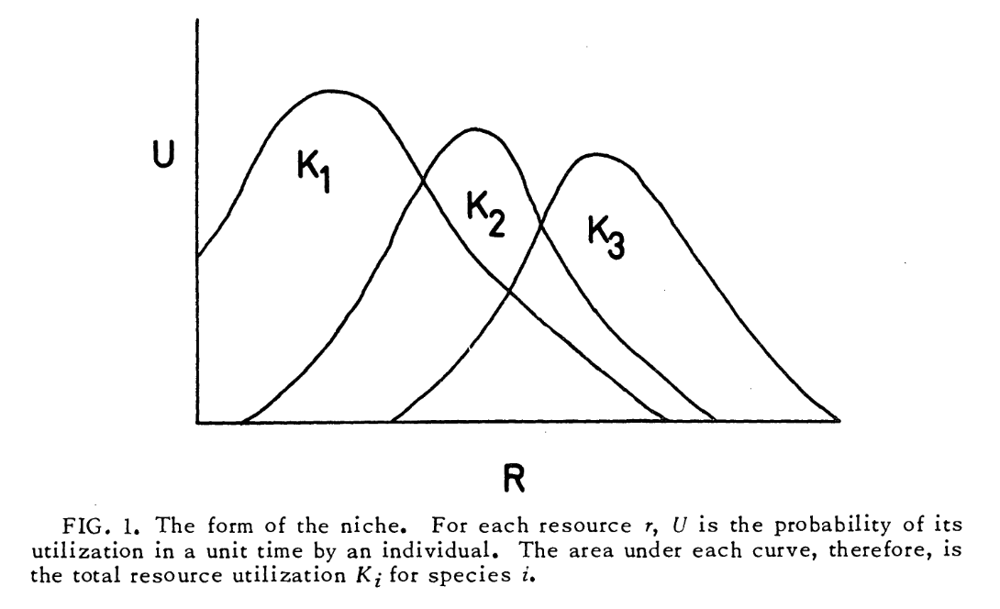
```

```{r echo = F, fig.align = 'center', out.width = '100%'}
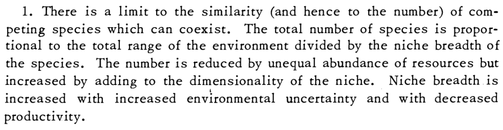
```

.footnote[[**MacArthur and Levins 1967**](https://doi.org/10.1086/282505)]
]

.pull-right[

<br>

Within a particular environment, there is a limit to the number (and similarity) of species that can be accommodated. 

It is proportional to the range of conditions or resources available divided by the niche breadth of the species.

Where species' niches overlap they should compete, leading either to competitive exclusion or niche partitioning.

]

---

layout: false

### 2. Species Coexistence and Competition

.pull-left[

#### *Limiting similarity* and *competitive outcomes*


Hypothesis:
- species competing for the same resources cannot stably coexist, because the stronger competitors will exclude the others

Predictions:
- co-occurring species should show **niche partitioning**, or
- similar species should **competitively exclude** one another and rarely co-occur

]

.pull-right[
```{r echo = F, fig.align = 'center', out.width = '65%'}
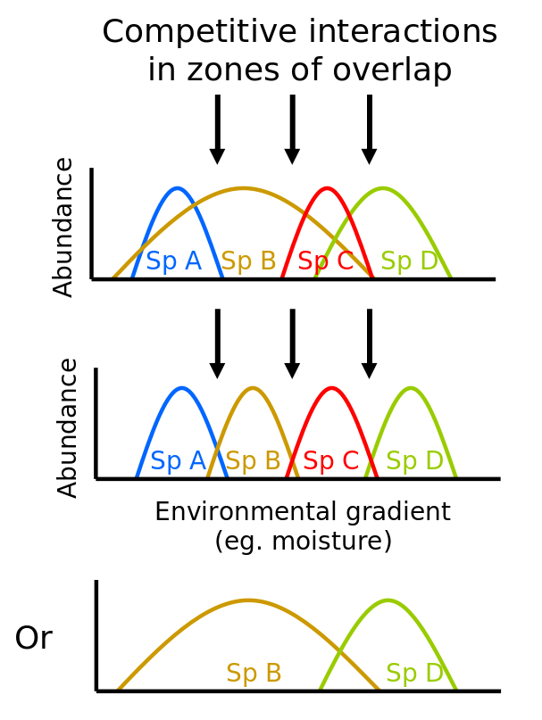
```

.footnote[###### ]

]

---

class: center, middle

### What do these two observations mean for how species assemble into the communities that we observe in nature?

```{r echo = F, fig.align = 'center', out.width = '100%'}
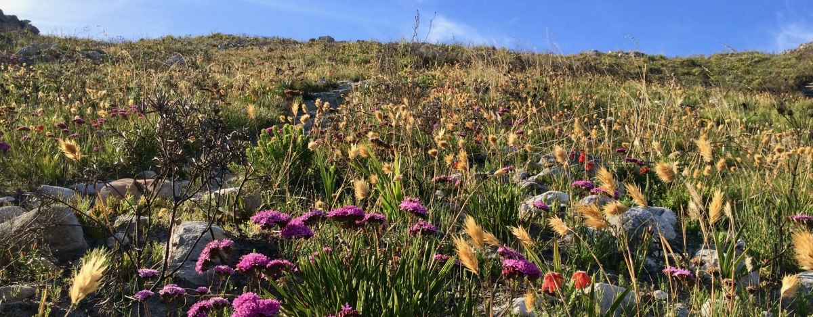
```

---

.pull-left[

### Assembly Rules

In 1975, Jared Diamond proposed assembly rules based on the assertion that competition is responsible for determining the composition of biotic assemblages.

Perhaps the most famous is the _"forbidden species combinations" hypothesis_, that competition is the main force structuring species composition on islands, not immigration, such that certain combinations of species should not occur.

The rule was based on observations of avian assemblages on islands near New Guinea where "checkerboards" were common - a pattern of mutual exclusivity such that if one species occurs on an island the other does not, and _vice versa_.

[**Cody and Diamond 1975**](https://books.google.co.za/books/about/Ecology_and_Evolution_of_Communities.html?id=j_idbVxwzpQC&redir_esc=y)
]


.pull-right[
```{r echo = F, fig.align = 'center', out.width = '90%'}
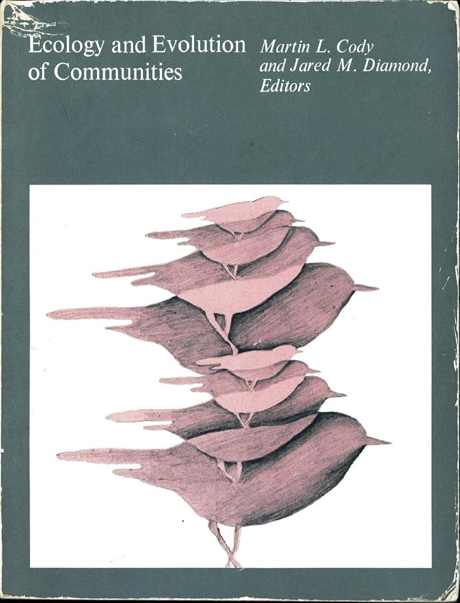
```
]

---

.pull-left[

### Assembly Rules

> "I think what we’re going to find out is that assembly rules are vague, gentle constraints," - Evan Weiher

Much effort has been invested exploring assembly rules, but few general rules have emerged.

This is a problem for predicting changes in the structure, composition and function of communities under global change...

On the positive side, we have developed a pretty good idea of the processes that determine community assembly, even if we can't always predict the outcome.

[**Weiher and Keddy 1999**](https://www.cambridge.org/core_title/gb/139891)
]

.pull-right[
```{r echo = F, fig.align = 'center', out.width = '80%'}
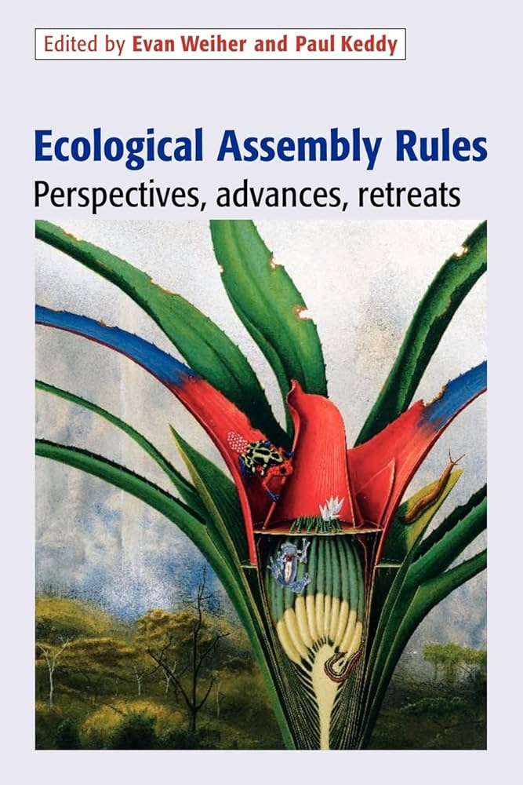
```
]

---

.left-column[
### Community Assembly

Starting with the pool of species from a region that could possibly occur (disperse to) your sites of interest.

This is the **regional species pool**, and can be defined in different ways, depending on your purpose.

Dispersal we'll get to later.
]

.right-column[
```{r echo = F, fig.align = 'center', out.width = '85%'}
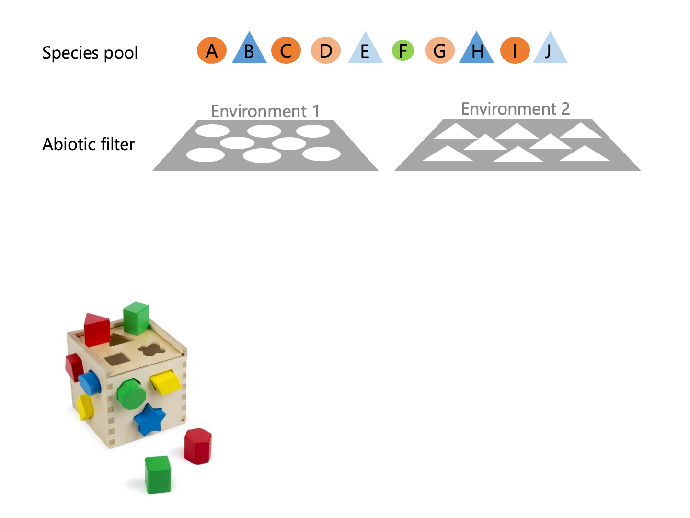
```

.footnote[image: Tony Verboom]
]

---

.left-column[
### Community Assembly

Firstly, species should be "filtered" such that they only occur in environments that they are adapted to (this is in effect their fundamental Hutchinsonian niche).

A process called **habitat filtering** or **ecological sorting**.
]

.right-column[
```{r echo = F, fig.align = 'center', out.width = '85%'}
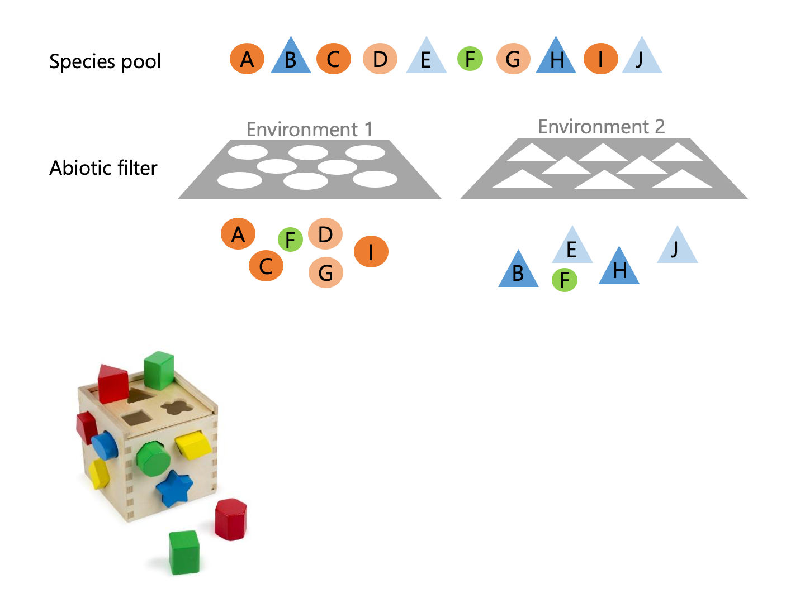
```

.footnote[image: Tony Verboom]
]

---

.left-column[
### Community Assembly

Secondly, the species must now pass through a biotic filter.

This means surviving -ve interspecific interactions (competition, predation, parasitism) and finding required +ve interactions like mutualists (pollinators, seed dispersers, mycorrhizae), facilitators or hosts (for parasites).

]

.right-column[
```{r echo = F, fig.align = 'center', out.width = '85%'}
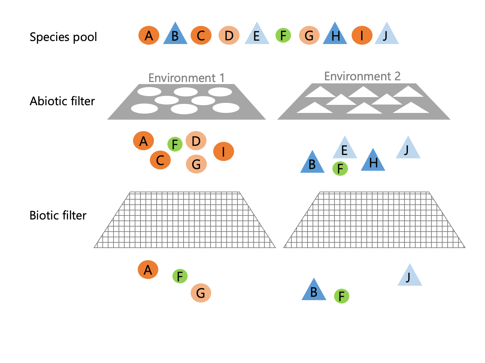
```

.footnote[image: Tony Verboom]
]

---

.left-column[
### Community Assembly

Lastly, once assembled, over time the community may alter the environment in ways that affect future community assembly at that site (e.g. flammability, nutrient availability).

This is termed **niche construction**, and if you want to hear more about it do the [**BIO3018F field course**](https://science.uct.ac.za/department-biological-sciences/undergraduate-study/third-year-courses) next year...
]

.right-column[
```{r echo = F, fig.align = 'center', out.width = '85%'}
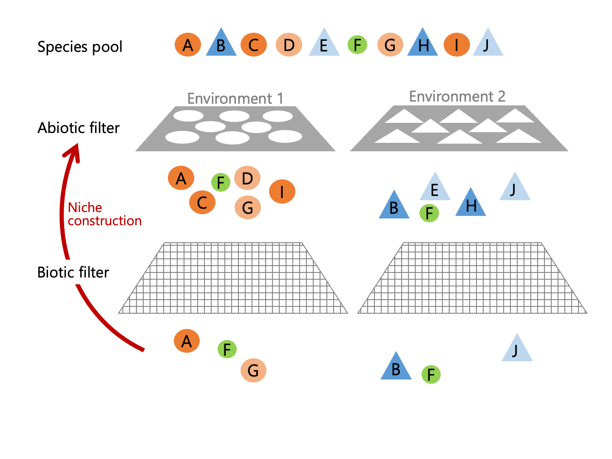
```

.footnote[image: Tony Verboom]
]

---

### Niche Construction

.pull-left[
As an example, here's a patch of Peninsula Granite Fynbos behind Kirstenbosch Gardens where fire has been excluded and forest species are invading.

Eventually, the less flammable forest species will exclude fire, and the necessary cues for most Fynbos species to recruit. They're also altering the soils and light environment, shifting the environmental filter for new species and selecting forest species.

```{r echo = F, fig.align = 'center', out.width = '100%'}
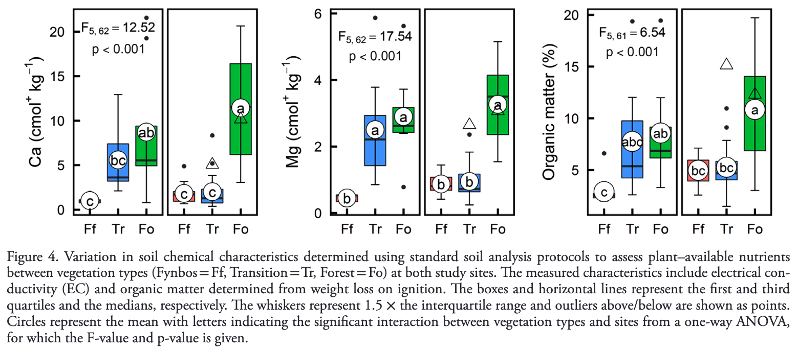
```
]

.pull-right[
```{r echo = F, fig.align = 'center', out.width = '100%'}
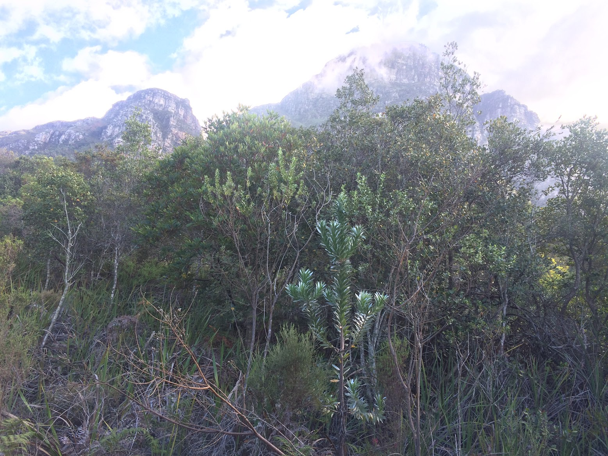
```

[Figure from **Cramer et al. 2019**](https://doi.org/10.1111/ecog.03860)

]

---

### Communities as "superorganisms" vs coincidental associations

.pull-left[
```{r echo = F, fig.align = 'center', out.width = '40%'}
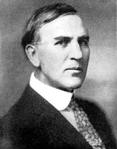
```

_"The developmental study of vegetation necessarily rests upon the assumption that the unit or climax formation is an organic entity. **As an organism the formation arises, grows, matures, and dies.** Furthermore, each climax formation is able to reproduce itself, repeating with essential fidelity the stages of its development."_ — [**Frederic Clements 1916**](https://ia601309.us.archive.org/1/items/cu31924000531818/cu31924000531818.pdf)
]

.pull-right[
```{r echo = F, fig.align = 'center', out.width = '40%'}

```

_"An association is not an organism, scarcely even a vegetational unit, but merely a coincidence."_ — [**Henry Gleason 1926**](https://www.jstor.org/stable/2479933)

i.e. Species largely respond to the environment individualistically
]

---

### Communities as "superorganisms" vs coincidental associations

.pull-left[

But what about our Fynbos vs Forest niche construction example?

Few species are shared between the two formations, and they appear to be alternative stable states that we can shift between by adding or excluding fire.

```{r echo = F, fig.align = 'center', out.width = '100%'}
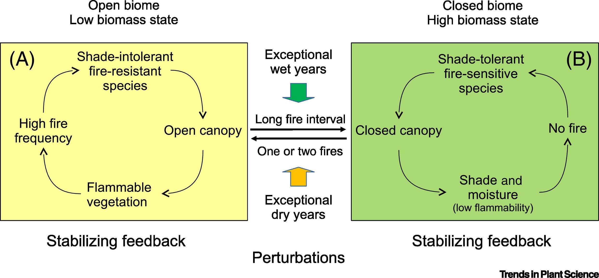
```
]

.pull-right[
```{r echo = F, fig.align = 'center', out.width = '100%'}

```

[Figure from **Pausas and Bond 2020**](https://doi.org/10.1016/j.tplants.2019.11.003)
]

---

### Communities as "superorganisms" vs coincidental associations

.pull-left[

While there's been rigorous debate in the literature for almost 100 years, it is difficult to completely exclude either notion...

_"Figure 1: Classical [Gleasonian] pattern of species response curves along a climate gradient (a), and the alternative pattern along the same climatic gradient when considering the shading factor (b). Note that in the driest and the wettest section of the gradient, we find open (e.g. grassland) and closed (forest) biomes, respectively; but at intermediate levels of the gradient, both are possible depending mainly on the disturbance regimes and feedback processes (alternative biome states, ABS; Pausas & Bond, 2020). Thus, under the intermediate levels of the gradient, species that may seem to coexist when considering climate only (a) are not really coexisting but occurring in drastically different biomes."_ - [**Pausas and Bond 2021**](https://doi.org/10.1111/1365-2745.13781)
]

.pull-right[
```{r echo = F, fig.align = 'center', out.width = '65%'}
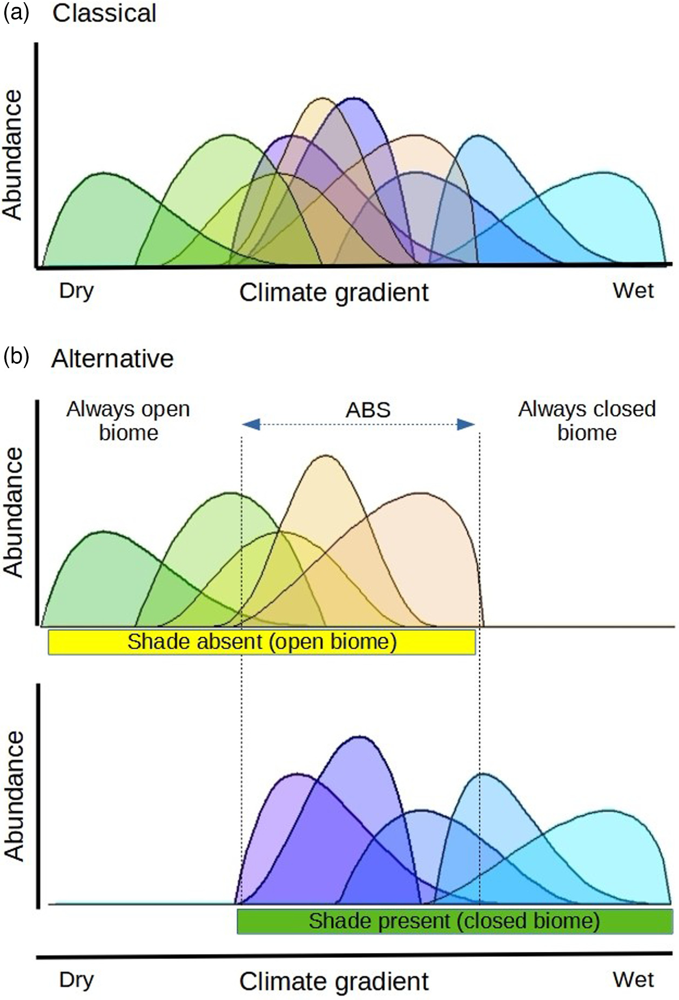
```

]

---

class: center, middle

### Where does this leave us with respect to understanding community assembly?

---

Community assembly: Deterministic or Stochastic?

.pull-left[
Slides 9 - 12 suggest that community assembly is a deterministic process - i.e. one whose behaviour is entirely determined by its initial state and inputs, and which is not random or stochastic. The outcome should be predictable.

While it may be predictable, we haven't worked out quite how yet and there are many mysteries and contrasting theories and concepts: Elton vs Grinnell, Gleason vs Clements, etc

]

.pull-right[

```{r echo = F, fig.align = 'center', out.width = '65%'}
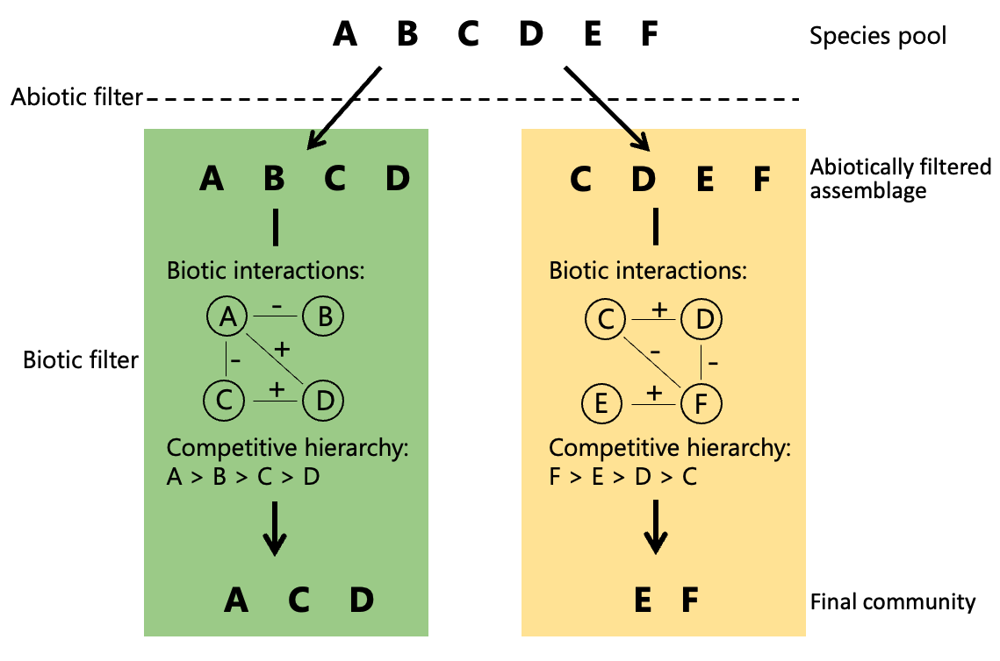
```

.footnote[image: Tony Verboom]

]

---

class: center, middle

### But wait! It gets worse!!!

--

```{r echo = F, fig.align = 'center', out.width = '65%'}

```

We have yet to meet Stephen Hubbell!


---

class: center, middle

### But wait! It gets worse!!!

```{r echo = F, fig.align = 'center', out.width = '65%'}

```

We have yet to meet Darth Hubbell!

---

Neutral theory...

---

.pull-left[

### Community Assembly

]

.pull-right[
```{r echo = F, fig.align = 'center', out.width = '90%'}
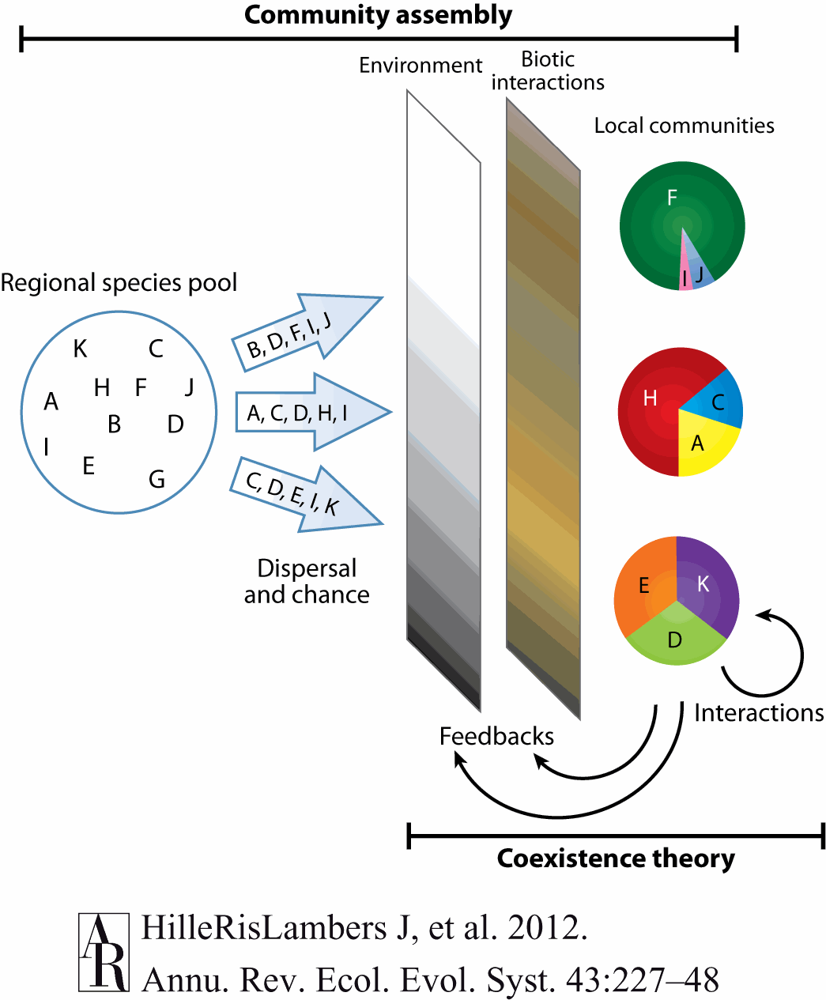
```

.footnote[[**HillRisLambers et al. 2012**](http://dx.doi.org/10.1146/annurev-ecolsys-110411-160411)]
]

---

.pull-left[

### Exponential growth

$dN/dt = rN$

Population growth rate, $r$, doesn't change with population size

- i.e. no competition

```{r, echo = F, out.width="80%", fig.height = 6}
library(tidyverse)

data.frame(N = c(2,4,8,16,32), 
           t = c(0,1,2,3,4)) %>%
  ggplot(aes(x = t, y = N)) +
  geom_line() +
  geom_point(size = 5) +
  ylim(0,35) +
  xlim(0,5) +
  ylab("Number of Individuals (N)") +
  xlab("Time or generations (t)") +
  theme_bw() +
  theme(axis.text=element_text(size=20),
        axis.title=element_text(size=24,face="bold"))

```

]

.pull-right[

### Logistic growth

$dN/dt = rN (K – N)/K$

Population growth rate, $r$, gets small as the population approaches carrying capacity, $K$

- i.e. _**intraspecific competition!**_

```{r, echo = F, out.width="80%", fig.height = 6}
library(tidyverse)

data.frame(N = c(2,4,8,16,24,28,30,30,30), 
           t = c(0,1,2,3,4,5,6,7,8)) %>%
  ggplot(aes(x = t, y = N)) +
  geom_line() +
  geom_point(size = 5) +
  ylim(0,35) +
  xlim(0,10) +
  ylab("Number of Individuals (N)") +
  xlab("Time or generations (t)") +
  theme_bw() +
  theme(axis.text=element_text(size=20),
        axis.title=element_text(size=24,face="bold")) +
  geom_hline(yintercept = 30, colour = "blue", linetype = 2) +
  geom_text(aes(x = 0, y = 32, label = "K"), colour = "blue", size = 10)

```
]

--

.footnote[_But what about int**er**specific competition? (i.e. between species)_]

---

.pull-left[

### Experiments with _Paramecium_

Georgyi Frantsevitch Gause's microcosm experiments with species of the unicellular cilliate genus _Paramecium_ taught us a lot about intra- and interspecific competition.

<br>

Microcosms are artificial, simplified ecosystems that are used to simulate the behaviour of natural ecosystems under controlled conditions.

<br>

Gause's microcosms were test tubes supplied with an oatmeal medium, which promotes the growth of bacteria in the upper, oxygenated part of the test tube, and yeast in the lower, de-oxygenated part.

]

.pull-right[

<br>

```{r echo = F, fig.align = 'center', out.width = '100%'}
knitr::include_graphics("images/Paramecium_aurelia.jpg")
```

.footnote[image: [**Wikipedia**](https://en.wikipedia.org/wiki/Paramecium#/media/File:Paramecium.jpg)]

]

---

### Experiments with _Paramecium_ spp

_Paramecium_ species cultured separately demonstrated **_intraspecific_** competition.

```{r echo = F, fig.align = 'center', out.width = '60%'}
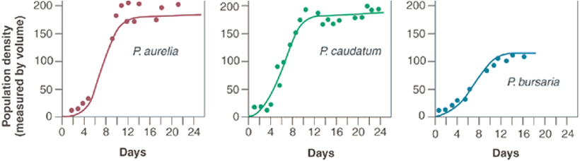
```

.footnote[[**Gause 1934**](http://dx.doi.org/10.1126/science.79.2036.16.b)]
--

Here _Paramecium_ species cultured together, demonstrate **_interspecific_** competition...

```{r echo = F, fig.align = 'center', out.width = '40%'}
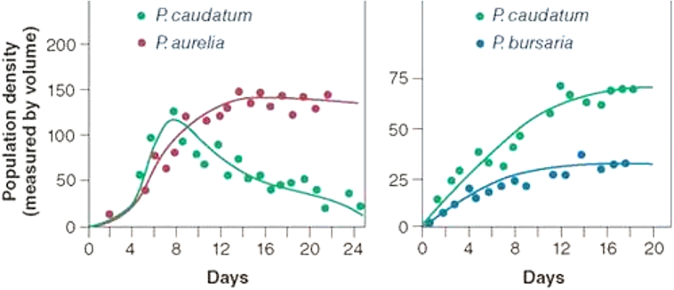
```

---

### Experiments with _Paramecium_ spp

Why the different outcomes between the species mixes?

.pull-left[
#### Observation

```{r echo = F, fig.align = 'center', out.width = '90%'}

```

In the panel on the **left**, growth of both species is suppressed, but _P. caudatum_ actually goes extinct!

The pair on the **right** appear to be able to coexist, albeit at lower densities than when grown alone.

]

--

.pull-right[

#### Explanation

**Left:** _P. caudatum_ and _P. aurelia_ both feed on bacteria, but _P. aurelia_ grows 6 times faster than _P. caudatum_, resulting in its **competitive exclusion**.

**Right:** While _P. caudatum_ out-competes _P. bursaria_ for bacteria, _P. bursaria_ can survive on yeast in the lower, less oxygenated part of the test tube, because it contains tiny green algae that provide it with oxygen. This is an example of **resource (or niche) partitioning**.

.footnote[[**Gause 1934**](http://dx.doi.org/10.1126/science.79.2036.16.b)]
]

---

.pull-left[
### Niche/Resource partitioning

There are many examples in nature of species that are able to coexist in a community, because they partition their resources.

Many of these examples are from birds, such as [**Robert MacArthur's 1958 study**](http://dx.doi.org/10.2307/1931600) of warblers in the genus _Dendroica_ in the conifer forests of northeastern USA. Here he concluded:

>_"There are differences of feeding position, behavior, and nesting date which reduce competition."_

These are niche differences, but by which definition of the niche?

]

.pull-right[
```{r echo = F, fig.align = 'center', out.width = '75%'}
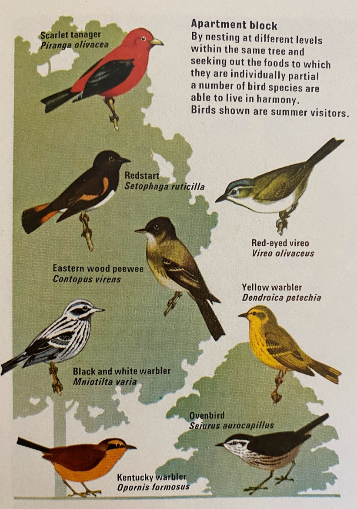
```

.footnote[Atlas of World Wildlife 1973 (not MacArthur's warblers...)]
]

---

.pull-left[
### Niche/Resource partitioning

There are many examples in nature of species that are able to coexist in a community, because they partition their resources.

Many of these examples are from birds, such as [**Robert MacArthur's 1958 study**](http://dx.doi.org/10.2307/1931600) of warblers in the genus _Dendroica_ in the conifer forests of northeastern USA. Here he concluded:

>_"There are differences of feeding position, behavior, and nesting date which reduce competition."_

These are niche differences, but by which definition of the niche?

> The Eltonian Niche (focus on resources)

One can also observe niche partitioning (or niche shifts) in the Grinnellian niche.
]

.pull-right[
```{r echo = F, fig.align = 'center', out.width = '75%'}

```

.footnote[Atlas of World Wildlife 1973 (not MacArthur's warblers...)]
]
---

.pull-left[
### Character Displacement

The process by which niche partitioning occurs.

_"the divergence shown when two partly allopatric species of comparable niche requirements become sympatric in part of their range"_ - [**Hutchinson 1959**](https://www.jstor.org/stable/2458768)

_"Two closely related species have overlapping ranges. In the parts of the ranges where one species occurs alone, the populations of that species are similar to the other species and  may even be very difficult to distinguish from it. In the area of overlap, where the two species occur together, the populations are more divergent and easily distinguished, i.e., they "displace" one another in one or more characters. The characters involved can be morphological, ecological, behavioral, or physiological; they are assumed to be genetically based."_ - [**Brown and Hutchinson 1956**](http://dx.doi.org/10.2307/2411924)

]

.pull-right[
```{r echo = F, fig.align = 'center', out.width = '75%'}
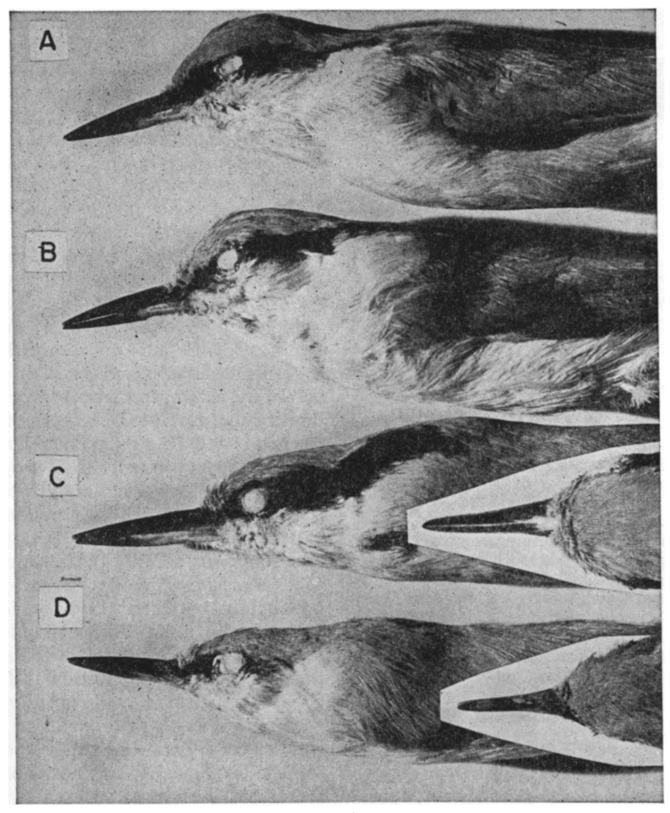
```

Size and shape of the bill and facial stripe in _Sitta neumayer_ and _S. tephronota_. A and B are collections of the respective species where they occur alone. D and C were collected where they co-occur.

]

---

### Competitive Exclusion

The **competitive exclusion principle** is often attributed to Gause, and sometimes called Gause's law, but there were earlier observations by Grinnell, Darwin and others, e.g.

>_Two species of approximately the same food habits are not likely to remain long evenly balanced in numbers in the same region. One will crowd out the other._ - [**Grinnell 1904**](https://doi.org/10.2307/4070199)

--

<br>

Unequivocal examples of competitive exclusion are rare, and can only really be demonstrated with experiments such as Gause's. These experiments are near-impossible for organisms with longer lifespans.

--

<br>

Why would we need experiments? Why would field observations not be good enough?

---

### Competitive exclusion and the Ghost of Competition Past

```{r echo = F, fig.align = 'center', out.width = '70%'}
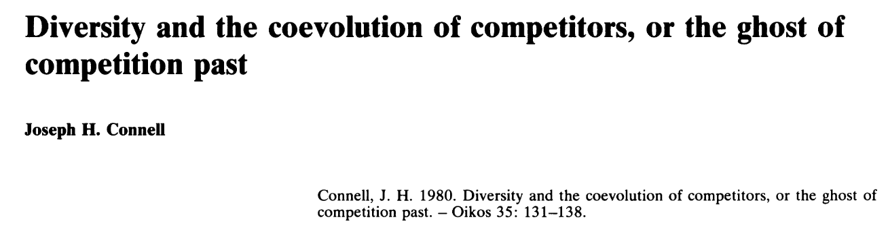
```

In nature, while interspecific competition may be common, where competitive exclusion has occurred it cannot be observed as only one competitor would remain.

- i.e. the loser is driven to extinction or there is spatial segregation of competitors (i.e. the species do not coexist locally, but occur in sympatry)

While similar species occurring in sympatry may suggest that competitive exclusion has occurred, there are other potential explanations like dispersal limitation that prevents them accessing the same physical space.

The criteria required to demonstrate that competitive exclusion has occurred, or that species have coevolved due to competition (e.g. resource partitioning or character displacement) are onerous! - see [**Connell 1980**](http://dx.doi.org/10.2307/3544421).

---

class: center, middle

### How can we determine if/when species can coexist?

---

class: center, middle

### How about both species maintaining population growth as a criterion?

---

class: center, middle

### How do we quantify the effect of interspecific competition on population growth? 

---

.pull-left[

### Exponential growth

$dN/dt = rN$

Population growth rate, $r$, doesn't change with population size

- i.e. no competition

```{r, echo = F, out.width="80%", fig.height = 6}
library(tidyverse)

data.frame(N = c(2,4,8,16,32), 
           t = c(0,1,2,3,4)) %>%
  ggplot(aes(x = t, y = N)) +
  geom_line() +
  geom_point(size = 5) +
  ylim(0,35) +
  xlim(0,5) +
  ylab("Number of Individuals (N)") +
  xlab("Time or generations (t)") +
  theme_bw() +
  theme(axis.text=element_text(size=20),
        axis.title=element_text(size=24,face="bold"))

```

]

.pull-right[

### Logistic growth

$dN/dt = rN (K – N)/K$

Population growth rate, $r$, gets small as the population approaches carrying capacity, $K$

- i.e. _**intraspecific competition!**_

```{r, echo = F, out.width="80%", fig.height = 6}
library(tidyverse)

data.frame(N = c(2,4,8,16,24,28,30,30,30), 
           t = c(0,1,2,3,4,5,6,7,8)) %>%
  ggplot(aes(x = t, y = N)) +
  geom_line() +
  geom_point(size = 5) +
  ylim(0,35) +
  xlim(0,10) +
  ylab("Number of Individuals (N)") +
  xlab("Time or generations (t)") +
  theme_bw() +
  theme(axis.text=element_text(size=20),
        axis.title=element_text(size=24,face="bold")) +
  geom_hline(yintercept = 30, colour = "blue", linetype = 2) +
  geom_text(aes(x = 0, y = 32, label = "K"), colour = "blue", size = 10)

```
]

--

.footnote[_But what about int**er**specific competition? (i.e. between species)_]

---

### Population growth with intra- and interspecific competition

.pull-left[
Assuming we have two species, 1 and 2. The population growth of species 1 can be modelled as:

<br>

$dN_1/dt = r_1 N_1(K_1 – {N_1 \mathbf{+ \alpha_{12} N_2}})/K_1$

<br>

This is the logistic curve with a new term, $\mathbf{\alpha_{12} N_2}$, to account for the competitive effect of species 2 on species 1. 

- $N_2$ gives the population size of species 2
- $\alpha_{12}$ is the per-capita competitive effect of species 2 on species 1 relative to intraspecific competition
]

--

.pull-right[

<br>

**What do the values of** $\alpha_{12}$ **mean?**

- if $= 1$ then the effect of species 2 on species 1 is the same as the effect of species 1 on species 1
  - the equation would essentially reduce to the logistic growth curve and you could treat all individuals as one species
- if $> 1$ the effect of species 2 on species 1 is greater
- if $< 1$ the effect of species 2 on species 1 is less
- if $= 0$ there is no effect of species 2 on species 1 and the new term effectively disappears (= 0)
]

---

### Population growth with intra- and interspecific competition

The population growth of species 1 can be modelled as:

<br>

$dN_1/dt = r_1 N_1(K_1 – {N_1 + \alpha_{12} N_2})/K_1$

<br>

Similarly, the population growth of species 2 can be modelled as:   

<br>

$dN_2/dt = r_2 N_2(K_2 – {N_2 + \alpha_{21} N_1})/K_2$

.footnote[These are the Lotka-Volterra competition equations, independently developed by Alfred Lotka and Vito Volterra in the 1920s.]

---

### What is carrying capacity ( $K$ ) when multiple species are present?

.pull-left[

$K$ = the maximum population that available resources can support, and growth drops to zero.

$K$ for each species is constrained not only by density-dependent intraspecific competition, but also by the second species drawing from the same resource pool (interspecific competition)...

Instead of being a single number, $K$ is now a linear function expressed in terms of the population sizes of the two species, $N_1$ and $N_2$.
  - The relationship is negative, because as one increases the other must decrease...
  - Above the line, resources are limiting and populations decline. Below the line, resources are available for populations to grow.
]

.pull-right[

```{r echo = F, fig.align = 'center', out.width = '80%'}
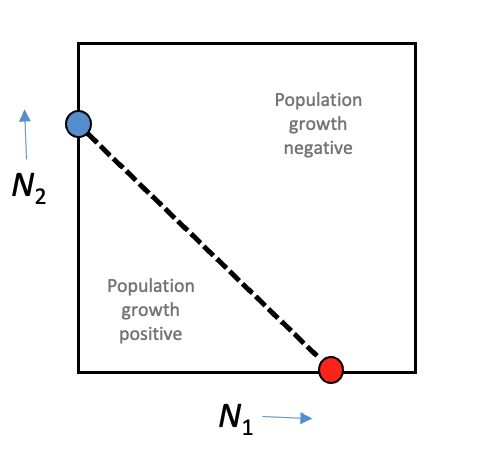
```

This is termed a zero net growth isocline (ZNGI)
]
---

### What is carrying capacity ( $K$ ) when multiple species are present?

.pull-left[

Focusing on species 1, pop growth will drop to zero:

**Firstly**, when $N2$ is negligible but $N1 = K1$ (i.e. species 1 reaches its carrying capacity). This is represented by the red dot. 

**Secondly**, when $N1$ is negligible but $N2$ is so large that species 2 is using up all the resources. This is by the blue dot.

- Notice that the size of $N2$ at this point depends on $\alpha_{12}$. $K1$ is reached at lower $N2$ when $\alpha_{12}$ is large (species 2 has a strong competitive effect).

**Lastly**, there is a series of intermediate combinations of $N1$ and $N2$ that also result in complete use of the available resources and halt population growth. These are represented by the dashed line.
]

.pull-right[

```{r echo = F, fig.align = 'center', out.width = '80%'}
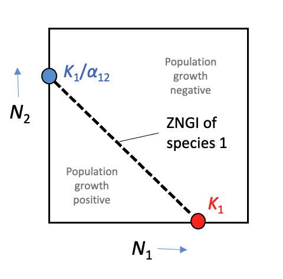
```

The zero net growth isocline (ZNGI) of species 1
]

---

### What is carrying capacity ( $K$ ) when multiple species are present?

.pull-left[

Or mathematically if you prefer?

For population growth of species 1 to drop to zero:

$dN_1/dt = r_1 N_1(K_1 – {N_1 + \alpha_{12} N_2})/K_1 = 0$

This can occur when:

- Two trivial scenarios not worth mentioning, $(r = 0$ or $N_1 = 0)$
- $N_2$ is close to 0 and $N_1 = K_1$ (the red dot)
- $N_1$ is close to 0 and $N_2 = K_1/\alpha_{12}$ (the blue dot)
- $N_1 = K_1 - \alpha_{12} N_2$ (the dashed line)

Together this gives the zero net growth isocline (ZNGI) of species 1.
]

.pull-right[

```{r echo = F, fig.align = 'center', out.width = '80%'}

```

The zero net growth isocline (ZNGI) of species 1
]

---

### ZNGI's for two species

```{r echo = F, fig.align = 'center', out.width = '55%'}
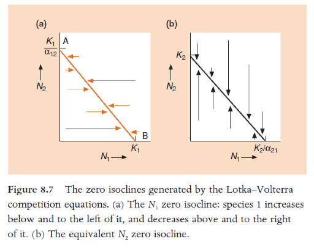
```

---

### ZNGI's and the coexistence of species

.left-column[

In (a) and (b) one species is a stronger competitor and competitive exclusion occurs

(c) both species' interspecific competitive effects > their intraspecific competitive effects

(d) both species' interspecific competitive effects < their intraspecific competitive effects

]

.right-column[
```{r echo = F, fig.align = 'center', out.width = '75%'}
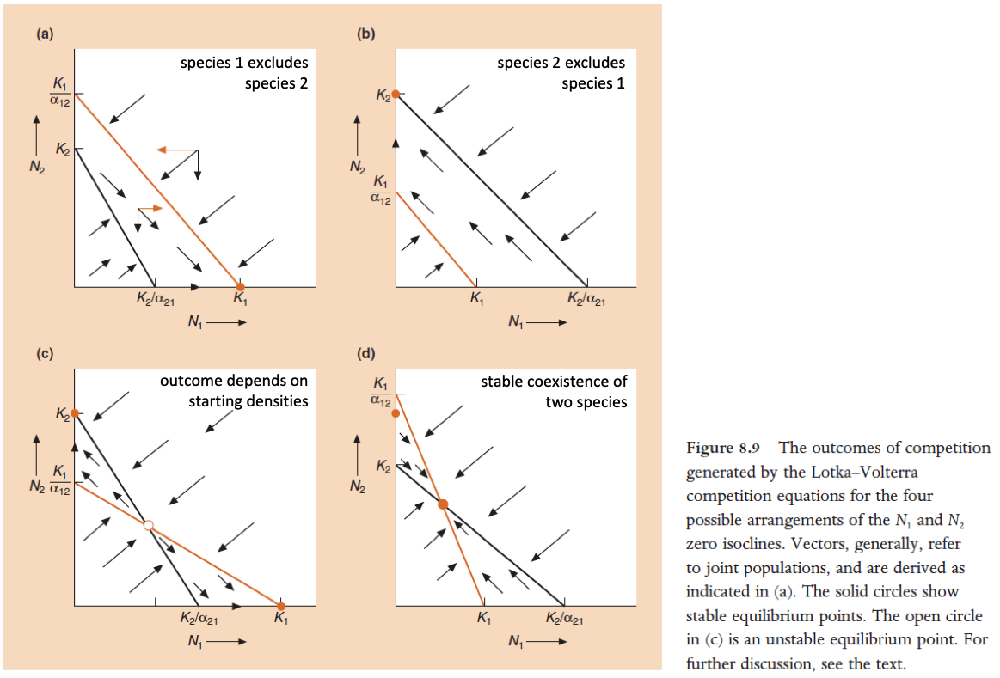
```
.footnote[Brown = Species 1; Black = Species 2]
]

---

### ZNGI's and the coexistence of species

.left-column[

Only (d) shows stable coexistence!

_Intraspecific competition must be greater than interspecific competition!_

This conveys a **Rare Species Advantage**, allowing the species with lower population numbers to grow faster and avoid extinction.

]

.right-column[
```{r echo = F, fig.align = 'center', out.width = '75%'}

```
.footnote[Brown = Species 1; Black = Species 2]
]
---

### Limiting similarity and species coexistence

.pull-left[
```{r echo = F, fig.align = 'center', out.width = '90%'}

```

```{r echo = F, fig.align = 'center', out.width = '100%'}

```

.footnote[[**MacArthur and Levins 1967**](https://doi.org/10.1086/282505)]
]

.pull-right[

The **Rare Species Advantage** occurs when intraspecific competition is stronger than interspecific competition.

> _"a community can retain all $n$ species if any one of them can increase when rare"_

Their work suggested that this can only happen when species show some degree of niche differentiation. 

It also suggested that the number of species that can be accommodated by a particular environment is proportional to the range of conditions or resources available divided by the niche breadth of the species.

- i.e. the size of the pie and how finely you slice it

]


---

### Examples?

.pull-left[
```{r echo = F, fig.align = 'center', out.width = '60%'}
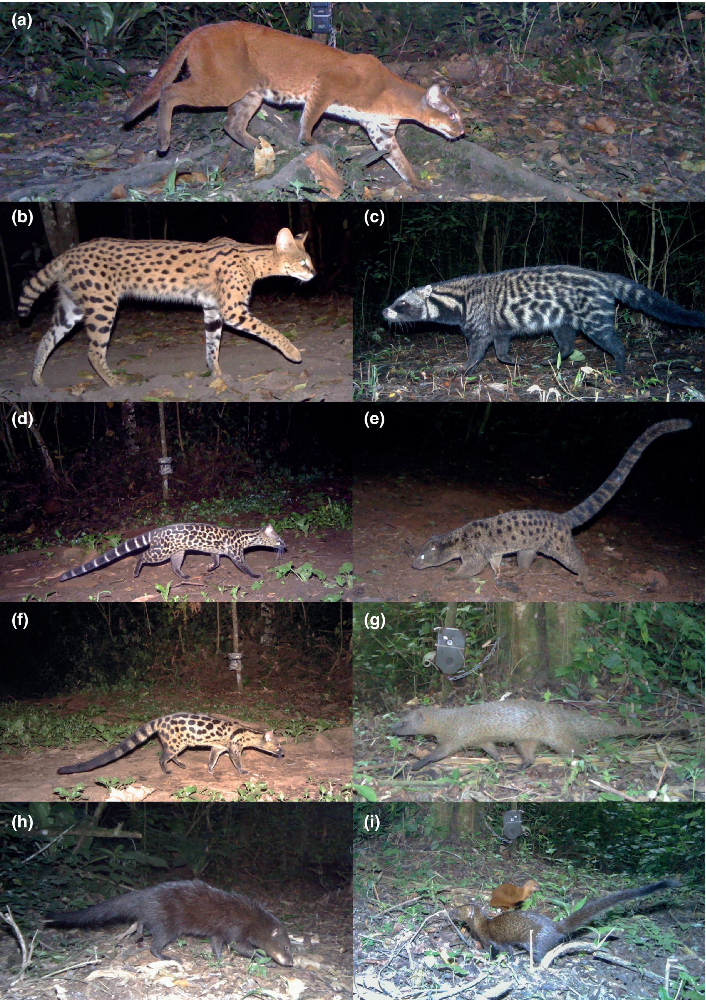
```
]

.pull-right[
```{r echo = F, fig.align = 'center', out.width = '100%'}
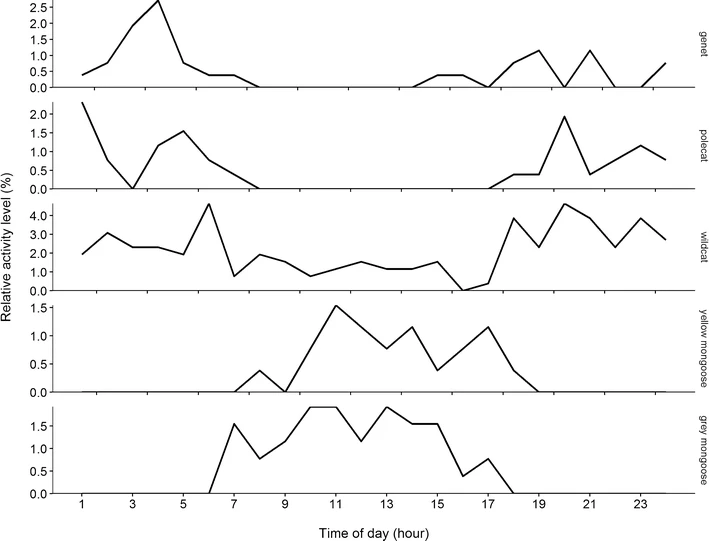
```

[**de Satgé et al. 2017**](http://dx.doi.org/10.1007/s00442-017-3916-2)
]

---

class: middle

## Take-home

>**

>**

>**

Check out this [**Crash Course** in community ecoogy](https://www.youtube.com/watch?v=GxE1SSqbSn4) for a rapid recap of the basics.

---
class: center, middle

# Thanks!

Slides created via the R packages:

[**xaringan**](https://github.com/yihui/xaringan)<br>
[gadenbuie/xaringanthemer](https://github.com/gadenbuie/xaringanthemer)

The chakra comes from [remark.js](https://remarkjs.com), [**knitr**](http://yihui.name/knitr), and [R Markdown](https://rmarkdown.rstudio.com).
