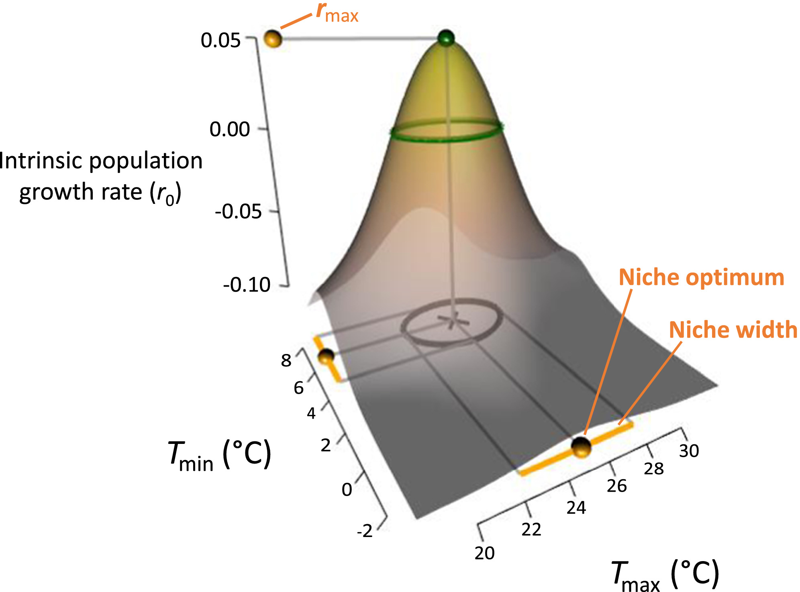
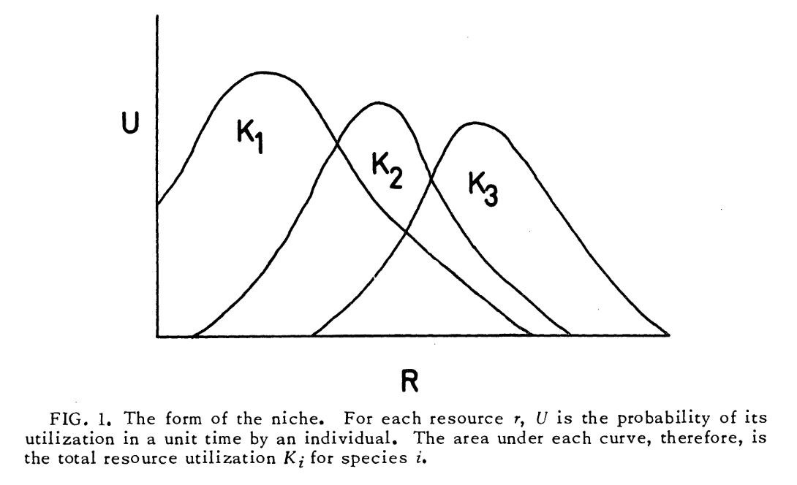
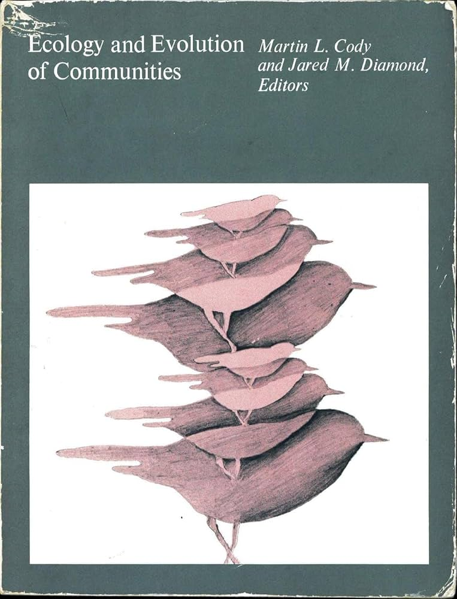
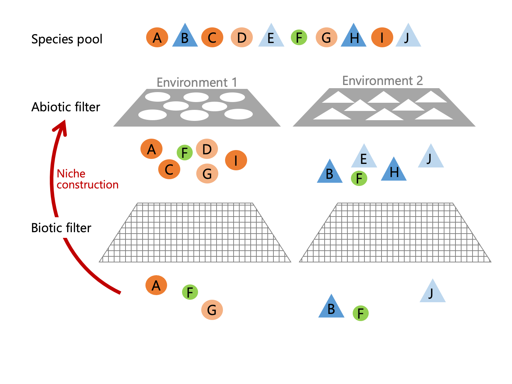
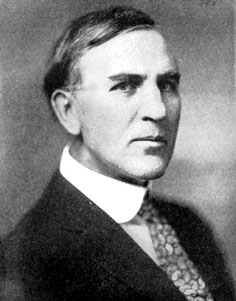
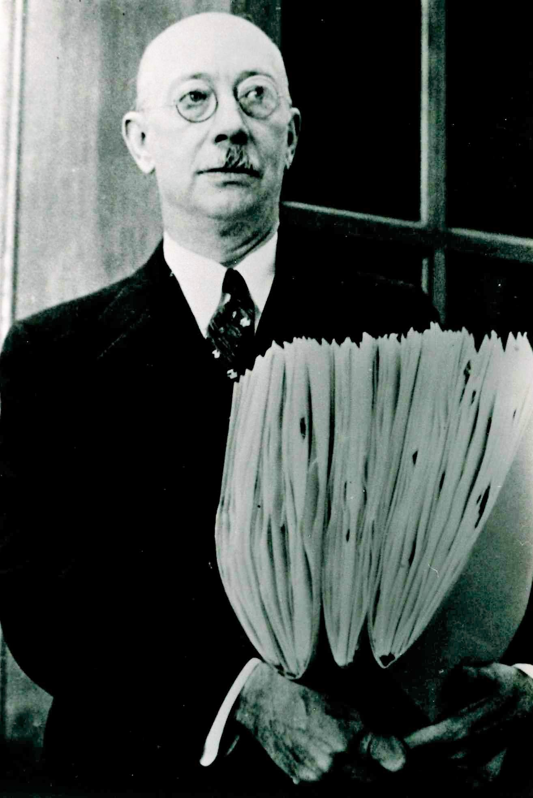
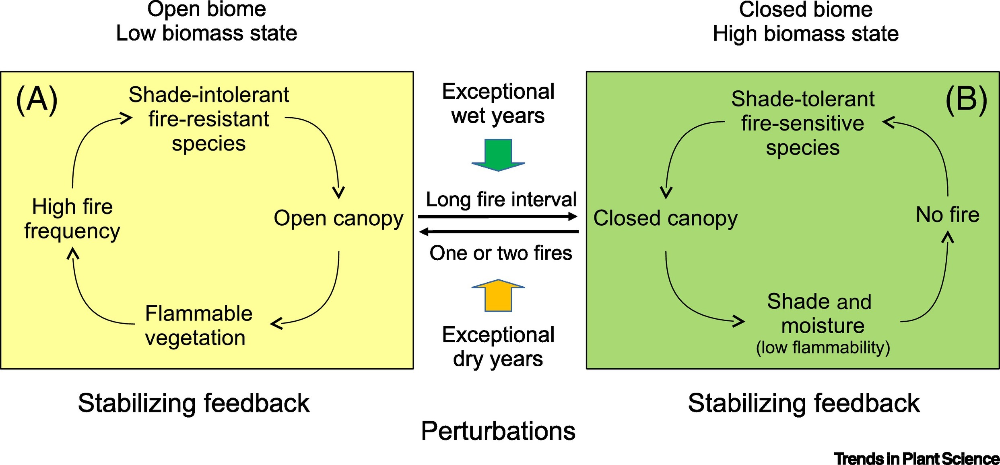
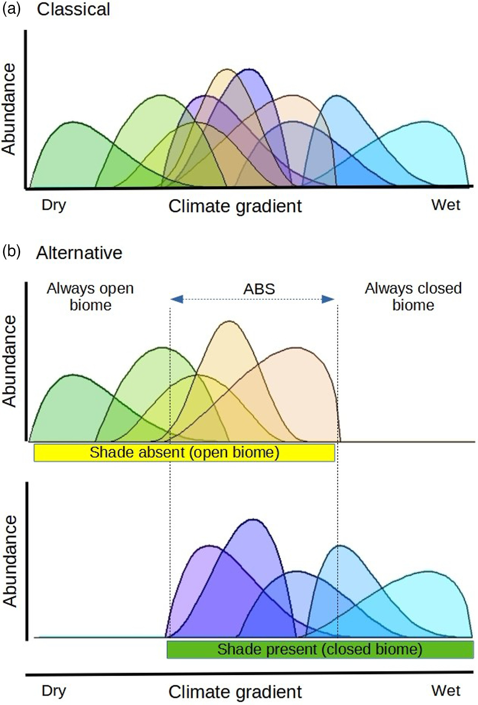
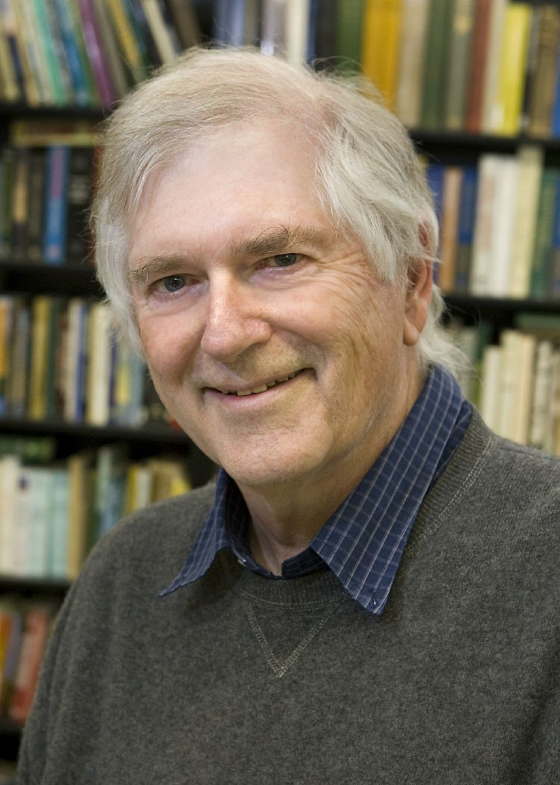

```{r setup, include=FALSE}
options(htmltools.dir.version = FALSE)
knitr::opts_chunk$set(
  fig.width=9, fig.height=3.5, fig.retina=3,
  out.width = "100%",
  cache = FALSE,
  echo = TRUE,
  message = FALSE, 
  warning = FALSE,
  hiline = TRUE
)

# library(RefManageR)
# BibOptions(check.entries = FALSE,
#            bib.style = "authoryear",
#            cite.style = "alphabetic",
#            style = "markdown",
#            hyperlink = FALSE,
#            dashed = FALSE)
# myBib <- ReadBib("bib/2_species.bib", check = FALSE)
```

```{r xaringan-themer, include=FALSE, warning=FALSE}
library(xaringanthemer)

# style_duo_accent(
#   primary_color = "#1381B0",
#   secondary_color = "#FF961C",
#   inverse_header_color = "#FFFFFF"
# )

style_mono_light(base_color = "#23395b")

#https://mycolor.space/?hex=%2323395B&sub=1 
#"Generic gradient" - #23395B #006287 #008E9D #00B897 #89DD81 #F9F871
#"Matching gradient" (reverse) - #23395B #494E77 #716292 #9C77AA #C88DBF #F5A3D0


library(knitr)
library(kableExtra)
```


```{r xaringan-tile-view, echo=FALSE}
# xaringanExtra::use_tile_view()
```

class: center, middle

###A quick recap...

---

### 1. The Grinnellian and Hutchinsonian Niche

.pull-left[

<br>

The occurrence of species at a locality is predominantly determined by its ability to maintain a viable population (i.e. positive per-capita reproductive rate) in the prevailing environmental conditions... $^1$

<br>

<br>

<br>

$^1$Or nearby and then disperse there..., but we'll ignore this for now...

]

.pull-right[
```{r echo = F, fig.align = 'center', out.width = '100%'}

```

.footnote[Figure from [**Treurnicht et al. 2020**](http://dx.doi.org/10.1111/geb.13048)]
]

---

### 2. Species Coexistence and Competition

.pull-left[
```{r echo = F, fig.align = 'center', out.width = '90%'}

```

```{r echo = F, fig.align = 'center', out.width = '100%'}
knitr::include_graphics("images/MacArthur_Levins_1967.png")
```

.footnote[[**MacArthur and Levins 1967**](https://doi.org/10.1086/282505)]
]

.pull-right[

<br>

(Based on classical coexistence theory...) Within a particular environment, there is a limit to the number (and similarity) of species that can be accommodated. 

It is proportional to the range of conditions or resources available divided by the niche breadth of the species.

Where species' niches overlap they should compete, leading either to competitive exclusion or niche partitioning.

]

---

layout: false

### 2. Species Coexistence and Competition

.pull-left[

#### *Limiting similarity* and *competitive outcomes*


Hypothesis:
- species competing for the same resources cannot stably coexist, because the stronger competitors will exclude the others

Predictions:
- co-occurring species should show **niche partitioning** (i.e. niche differences), or
- similar species should **competitively exclude** one another and rarely co-occur $^*$

.footnote[*Side note that this does not consider _fitness differences_ as recognised by modern coexistence theory. If there are no fitness differences, or there are _equalising mechanisms_ at play (i.e. that reduce fitness differences), competitive exclusion will not occur even where niches overlap (see Lecture 5, Slide 16).]

]

.pull-right[
```{r echo = F, fig.align = 'center', out.width = '55%'}
knitr::include_graphics("images/competition.png")
```

.footnote[###### ]

]

---

class: center, middle

### What do these observations mean for how species assemble into the communities that we observe in nature?

```{r echo = F, fig.align = 'center', out.width = '100%'}
knitr::include_graphics("images/fynbos_community.jpg")
```

---

.pull-left[

### Assembly Rules

In 1975, Jared Diamond proposed assembly rules based on the assertion that competition is responsible for determining the composition of biotic assemblages.

Perhaps the most famous is the _"forbidden species combinations" hypothesis_, that competition is the main force structuring species composition on islands, not immigration, such that certain combinations of species should not occur.

The rule was based on observations of avian assemblages on islands near New Guinea where "checkerboards" were common - a pattern of mutual exclusivity such that if one species occurs on an island the other does not, and _vice versa_.

[**Cody and Diamond 1975**](https://books.google.co.za/books/about/Ecology_and_Evolution_of_Communities.html?id=j_idbVxwzpQC&redir_esc=y)
]


.pull-right[
```{r echo = F, fig.align = 'center', out.width = '90%'}

```
]

---

.pull-left[

### Assembly Rules

Much effort has been invested exploring assembly rules, but few general rules have emerged.

> _"I think what we’re going to find out is that assembly rules are vague, gentle constraints..."_ - Evan Weiher

This is a problem for predicting changes in the structure, composition and function of communities under global change...

On the positive side, **we have developed a pretty good idea of the processes that determine community assembly**, even if we can't always predict the outcome.

[**Weiher and Keddy 1999**](https://www.cambridge.org/core_title/gb/139891)
]

.pull-right[
```{r echo = F, fig.align = 'center', out.width = '80%'}
knitr::include_graphics("images/ecological_assembly_rules.jpg")
```
]

---

.left-column[
### Community Assembly

Starting with the pool of species from a region that could possibly occur (disperse to) your sites of interest.

This is the **regional species pool**, and can be defined in different ways, depending on your purpose.

Dispersal we'll get to later.
]

.right-column[
```{r echo = F, fig.align = 'center', out.width = '85%'}
knitr::include_graphics("images/Tony_CA1.png")
```

.footnote[image: Tony Verboom]
]

---

.left-column[
### Community Assembly

Firstly, species should be "filtered" such that they only occur in environments that they are adapted to (this is in effect their fundamental Hutchinsonian niche).

A process called **habitat filtering** or **ecological sorting**.
]

.right-column[
```{r echo = F, fig.align = 'center', out.width = '85%'}
knitr::include_graphics("images/Tony_CA2.png")
```

.footnote[image: Tony Verboom]
]

---

.left-column[
### Community Assembly

Secondly, the species must now pass through a **biotic filter**.

i.e. survive negative interspecific interactions (competition, predation, parasitism) and find required positive interactions like mutualists (pollinators, seed dispersers, mycorrhizae), facilitators or hosts (for parasites)

]

.right-column[
```{r echo = F, fig.align = 'center', out.width = '85%'}
knitr::include_graphics("images/Tony_CA3.png")
```

.footnote[image: Tony Verboom]
]

---

.left-column[
### Community Assembly

Lastly, once assembled, over time the community may alter the environment in ways that affect future community assembly at that site (e.g. flammability, nutrient availability).

This is termed **niche construction**, and we'll discuss it more on the [**BIO3018F field course**](https://science.uct.ac.za/department-biological-sciences/undergraduate-study/third-year-courses) next year...
]

.right-column[
```{r echo = F, fig.align = 'center', out.width = '85%'}

```

.footnote[image: Tony Verboom]
]

---

### Niche Construction

.pull-left[
As an example, here's a patch of Peninsula Granite Fynbos behind Kirstenbosch Gardens where fire has been excluded and forest species are invading.

Eventually, the less flammable forest species will exclude fire - a necessary cue for most Fynbos species to recruit. They're also altering the soils and light environment, shifting the environmental filter for new species and selecting for forest species.

```{r echo = F, fig.align = 'center', out.width = '100%'}
knitr::include_graphics("images/Cramer2019_F4.png")
```
]

.pull-right[
```{r echo = F, fig.align = 'center', out.width = '100%'}
knitr::include_graphics("images/forest_invasion.jpeg")
```

[Figure from **Cramer et al. 2019**](https://doi.org/10.1111/ecog.03860)

]

---

### Communities as "superorganisms" vs coincidental associations?

--

.pull-left[
```{r echo = F, fig.align = 'center', out.width = '40%'}

```

_"The developmental study of vegetation necessarily rests upon the assumption that the unit or climax formation is an organic entity. **As an organism the formation arises, grows, matures, and dies.** Furthermore, each climax formation is able to reproduce itself, repeating with essential fidelity the stages of its development."_ — [**Frederic Clements 1916**](https://ia601309.us.archive.org/1/items/cu31924000531818/cu31924000531818.pdf)
]

--

.pull-right[
```{r echo = F, fig.align = 'center', out.width = '40%'}

```

_"An association is not an organism, scarcely even a vegetational unit, but merely a coincidence."_ — [**Henry Gleason 1926**](https://www.jstor.org/stable/2479933)

i.e. species respond to the environment individualistically
]

---

### Communities as "superorganisms" vs coincidental associations?

.pull-left[

But what about our Fynbos vs Forest niche construction example?

Few species are shared between the two formations, and they appear to be alternative stable states that can be shifted between by adding or excluding fire.

```{r echo = F, fig.align = 'center', out.width = '100%'}

```
]

.pull-right[
```{r echo = F, fig.align = 'center', out.width = '100%'}
knitr::include_graphics("images/forest_invasion.jpeg")
```

[Figure from **Pausas and Bond 2020**](https://doi.org/10.1016/j.tplants.2019.11.003)
]

---

### Communities as "superorganisms" vs coincidental associations?

.pull-left[

While there's been rigorous debate in the literature for >100 years, it is difficult to completely exclude either notion...

_"Figure 1: Classical [Gleasonian] pattern of species response curves along a climate gradient (a), and the alternative pattern along the same climatic gradient when considering the shading factor (b). Note that in the driest and the wettest section of the gradient, we find open (e.g. grassland) and closed (forest) biomes, respectively; but at intermediate levels of the gradient, both are possible depending mainly on the disturbance regimes and feedback processes (alternative biome states, ABS; Pausas & Bond, 2020). Thus, under the intermediate levels of the gradient, species that may seem to coexist when considering climate only (a) are not really coexisting but occurring in drastically different biomes."_ - [**Pausas and Bond 2021**](https://doi.org/10.1111/1365-2745.13781)
]

.pull-right[
```{r echo = F, fig.align = 'center', out.width = '65%'}

```

]

---

class: center, middle

### Where does this leave us with respect to understanding community assembly?

---

### Community assembly: Deterministic or Stochastic?

.pull-left[
Slides 9 - 12 suggest that community assembly is a deterministic process... (as illustrate here)
  - i.e. one whose behaviour is entirely determined by its initial state and inputs, and which is not random or stochastic. 
  - The outcome should be predictable.

<br>

While it may be predictable, we haven't worked out quite how to predict it accurately yet and there are many mysteries, contrasting theories and concepts, and consequent raging debates: Eltonians vs Grinnellians, Gleasonians vs Clementsians, Alternate Stable States vs single climax states, etc

]

.pull-right[

```{r echo = F, fig.align = 'center', out.width = '100%'}
knitr::include_graphics("images/Tony_Deterministic.png")
```

.footnote[image: Tony Verboom]

]

---

class: center

### But wait! It gets worse!!!

--

```{r echo = F, fig.align = 'center', out.width = '25%'}

```

We have yet to meet Stephen Hubbell!

---

class: center

### But wait! It gets worse!!!

```{r echo = F, fig.align = 'center', out.width = '50%'}
knitr::include_graphics("images/DarthSidious.jpeg")
```

Or Darth Hubbell as the Niche Theorists call him...

---

.pull-left[

### Neutral Theory - Hubbell 2001

Niche Theory assumes _a priori_ that ecological communities are inherently high-dimensional and complex _sensu_ Hutchinson's (1957) hypervolume.

Neutral Theory takes the opposite approach and asks: _"What is the minimum necessary dimensionality of the theory required to characterize a given ecological community to a desired level of realism and precision?"_

]

.pull-right[

```{r echo = F, fig.align = 'center', out.width = '75%'}
knitr::include_graphics("images/Neutral_Theory_Cover.jpg")
```

]

---

.pull-left[

### Neutral Theory - Hubbell 2001

Niche Theory assumes _a priori_ that ecological communities are inherently high-dimensional and complex _sensu_ Hutchinson's (1957) hypervolume.

Neutral Theory takes the opposite approach and asks: _"What is the minimum necessary dimensionality of the theory required to characterize a given ecological community to a desired level of realism and precision?"_

The "neutrality assumption" is that species are viewed as functionally equivalent (no niche or fitness differences)

- Individuals only differ in their species label
- Species only differ in their relative abundance and have equivalent birth, death, dispersal and reproduction rates 

Consequently, species' distributions (and co-occurrence) are an outcome of stochastic processes...
]

.pull-right[

```{r echo = F, fig.align = 'center', out.width = '75%'}
knitr::include_graphics("images/Neutral_Theory_Cover.jpg")
```

]


---

### Neutral Theory

```{r echo = F, fig.align = 'center', out.width = '95%'}

```

- $J$ = number of individuals in the community
- $m$ = probability of a replacement individual immigrating from another community (the metacommunity)
- $v$ = probability of a replacement individual being a newly evolved species

.footnote[[**Rosindell et al. 2011**](http://dx.doi.org/10.1016/j.tree.2011.03.024)]

---

.pull-left[

### Neutral Theory in the Cape

```{r echo = F, fig.align = 'center', out.width = '100%'}

```

[**Latimer et al. 2005**]() applied Neutral Theory models to datasets from Fynbos and the Amazon forest.

The models were able to accurately predict species rank abundances (a form of the species abundance distribution) in both ecosystems.

They were also able to explain the spatial patterns of biodiversity in each ecosystem. 

]

.pull-right[

```{r echo = F, fig.align = 'center', out.width = '100%'}

```

- Communities in the Cape are dominated by locally abundant narrow endemics and high turnover between communities, suggesting strong dispersal limitation.
- Amazon Forest communities are comprised of locally rare species with broad distributions and moderate turnover between communities.

]

---

### Neutral Theory

> _"Neutral theory is thus a good starting point for an explanation of the universal patterns in species abundance distributions and it has indeed been successful at this."_

> _"The future of neutral theory is promising, but its concepts must be applied more broadly beyond the current focus on species–abundance distributions."_

- [**Rosindell et al. 2011**](http://dx.doi.org/10.1016/j.tree.2011.03.024)

<br>

--

> _"Probably no ecologist in the world with even a modicum of field experience would seriously question the existence of niche differences among competing species on the same trophic level."_

> _"The real question, however, is how did these niche differences evolve, how are they maintained ecologically, and what niche differences, if any, matter to the assembly of ecological communities?"_

> _"In my judgement, despite a long and rich tradition of research on these questions in community ecology, we are still far from having definitive answers."_

- [**Hubbell 2005**](https://doi.org/10.1111/j.0269-8463.2005.00965.x)
    
---

class: middle

## Take-home

>*Classical niche theory provides a plausible set of deterministic processes by which ecological communities could be assembled.*

>*Unfortunately, their ability to clearly predict the outcomes of community assembly appear to be limited and so far we have failed to develop an accepted set of general assembly rules.*

>*Some of the issue is our inability to adequately account for stochasticity due to dispersal or environmental fluctuations.*

>*Another issue is lack of understanding of species associations that may lead them to act as "superorganisms" at times, constructing niches and driving alternative ecosystem states.*

>*Neutral theory offers an extreme alternative view to niche theory in that it ignores species niche differences and predicts community assembly purely on the basis of neutral birth, death, dispersal and speciation rates.*

Check out this [**Crash Course** in community ecology](https://www.youtube.com/watch?v=GxE1SSqbSn4) for a rapid recap of the basics.

---
class: center, middle

# Thanks!

Slides created via the R packages:

[**xaringan**](https://github.com/yihui/xaringan)<br>
[gadenbuie/xaringanthemer](https://github.com/gadenbuie/xaringanthemer)

The chakra comes from [remark.js](https://remarkjs.com), [**knitr**](http://yihui.name/knitr), and [R Markdown](https://rmarkdown.rstudio.com).
