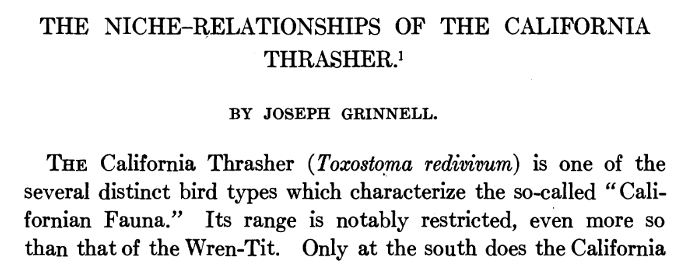
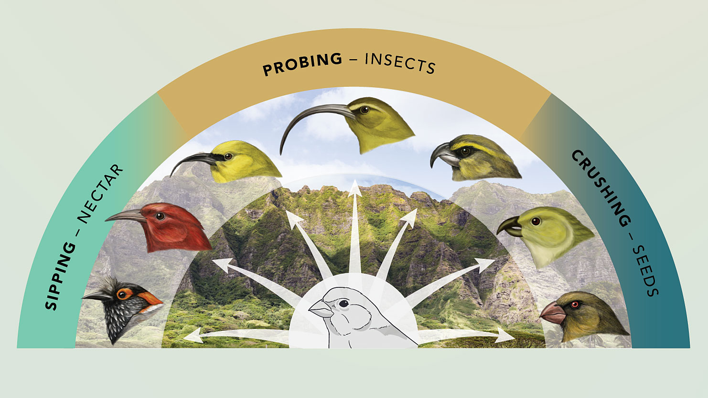
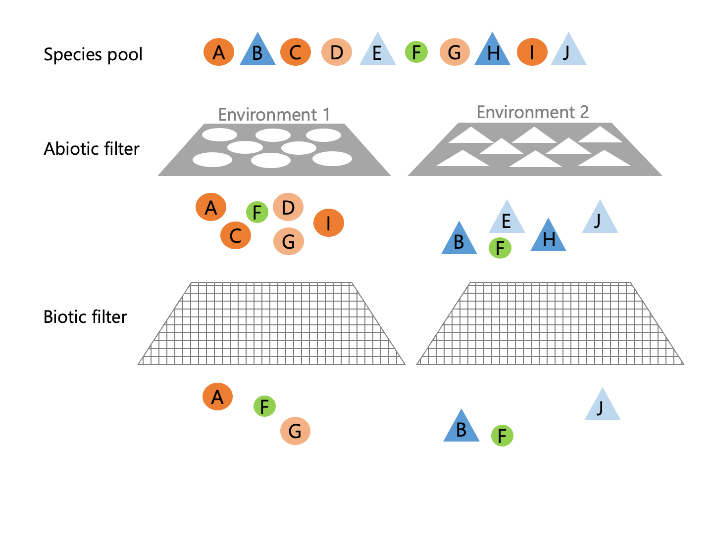
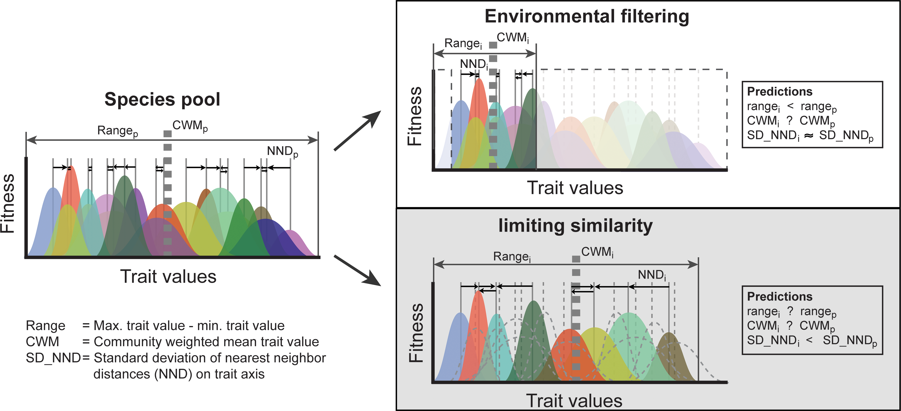

```{r setup, include=FALSE}
options(htmltools.dir.version = FALSE)
knitr::opts_chunk$set(
  fig.width=9, fig.height=3.5, fig.retina=3,
  out.width = "100%",
  cache = FALSE,
  echo = TRUE,
  message = FALSE, 
  warning = FALSE,
  hiline = TRUE
)

# library(RefManageR)
# BibOptions(check.entries = FALSE,
#            bib.style = "authoryear",
#            cite.style = "alphabetic",
#            style = "markdown",
#            hyperlink = FALSE,
#            dashed = FALSE)
# myBib <- ReadBib("bib/2_species.bib", check = FALSE)
```

```{r xaringan-themer, include=FALSE, warning=FALSE}
library(xaringanthemer)

# style_duo_accent(
#   primary_color = "#1381B0",
#   secondary_color = "#FF961C",
#   inverse_header_color = "#FFFFFF"
# )

style_mono_light(base_color = "#23395b")

#https://mycolor.space/?hex=%2323395B&sub=1 
#"Generic gradient" - #23395B #006287 #008E9D #00B897 #89DD81 #F9F871
#"Matching gradient" (reverse) - #23395B #494E77 #716292 #9C77AA #C88DBF #F5A3D0


library(knitr)
library(kableExtra)
```


```{r xaringan-tile-view, echo=FALSE}
# xaringanExtra::use_tile_view()
```

class: center, middle

### Why haven't we been talking about traits?

---

### The Grinnellian Niche

.pull-left[
```{r echo = F, fig.align = 'center', out.width = '85%'}

```

> _"An explanation of this restricted distribution is probably to be found in the **close adjustment of the bird in various physiological and psychological respects** to a narrow range of environmental conditions. The nature of these critical conditions is to be learned through an examination of the bird's habitat."_

.footnote[[**Grinnell 1917**](http://dx.doi.org/10.2307/4072271)]
]

.pull-right[
```{r echo = F, fig.align = 'center', out.width = '85%'}
knitr::include_graphics("images/california_thrasher.jpg")
```

.footnote[Photo: Leslie Cavaliere, iNaturalist]
]

---

.pull-left[

### The Eltonian Niche

> _"what [it] is doing in its community,... its place in the **biotic** environment, its relations to food and enemies"_ - [**Elton 1927**](https://press.uchicago.edu/ucp/books/book/chicago/A/bo25281897.html)

> _"used in ecology in the sense that we speak of trades or professions or jobs in a human community"_ - [**Elton 1933**](https://books.google.co.za/books/about/The_Ecology_of_Animals.html?id=OxzZAAAAMAAJ&redir_esc=y)

Focuses on the organism's role or **function** in the ecosystem, often in relation to trophic position (consumers, predators, etc) and **resource use**.

Often considers the **attributes or traits** of species that allow them to fulfill their role.

]

.pull-right[
```{r echo = F, fig.align = 'center', out.width = '90%'}
knitr::include_graphics("images/elton_interactions.jpg")
```

.footnote[image: _The Atlas of World Wildlife_ 1973]
]

---

### Eltonian Niche Traits

Honeycreepers evolved a range of bill forms in response to available food sources on the Hawaiian archipelago.

```{r echo = F, fig.align = 'center', out.width = '70%'}

```

[**Illustration by Jillian Ditner, photo by Ashlyn Gehrett**](https://www.allaboutbirds.org/news/why-evolution-goes-wild-on-islands-the-science-of-adaptive-radiation/#)

---

### Eltonian and Grinnellian Niche Traits?

```{r echo = F, fig.align = 'center', out.width = '65%'}

```

Plants have a range of nutrient-acquisition strategies that affect both their ability to compete for (or partition) nutrients and the soil environmental conditions where they are most likely to occur ([**Lambers et al. 2008**](http://dx.doi.org/10.1016/j.tree.2007.10.008)).

---

### Eltonian and Grinnellian Niche Traits?

```{r echo = F, fig.align = 'center', out.width = '65%'}

```

East African cichlid fishes have diverged in traits relating diet, mating behaviour, competition and habitat.

.footnote[[**Santos et al. 2023**](http://dx.doi.org/10.1186/s13227-022-00205-5)]

---

.pull-left[

### Grinnellian Niche Traits?

Not only have _Anolis_ lizard species of the Greater Antilles specialised to use different parts of the trees they live in (niche partitioning), but these niches are filled by different species on each island and unrelated species have converged to similar morphology for each habitat type!

.footnote[[**Losos and de Queiroz 1997**](https://repository.si.edu/handle/10088/38506)]
]

.pull-right[
```{r echo = F, fig.align = 'center', out.width = '60%'}

```
]

---

.pull-left[

### Grinnellian Niche Traits

There are clear climatic preferences among plant functional types in Africa.

.footnote[[**Conradi et al. 2021**](http://dx.doi.org/10.1111/nph.16580)]
]

.pull-right[
```{r echo = F, fig.align = 'center', out.width = '90%'}

```
]

---

```{r echo = F, fig.align = 'center', out.width = '80%'}

```

> _"There is considerable debate about whether community ecology will ever produce general principles."_

> _"...this can be achieved [,but] community ecology has lost its way by focusing on pairwise species interactions independent of the environment."_

> _"...community ecology should return to an emphasis on ..._

> [1.] _how the fundamental niche is governed by functional traits within the context of abiotic environmental gradients; and_

> [2.] _how the interaction between traits and fundamental niches maps onto the realized niche in the context of a biotic interaction milieu._

> _"...this approach can create a more quantitative and predictive science that can more readily address issues of global change."_

---

```{r echo = F, fig.align = 'center', out.width = '80%'}

```

> _"There is considerable debate about whether community ecology will ever produce general principles."_

> _"...this can be achieved [,but] community ecology has lost its way by focusing on pairwise species interactions independent of the environment."_

> _"...community ecology should return to an emphasis on ..._

> [1.] _how the fundamental niche is governed by functional traits within the context of abiotic environmental gradients; and_        [**Traits and the Fundamental Niche**]

> [2.] _how the interaction between traits and fundamental niches maps onto the realized niche in the context of a biotic interaction milieu._       [**Traits and Community Assembly**]

> _"...this approach can create a more quantitative and predictive science that can more readily address issues of global change."_


---

class: center, middle

## Traits and the fundamental niche

### Can traits be used to predict the fundamental niche of species?

---

.pull-left[

### Traits and the fundamental niche

An example from serotinous Cape Proteaceae...

```{r echo = F, fig.align = 'center', out.width = '100%'}
knitr::include_graphics("images/Treurnicht2020.png")
```

<br>

Related inter- and intraspecific variation in 11 functional traits to measures of the fundamental Hutchinsonian niches of 26 Proteaceae species in the Cape Floristic Region.

.footnote[[**Treurnicht et al. 2020**](http://dx.doi.org/10.1111/geb.13048)]
]

.pull-right[

```{r echo = F, fig.align = 'center', out.width = '100%'}
knitr::include_graphics("images/proteas_Roets2006.jpg")
```

.footnote[image: Roets et al 2006]
]

---

.pull-left[

### Traits and the fundamental niche

An example from serotinous Cape Proteaceae...

```{r echo = F, fig.align = 'center', out.width = '100%'}
knitr::include_graphics("images/Treurnicht2020.png")
```

Sampled traits and demographic parameters (fecundity, recruitment and adult fire survival) for the 26 species from across their ranges.

Most of the variation in traits was between species, but some (e.g. leaf and seed N) showed high intraspecific variability.

.footnote[[**Treurnicht et al. 2020**](http://dx.doi.org/10.1111/geb.13048)]
]

.pull-right[

```{r echo = F, fig.align = 'center', out.width = '95%'}

```

]

---

.pull-left[

### Traits and the fundamental niche

An example from serotinous Cape Proteaceae...

```{r echo = F, fig.align = 'center', out.width = '100%'}
knitr::include_graphics("images/Treurnicht2020.png")
```

Built demographic models to estimate measures of the fundamental Hutchinsonian niche for the 26 species. These were the niche optimum and niche width for each of 5 environmental variables (aridity, minimum and maximum temperature, soil fertility and fire interval) and the $r_{max}$ (which integrates across all variables).

.footnote[[**Treurnicht et al. 2020**](http://dx.doi.org/10.1111/geb.13048)]
]

.pull-right[

<br>

<br>

```{r echo = F, fig.align = 'center', out.width = '100%'}
knitr::include_graphics("images/treurnicht2020_hutchinson.jpg")
```

]
---

```{r echo = F, fig.align = 'center', out.width = '70%'}
knitr::include_graphics("images/Treurnicht2020.png")
```

.pull-left[

<br>

Built statistical models to predict the Hutchinsonian niche parameters as a function of the 11 functional traits.

.footnote[[**Treurnicht et al. 2020**](http://dx.doi.org/10.1111/geb.13048)]

]

.pull-right[

```{r echo = F, fig.align = 'center', out.width = '75%'}
knitr::include_graphics("images/treurnicht2020_hutchinson.jpg")
```

]

---

.left-column[

<br>

<br>

The models could explain 30% of the variance in $r_{max}$ and >50% of the variance in the niche optima and widths!

<br>

<br>

<br>

P.S. This is good...
]

.right-column[
```{r echo = F, fig.align = 'center', out.width = '100%'}

```
]

.footnote[[**Treurnicht et al. 2020**](http://dx.doi.org/10.1111/geb.13048)]

---

.left-column[

<br>

<br>

Several of the traits were significant predictors of the niche optima and widths for the 5 environmental variables.

]

.right-column[
```{r echo = F, fig.align = 'center', out.width = '100%'}

```
]

.footnote[[**Treurnicht et al. 2020**](http://dx.doi.org/10.1111/geb.13048)]

---

class: center, middle

## Traits and Community Assembly

### What can traits reveal about community assembly?

---

### Traits and Community Assembly

.left-column[

<br>

How would you expect traits to relate to the community assembly process?
]

.right-column[
```{r echo = F, fig.align = 'center', out.width = '70%'}

```

.footnote[image: Tony Verboom]
]

---

### Traits and Community Assembly

.left-column[
**Environmental filtering** should select for species with the traits needed to survive in that environment, usually reducing the variation in traits.

**Biotic interactions** can have two outcomes. Competition should drive trait divergence. Conversely, a common limiting factor (e.g. a resource or shared predator) should drive convergence.
]

.right-column[
```{r echo = F, fig.align = 'center', out.width = '90%'}

```

.footnote[Figure from [**Lechene et al 2018**](https://doi.org/10.1371/journal.pone.0209025)]
]

---

Examples?

---

### Traits and Community Assembly

.left-column[

Just a note that these things are complex to measure though. 

For example, limiting similarity may result in a greater range of traits, but there's a lot going on within that range too. Only species with overlapping niches should compete, so many species within the range should be competitively excluded...

]

.right-column[
```{r echo = F, fig.align = 'center', out.width = '100%'}

```

.footnote[Figure from [**Luo et al 2016**](https://doi.org/10.1371/journal.pone.0155749)]
]

---

class: center, middle

## But how do we know these are the right traits?

---

### Traits and Community Assembly

.pull-left[
If one has a clear understanding of the system and necessary traits, you could be more specific in your predictions than just changes in trait convergence or divergence.

e.g. This example shows the need for plants to have aerenchyma to survive in inundated wetlands, because otherwise their roots would rot.

Unfortunately, it is rare to have this detailed an understanding of the biology _a priori_. It is also difficult to generalise this rule beyond wetland plants...
]

.pull-right[
```{r echo = F, fig.align = 'center', out.width = '95%'}

```

.footnote[Figure from [**Keddy 1992**](http://dx.doi.org/10.2307/3235676)]
]

---

class: center, middle

## But how do we know these are the right traits?

### This is why step 1 is looking at the relationship between traits and fundamental niches!

---

### Selecting the right traits

```{r echo = F, fig.align = 'center', out.width = '80%'}

```

This is essentially the process we followed in [**Treurnicht et al. 2020**](http://dx.doi.org/10.1111/geb.13048). Figure from [**Laughlin et al. 2020**](https://doi.org/10.1016/j.tree.2020.07.010).

---

class: center, middle

### Other considerations and advantages of trait-based ecology?

---

layout: false

.pull-left[
## There are often trade-offs among traits

Leaf dry mass per unit area (LMA) predicts 
- Nitrogen content 
- photosynthetic capacity
- relative growth rate

But
- Trades off against leaf longevity

.footnote[The leaf economics spectrum (LES) - Wright et al. 2004]

]

.pull-right[
```{r echo = F, fig.align = 'center', out.width = '40%'}

```
]

---

layout: false

.pull-left[
## There are often trade-offs among traits

LMA correlates with environment (temp and rainfall)
- Higher LMA in hot, dry places

<br>

This also represents a trade-off in that specific traits can limit species to specific resource/habitat requirements (water, light, nutrients). i.e. these trade-offs have a direct effect on species niches!

.footnote[The leaf economics spectrum (LES) - Wright et al. 2004]
]

.pull-right[
```{r echo = F, fig.align = 'center', out.width = '100%'}
knitr::include_graphics("images/LES_env.webp")
```
]

---

### Traits and scaling

```{r echo = F, fig.align = 'center', out.width = '75%'}

```

Traits affect processes from the organism to ecosystem and should help us scale across the hierarchy or ecology [**Funk et al. 2017**](http://dx.doi.org/10.1111/brv.12275)

---

### Traits and ecosystem function

```{r echo = F, fig.align = 'center', out.width = '80%'}

```

A focus on traits allows us to link community assembly and outcomes for ecosystem function, [**Chapin et al 1997**](http://dx.doi.org/10.1126/science.277.5325.500)

---

<br>

<br>

> "Opinions  regarding  the relative   importance   of   the   niche,   and   hence   traits,   to community dynamics fall loosely into three camps.

> - The first argues  that  trait  differences  among  individuals  are  largely irrelevant  at  the  community  level  compared  to  factors such  as  demographic  stochasticity  (e.g.  Neutral  Theory: Hubbell, 2001). 
> - The second argues that traits are relevant to  individuals,  but  the  complexity  of  biotic  and  abiotic interactions  precludes  us  from  scaling  individual  processes to the community level (e.g. Lawton, 1999). 
> - The final camp argues that traits provide a path forward to a unified theory of  community  ecology  by  providing  a  taxon-independent means  for  generalizing  the  structure  and/or  functioning of  communities  that  is  based  on  functional  traits  rather than  species  identity  (e.g. Westoby  &  Wright,  2006; McGill et al.,  2006a)."
   
- [**Funk et al. 2017**](http://dx.doi.org/10.1111/brv.12275)

---

class: middle

## Take-home

>**

>**

>**

>**

>**


---
class: center, middle

# Thanks!

Slides created via the R packages:

[**xaringan**](https://github.com/yihui/xaringan)<br>
[gadenbuie/xaringanthemer](https://github.com/gadenbuie/xaringanthemer)

The chakra comes from [remark.js](https://remarkjs.com), [**knitr**](http://yihui.name/knitr), and [R Markdown](https://rmarkdown.rstudio.com).
