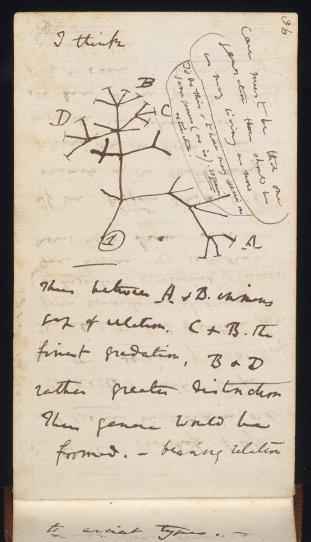
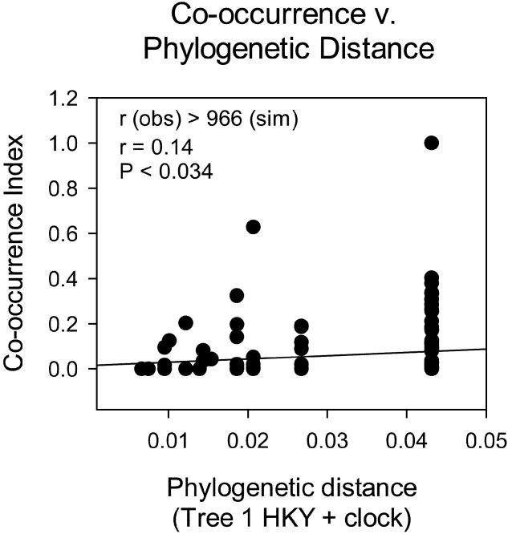

```{r setup, include=FALSE}
options(htmltools.dir.version = FALSE)
knitr::opts_chunk$set(
  fig.width=9, fig.height=3.5, fig.retina=3,
  out.width = "100%",
  cache = FALSE,
  echo = TRUE,
  message = FALSE, 
  warning = FALSE,
  hiline = TRUE
)

# library(RefManageR)
# BibOptions(check.entries = FALSE,
#            bib.style = "authoryear",
#            cite.style = "alphabetic",
#            style = "markdown",
#            hyperlink = FALSE,
#            dashed = FALSE)
# myBib <- ReadBib("bib/2_species.bib", check = FALSE)
```

```{r xaringan-themer, include=FALSE, warning=FALSE}
library(xaringanthemer)

# style_duo_accent(
#   primary_color = "#1381B0",
#   secondary_color = "#FF961C",
#   inverse_header_color = "#FFFFFF"
# )

style_mono_light(base_color = "#23395b")

#https://mycolor.space/?hex=%2323395B&sub=1 
#"Generic gradient" - #23395B #006287 #008E9D #00B897 #89DD81 #F9F871
#"Matching gradient" (reverse) - #23395B #494E77 #716292 #9C77AA #C88DBF #F5A3D0


library(knitr)
library(kableExtra)
```


```{r xaringan-tile-view, echo=FALSE}
# xaringanExtra::use_tile_view()
```

class: center, middle

> _"...species of the same genus usually have, though by no means invariably, much similarity in habits and constitution, and always in structure..."_ 

> [**Darwin 1859**](https://books.apple.com/za/book/on-the-origin-of-species/id395536758)

---

.pull-left[

### Relatedness

While it seems obvious now, it took a long time for people to realise that the similarity among some species that we observe is because they have descended from a common ancestor. i.e. They were once identical, because they were once the same thing!

The degree to which they differ is a function of:

- time
- genetic variation (including mutation rates)
- genetic and developmental constraints
- selective pressure

.footnote[The first phylogeny. From Darwin's Notebook B.]
]

.pull-right[
```{r echo = F, fig.align = 'center', out.width = '65%'}

```
]

---

.pull-left[
```{r echo = F, fig.align = 'center', out.width = '70%'}
knitr::include_graphics("images/elephant.JPG")
```

```{r echo = F, fig.align = 'center', out.width = '70%'}

```

.footnote[Who is the elephant's closest ancestor?]
]

.pull-right[
```{r echo = F, fig.align = 'center', out.width = '70%'}

```

```{r echo = F, fig.align = 'center', out.width = '70%'}

```

.footnote[[**Tapir: guyincognito**](https://www.inaturalist.org/observations/17547825); [**Dugong: Dennis Rabeling**](https://www.inaturalist.org/observations/72603891)]
]

---

Quite a bit of divergence, but then it has been 60+ million years...

```{r echo = F, fig.align = 'center', out.width = '70%'}

```

.footnote[[**Poulakakis and Stamatakis 2010.jpg**](https://doi.org/10.1080/14772000.2010.484436)]

---

### What's the difference between a crocodile and an alligator?

<br>

.pull-left[
```{r echo = F, fig.align = 'center', out.width = '100%'}

```
]

.pull-right[
```{r echo = F, fig.align = 'center', out.width = '100%'}

```
]

.footnote[[**Alligator: joemdo**](https://www.inaturalist.org/observations/19501898); [**Crocodile: Wayne and Pam Osborn**](https://www.inaturalist.org/photos/254500796)]

---

So similar despite ±95 million years of independent evolution!!!

```{r echo = F, fig.align = 'center', out.width = '60%'}

```

.footnote[[**Darlim et al 2022**](https://doi.org/10.1098/rsbl.2021.06036)]

---

.pull-left[

### Phylogeny and ecological similarity

**Phylogenetic signal** is the tendency for related species to resemble each other more than they resemble species drawn at random from the phylogenetic tree.

**Phylogenetic niche conservatism** is when closely related species are _more_ similar ecologically than expected based on their relatedness (i.e. given the time they've had to diverge).


.footnote[East African terns by [**H Douglas Pratt**](http://hdouglaspratt.com/Art_Gallery/kenyantanzania/smallerternsinflightdraft.html)]

]

.pull-right[
```{r echo = F, fig.align = 'center', out.width = '75%'}

```
]

---

### Drivers of niche conservatism

<br>

I'm not going to go into detail, but conservatism may be maintained through a variety of processes, including:

- lack of genetic variation for necessary traits
- genetic constraints
- developmental/morphological constraints
- selection favouring maintenance of the original niche 
- competition with other species preventing divergence into other niches

---

class: center, middle

### What are the implications of closely related species being more similar?

---

### The Competition-Relatedness Hypothesis

<br>

> _"As the species of the same genus usually have, though by no means invariably, much similarity in habits and constitution, and always in structure, the struggle will generally be more severe between them, if they come into competition with each other, than between the species of distinct genera."_ - [**Darwin 1859**](https://books.apple.com/za/book/on-the-origin-of-species/id395536758)

<br>

In modern ecology, this translates as:

<br>

> Since close relatives usually have similar traits, and thus similar niches, the limiting similarity principle dictates that they should compete more strongly than distant relatives.

---

.pull-left[

### The Competition-Relatedness Hypothesis

```{r echo = F, fig.align = 'center', out.width = '100%'}

```

[**Slingsby and Verboom 2006**](http://dx.doi.org/10.1086/505158) explored patterns of co-occurrence of _Tetraria_ species in plots sampled across several mountains in the CFR.
]

.pull-right[

```{r echo = F, fig.align = 'center', out.width = '90%'}

```

]

---

.pull-left[

### The Competition-Relatedness Hypothesis

[**Slingsby and Verboom 2006**](http://dx.doi.org/10.1086/505158) explored patterns of co-occurrence of _Tetraria_ species in plots sampled across several mountains in the CFR.

They found that close relatives were functionally similar (phylogenetic signal) and that they rarely co-occur (empty top-left corner of figures), as one would expect if close relatives competitively exclude one another.

Similar patterns have been found for many taxonomic groups all over the world, but it is difficult to exclude processes other than competition as potential drivers of the pattern.
]

.pull-right[

```{r echo = F, fig.align = 'center', out.width = '70%'}

```

]

---

class: center, middle

### But what about relatedness and habitat filtering?

---

.pull-left[

### Relatedness and habitat filtering

As a counter to the competition-relatedness hypothesis, since close relatives should have similar traits and niches, you might expect them to be filtered into the same communities.

This sets up contrasting predictions, depending on whether competition or habitat filtering are the dominant processes...

```{r echo = F, fig.align = 'center', out.width = '100%'}

```

]

.pull-right[

```{r echo = F, fig.align = 'center', out.width = '100%'}

```

.footnote[[**Cavender-Bares et al. 2004**](https://doi.org/10.1086/386375)]
]

---

.pull-left[

### Relatedness and habitat filtering

```{r echo = F, fig.align = 'center', out.width = '100%'}

```

Revisiting our rainforest example from the previous lecture, [**Kraft and Ackerly 2010**](https://doi.org/10.1890/09-1672.1) did a follow-up study looking at trait conservatism and phylogenetic relatedness in their Amazon forest plot.

They found that the range and variance of a set of key traits were smaller than expected by chance (i.e. clustered), and that the communities showed phylogenetic clustering at a range of plot sized from 5 to 100m.

]

.pull-right[

```{r echo = F, fig.align = 'center', out.width = '55%'}

```

]

---

.pull-left[

### Relatedness and habitat filtering

```{r echo = F, fig.align = 'center', out.width = '100%'}

```

Mediterranean plant species persist after fire by having hard-coated seeds or serotinous cones to protect them from the heat of the fire and permit rapid post-fire recruitment.

[**Verdu and Pausas 2007**](https://doi.org/10.1111/j.1365-2745.2007.01300.x) tested and showed: 

1. seed traits show phylogenetic signal
2. co-occurring species have similar seed/cone phenotypes (phenotypic clustering)
3. communities in high fire frequency environments (HiFi) are significantly phylogenetically clustered

]

.pull-right[

```{r echo = F, fig.align = 'center', out.width = '70%'}

```

]

---

.pull-left[

### Relatedness and habitat filtering

```{r echo = F, fig.align = 'center', out.width = '70%'}

```

]

.pull-right[

#### Niche conservatism and global biogeography!

```{r echo = F, fig.align = 'center', out.width = '80%'}
knitr::include_graphics("images/crisp2009_2.png")
```

Speciation is more likely to occur via dispersal to a similar biome on a different continent than to a different biome right next door!

```{r echo = F, fig.align = 'center', out.width = '80%'}

```


.footnote[Figures: [**Crisp et al. 2009**](https://doi.org/10.1038/nature07764); Quote: [**Donoghue 2008**](http://dx.doi.org/10.1073/pnas.0801962105)]
]

---

.pull-left[

### Relatedness and habitat filtering

```{r echo = F, fig.align = 'center', out.width = '70%'}

```

]

.pull-right[

#### Niche conservatism and global biogeography!

```{r echo = F, fig.align = 'center', out.width = '80%'}
knitr::include_graphics("images/crisp2009_2.png")
```

Speciation is more likely to occur via dispersal to a similar biome on a different continent than to a different biome right next door!

```{r echo = F, fig.align = 'center', out.width = '80%'}

```


.footnote[Figures: [**Crisp et al. 2009**](https://doi.org/10.1038/nature07764); Quote: [**Donoghue 2008**](http://dx.doi.org/10.1073/pnas.0801962105)]
]

---

class: center, middle

### But what if the key traits/niche are not conserved?

---

Divergence in traits and/or niches is relatively common, as we see in adaptive radiations such as the Honeycreepers of the Hawaiian archipelago.

```{r echo = F, fig.align = 'center', out.width = '70%'}
knitr::include_graphics("images/AllAboutBirds_Beaks.jpg")
```

[**Illustration by Jillian Ditner, photo by Ashlyn Gehrett**](https://www.allaboutbirds.org/news/why-evolution-goes-wild-on-islands-the-science-of-adaptive-radiation/#)

---

.pull-left[

### Relatedness and habitat filtering

If we consider that close relatives may not have similar traits and niches, you might expect them to be filtered into different communities.

In fact, in this case, distant relatives are likely to have converged to the same traits or niche preferences (**convergent evolution**), leading to habitat filtering selecting for communities of distantly related species!

```{r echo = F, fig.align = 'center', out.width = '100%'}

```

]

.pull-right[

```{r echo = F, fig.align = 'center', out.width = '95%'}

```

Note that there are no clear predictions for competition and convergent evolution...

.footnote[[**Cavender-Bares et al. 2004**](https://doi.org/10.1086/386375)]
]

---

.pull-left[

### Relatedness and habitat filtering

#### Habitat filtering and _convergent_ evolution

```{r echo = F, fig.align = 'center', out.width = '100%'}

```

A similar pattern to Slingsby and Verboom 2006!

]

.pull-right[

```{r echo = F, fig.align = 'center', out.width = '100%'}

```


.footnote[[**Cavender-Bares et al. 2004**](https://doi.org/10.1086/386375)]
]

---

.pull-left[

### Relatedness and habitat filtering

#### Habitat filtering and _convergent_ evolution

```{r echo = F, fig.align = 'center', out.width = '100%'}

```

A similar pattern to Slingsby and Verboom 2006!

#### But 

This pattern was driven by convergent evolution of niches!

To discern between processes, you have to test for phylogenetic signal.
]

.pull-right[

```{r echo = F, fig.align = 'center', out.width = '85%'}

```

.footnote[[**Cavender-Bares et al. 2004**](https://doi.org/10.1086/386375)]
]

---

### Niches and Diversification

Since niches are key for the distribution and coexistence of species, it stands to reason that they should feed back to affect the diversification process?

```{r echo = F, fig.align = 'center', out.width = '60%'}

```

One proposal is that diversification should slow through time as niche space is gradually filled. This is termed density- (or diversity-) dependent diversification.

The idea has its roots in paleobiology, based on the fossil record, but has since been explored using molecular phylogenies.

.footnote[[**Foote 1997**](http://dx.doi.org/10.1146/annurev.ecolsys.28.1.129)]

---

.pull-left[

### Diversity-dependent diversification

```{r echo = F, fig.align = 'center', out.width = '100%'}

```

The key notion is that the diversification rate declines through time as the number of lineages increases (and presumably niche space saturates).

While the notion that there is an ecological limit on diversification is a somewhat controversial one, there's enough evidence of a pattern that it cannot be ignored, even if we're not sure of the process. We may yet find alternative explanations...

]

.pull-right[

```{r echo = F, fig.align = 'center', out.width = '100%'}

```

.footnote[[**Rabosky and Lovette 2008**](https://doi.org/10.1098/rspb.2008.0630)]
]

---

.pull-left[

### Diversity-dependent diversification

```{r echo = F, fig.align = 'center', out.width = '100%'}

```

There's even some evidence for it from the Cape...

Revisiting the genus _Tetraria_...

.footnote[[**Slingsby et al. 2013**](http://dx.doi.org/10.1016/j.ympev.2013.11.017)]
]

.pull-right[

```{r echo = F, fig.align = 'center', out.width = '90%'}

```

]

---

### Diversity-dependent diversification

```{r echo = F, fig.align = 'center', out.width = '100%'}

```

.footnote[[**Slingsby et al. 2013**](http://dx.doi.org/10.1016/j.ympev.2013.11.017)]

---

class: middle

## Take-home

>*Phylogenetic relatedness can have a profound effect on the similarity of species' niches, with the expectation being that species should show phylogenetic signal (close relatives are more similar than distant relatives).*

>*Under some circumstances, one may even have phylogenetic niche conservatism, where close relatives are more similar than you'd expect on the basis of phylogenetic signal alone.*

>*In other cases, one can have trait or niche convergence, where distant species evolve similar traits/niches (e.g. sharks and dolphins).*

>*The nature of trait/niche evolution has implications for the patterns of relatedness on biotic communities under different ecological processes (competition vs habitat filtering).*

>*Niche conservatism can also have a big impact on global biogeography in that it seems to be easier for species to disperse between continents than to shift between biomes.*

>*There is even some evidence that niche evolution can affect the rate of diversification, with rates slowing as more species accumulate and niche space saturates. This is often considered to be an ecological limit on diversification.*

---
class: center, middle

# Thanks!

Slides created via the R packages:

[**xaringan**](https://github.com/yihui/xaringan)<br>
[gadenbuie/xaringanthemer](https://github.com/gadenbuie/xaringanthemer)

The chakra comes from [remark.js](https://remarkjs.com), [**knitr**](http://yihui.name/knitr), and [R Markdown](https://rmarkdown.rstudio.com).
